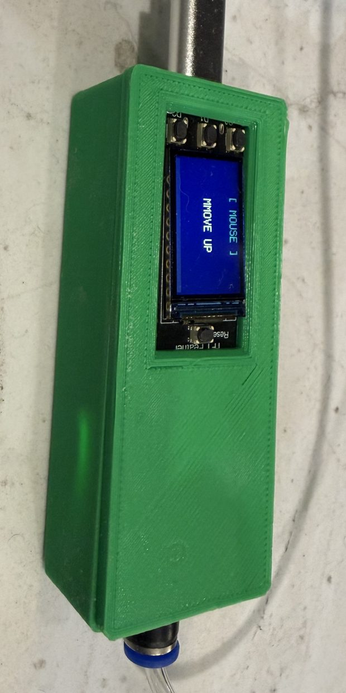
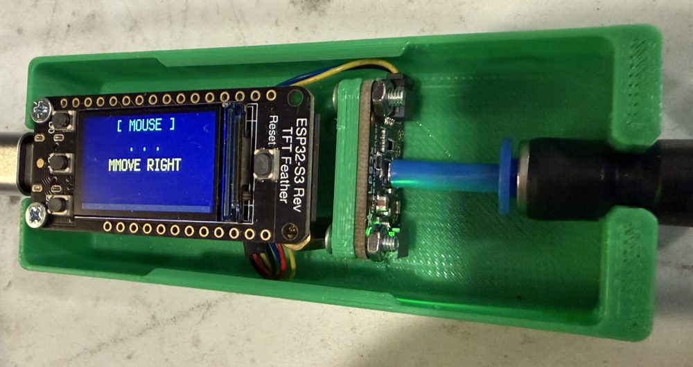
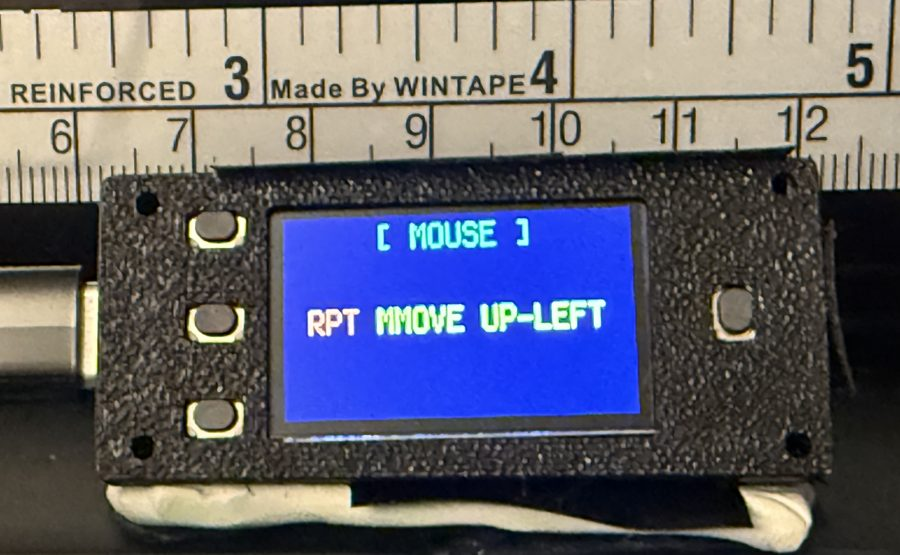

# AeroMorse — Complete Build Guide
### USB HID Keyboard & Mouse via Sip-and-Puff or Accessibility Switches

> **Software & this guide live here:** https://github.com/jlubin2001/AeroMorse
> — always download the firmware (`code.py`, `boot.py`, `morse_map.py`,
> `config.py`) from that repo. See **§9.4** for the download steps.

This guide walks a first-time, non-technical builder through every decision and
every step needed to assemble a working AeroMorse device. Read the whole guide
once before buying anything — your hardware choices affect each other.

---

## Table of Contents

1. [What AeroMorse Does](#1-what-aeromorse-does)
2. [How This Guide Works](#2-how-this-guide-works)
3. [Compatible Feather Boards](#3-compatible-feather-boards)
4. [Input Method Options](#4-input-method-options)
5. [Display Options](#5-display-options)
   - [Wireless Display — ESP-NOW Remote Mirror](#wireless-display--esp-now-remote-mirror)
6. [Speaker Options](#6-speaker-options)
7. [Complete Parts Lists](#7-complete-parts-lists)
8. [Step-by-Step Assembly](#8-step-by-step-assembly)
9. [Software Installation](#9-software-installation)
10. [Configuration](#10-configuration)
11. [First Power-On Test](#11-first-power-on-test)
12. [Troubleshooting](#12-troubleshooting)

Appendices: [A — Groups](#appendix-a--groups-and-group-cycling) ·
[B — Display layout](#appendix-b--display-layout) ·
[C — Macros](#appendix-c--customising-macros) ·
[D — Breadboard wiring](#appendix-d--breadboard-wiring-walkthrough) ·
[E — Configuration reference](#appendix-e--configuration-reference) ·
[F — #5477 + 3.5" FeatherWing](#appendix-f--building-with-5477--35-tft-featherwing-3651) ·
[G — AutoHotkey](#appendix-g--autohotkey-starting-programs-with-a-morse-code) ·
[H — Enclosure and tube strain relief](#appendix-h--enclosure-and-air-tube-strain-relief) ·
[I — Keyboard layout](#appendix-i--keyboard-layout-when-symbols-come-out-wrong) ·
[J — More media, browser and app keys](#appendix-j--more-media-browser-and-app-launcher-keys)

---

## 1. What AeroMorse Does

AeroMorse is an open-source CircuitPython project directed by Jim Lubin — a
ventilator-dependent quadriplegic who has used Morse code for computer access
since 1989. Inspired by [AirTalker](https://github.com/ATMakersOrg/AirTalker), it turns an Adafruit Feather microcontroller into a
USB HID keyboard and mouse that connects via USB-C and appears to the host as
a standard keyboard and mouse with no drivers required. Works on **Windows,
macOS, Linux, iPadOS, Android, and ChromeOS**.

**How this project was built — what's confirmed vs documented.** Jim is the
user, project lead, and source of all design decisions: hardware choices,
input-mode requirements, Morse code-set conventions, accessibility trade-offs,
and ongoing user feedback (his own and from other AAC users — Darci USB
veterans in particular). The firmware (`code.py`), this build guide, and the
comparison documents were written by **Claude Opus 4.7** (Anthropic) acting as
the coding assistant — a "vibe coding" workflow in which Jim directs and
Claude writes. Jim does not write the firmware himself, and has not personally
soldered or assembled every hardware combination listed here. Several options
— particularly some board / display / speaker combinations — are documented
from datasheets and Claude's understanding of the parts rather than from a
verified build.

**If you build a configuration, please report back via a GitHub issue —
whether it works or doesn't.** Confirmed-vs-theoretical is the single most
useful signal this project can collect right now.

Input is by **sip-and-puff** (LPS33HW pressure sensor) or **two standard AT
switches**. A short sip (or switch 1) is a dot; a short puff (or switch 2) is
a dash. A small colour screen (built into the recommended board) shows the
active group, the Morse pattern as it builds, and the last action. An optional speaker beeps for every dot and dash.

Ten groups organize all functions — `g0` plus `g1–g9`:

- **Group 0** — always-available system layer; 8-symbol patterns jump
  directly to any other group from anywhere
- **Group 1** — **Keyboard**: letters, numbers, punctuation, function keys,
  navigation, sticky modifiers (default group at boot)
- **Group 2** — **Mouse**: movement, clicks, drag, repeat, and Windows
  shortcuts
- **Group 3** — **Macro**: user-defined text strings
- **Group 4** — **Scanning**: Enter, Space and F3–F12 on the 12 shortest
  codes — for iOS / Android Switch Control
- **Group 5** — **Media**: USB HID Consumer Controls — play/pause, volume,
  mute, track skip, brightness, plus launchers for calculator, file
  explorer, browser, and mail
- **Groups 6, 7, 8** — **Placeholders** carrying Group 1's letters and numbers,
  written out line by line in `morse_map.py`, ready for you to customise
- **Group 9** — **Switch**: no Morse — a sip holds Enter and a puff holds
  Space for as long as you keep going, like two real switches (games and
  switch apps). See [AEROMORSE_SWITCH_MODE_GUIDE.md](AEROMORSE_SWITCH_MODE_GUIDE.md).
  (It was Group 7 before v1.24.)

Groups cycle with a long sip or puff. An optional **ESP-NOW wireless display**
mirrors the main screen on a second board up to ~30 m away — useful when the
sensor is mounted behind the user.

Existing **Darci USB** users can drop in `morse_map_darci.py` to use their
familiar code set. All Morse assignments are fully customizable in
`morse_map.py`. Parts cost approximately **$50–$100** in off-the-shelf
components.

### Morse code basics

| Symbol | Input | Display |
|--------|-------|---------|
| Dot | Short sip or press | `.` |
| Dash | Short puff or press | `-` |
| Letter gap | Pause ≥ 0.2 s | (pattern fires) |

Example: sip · puff · puff = `. - -` = the letter **W**

You do not need to know Morse code from memory to begin — the device can be used
with a printed reference card while you learn.

---

## 2. How This Guide Works

AeroMorse has modular hardware. You pick:

1. **A Feather microcontroller board** (the brain — required)
2. **An input method** (sip-and-puff sensor or AT switches — required)
3. **A display** (what you see — optional but recommended)
4. **A speaker** (audio feedback — optional)

Once you have chosen each, jump to the relevant wiring section in Step 8.

> **Is the AeroMorse going to be someone's only way to use a computer?**
> Then consider building **two**. The second is a spare that is working the
> minute the first one fails, and a safe place to try a new version or a new
> setting without risking the device that is depended on. It is how the
> project's author works. See the Usage Guide, §6 "More than one device".

> **Recommended combination for most builders (USB HID, display included):**
> ESP32-S3 Reverse TFT Feather #5691 · LPS33HW sensor #4414 · STEMMA Speaker #3885
>
> **If you need Bluetooth wireless HID:**
> Metro ESP32-S3 #5500 · 1.3" OLED #938 · LPS33HW sensor #4414 · STEMMA Speaker #3885

---

## 3. Compatible Feather Boards

### Why not every Feather works

AeroMorse uses **USB HID** — the USB standard that lets keyboards and mice talk
to computers. Only Feather boards with **native USB** support this. Classic
ESP32 boards (including Adafruit #5900 Feather ESP32 V2) use a separate USB-to-
serial chip that cannot emulate a keyboard. Those boards will not work.

### BLE HID note — CircuitPython 10.x

**The chip supports it, but CircuitPython's BLE keyboard support on the
ESP32-S3 is still not reliable — tested, see below.** The ESP32-S3 hardware
fully supports Bluetooth LE; the problems are in CircuitPython's ESP32 BLE
code. Several were fixed (issues #9430, #9669, and #10739, the last marked
fixed in 10.3.0), but on CircuitPython 10.3.1 a BLE keyboard still does not
stay connected to an Android phone.

> **Tested 2026-09-26** — #5691 with TinyUF2 0.35.0 + CircuitPython 10.3.1,
> host a Samsung Galaxy A15 (Android 16), using `test_ble.py` from this repo:
> - The board advertises and the phone pairs (`paired=True`).
> - **No keystrokes ever reached the phone** — not on any connection, even
>   while the board reported it was paired — although CircuitPython raised no
>   error when sending them.
> - The link then **drops about 6.5 s after every connection**, and every
>   reconnect starts **unpaired** again — the board doesn't keep the pairing —
>   so it loops connect → pair → drop.
>
> **Result: not usable yet.** Reported upstream on
> [adafruit/circuitpython #10739](https://github.com/adafruit/circuitpython/issues/10739).
> An iPad or Windows host has not been tested.
> Run `test_ble.py` to check a newer CircuitPython or a different host. For a
> phone or tablet today, use a **USB-C cable** — AeroMorse works as a wired
> keyboard/mouse.

**4 MB flash boards include BLE on 10.x.** Earlier builds sometimes left the
BLE stack out of 4 MB firmware images to save space. As of **CircuitPython
10.3.1**, circuitpython.org lists the `_bleio` (BLE) module — together with
`espnow` and `usb_hid` — for all three 4 MB boards below (#5691, #5483,
#5477). Always confirm on your board's circuitpython.org page under
"Built-in modules available".

**Before you can use BLE:**
- **You need CircuitPython 10.x** — BLE HID is not reliable on 9.x.
- **An older bootloader may refuse to flash 10.x.** A #5691 with the 2023
  TinyUF2 bootloader (0.12.3) accepted 9.2.9 but silently ignored a 10.x
  `.uf2` — the drive stayed `FTHRS3BOOT` and never rebooted. Update the
  TinyUF2 bootloader first, then flash 10.x.
- **Use the matching 10.x library bundle** in `lib/`.

**AeroMorse status:** `code.py` sends **USB HID only**. BLE HID (pairing with
a phone or iPad) is not implemented, and won't be until the CircuitPython
problem above is resolved. Running the ESP-NOW wireless display and BLE at the
same time shares one 2.4 GHz radio and has not been tested either. iPads and
phones with USB-C already accept AeroMorse as a **wired** USB keyboard/mouse.

---

### Boards that work

| Board | Adafruit # | USB HID | BLE HID | PSRAM | WiFi | Notes |
|-------|-----------|---------|---------|-------|------|-------|
| ESP32-S3 Reverse TFT Feather | [#5691](https://www.adafruit.com/product/5691) | ✅ | ✅※ | ✅ 2MB | ✅ | Built-in 1.14" TFT — screen faces down (panel mount). **Recommended for panel-mount enclosures — see below.** Not great on a breadboard once headers are soldered (TFT ends up pressed against the breadboard). |
| ESP32-S3 TFT Feather | [#5483](https://www.adafruit.com/product/5483) | ✅ | ✅※ | ✅ 2MB | ✅ | Built-in 1.14" TFT — screen faces up. **Best built-in-TFT option if you plan to use a breadboard with headers.** |
| ESP32-S3 Feather 4MB/2MB PSRAM | [#5477](https://www.adafruit.com/product/5477) | ✅ | ✅※ | ✅ 2MB | ✅ | No built-in display — pair with a STEMMA QT OLED (#326 / #938) or a FeatherWing TFT (§5). EYESPI is also possible but needs the most code editing. |
| ESP32-S2 TFT Feather | [#5300](https://www.adafruit.com/product/5300) | ✅ | — | ✅ 2MB | ✅ | Built-in 1.14" TFT — older S2 chip; no BLE |

※ BLE is included in CircuitPython 10.3.1 for these boards (needs 10.x and a
bootloader that can flash it), but a BLE keyboard does **not** stay connected
reliably yet — see the tested result in the BLE HID note above. AeroMorse
firmware does not use BLE. The ESP32-S2 (#5300) has no Bluetooth hardware.

### Metro form factor boards

Metro boards use the Arduino Uno footprint (68×53 mm) — larger than a Feather.
They work for AeroMorse but with one key difference: **FeatherWing displays
will not plug directly onto them.** Use a standalone TFT breakout (SPI wires)
or the STEMMA QT OLED instead. The pressure sensor plugs straight in via
STEMMA QT with no wiring change.

| Board | Adafruit # | USB HID | BLE HID | PSRAM | WiFi | Notes |
|-------|-----------|---------|---------|-------|------|-------|
| Metro ESP32-S3 | [#5500](https://www.adafruit.com/product/5500) | ✅ | ✅ | ✅ **8MB** | ✅ | **Most memory** (16 MB flash + 8 MB PSRAM); built-in LiPoly charging + battery monitor |

> The Metro ESP32-S3 #5500 has the most memory in this guide (16 MB flash,
> 8 MB PSRAM). BLE is **not** unique to it — on CircuitPython 10.x the 4 MB
> Feathers (#5691 / #5483 / #5477) include BLE too. Choose the Metro for the
> extra memory or the larger form factor.

---

### Boards that do NOT work for USB HID

| Board | Reason |
|-------|--------|
| Feather ESP32 V2 #5400 | No native USB — uses CP2102N serial chip |
| Feather ESP32 Huzzah #3405 | No native USB |
| Feather ESP8266 #2821 | No native USB |

---

### Recommended board: Adafruit ESP32-S3 Reverse TFT Feather #5691

**Why this one:**

- **Display already built in** — the 240×135 colour TFT is soldered to the
  board, facing down for panel mounting; no separate display to buy or wire
- Has **PSRAM** (2 MB extra RAM) — handles all display and sensor work without
  running out of memory
- Has a **STEMMA QT** port — the LPS33HW pressure sensor plugs straight in with
  no soldering
- **WiFi + ESP-NOW** built in — supports the wireless remote display option
  (Section 5) without any extra hardware on the main board
- USB HID works out of the box — appears as keyboard and mouse to any computer
- CircuitPython support is excellent and actively maintained
- Available from Adafruit:
  https://www.adafruit.com/product/5691

> **Watch out — #5691 is not breadboard-friendly once you solder headers.**
> The TFT is on the back of the board, so once header pins are soldered and
> the Feather is pressed into a breadboard, the screen ends up facing the
> breadboard and is unreadable. #5691 is designed for **panel-mount enclosures**
> (a cutout in a case with the screen showing through), not for prototyping
> on a solderless breadboard. If you plan to develop on a breadboard before
> moving to an enclosure, use **#5483** (built-in TFT facing up — screen
> still visible when the Feather is on a breadboard) or **#5477** with an
> external display.

---

**If you want a built-in TFT and plan to use a breadboard (or no enclosure):**

The **ESP32-S3 TFT Feather #5483** is electrically identical to #5691, but
its TFT faces the same side as the components, so the screen still faces up
when the board stands in a breadboard. **A breadboard needs header pins on
the Feather** — they come loose in the bag and have to be soldered on
first (see "Building with no header pins" below). Without a breadboard the
#5483 needs no pins at all, exactly like the #5691. Everything else —
PSRAM, STEMMA QT, ESP-NOW, USB HID — is the same.
https://www.adafruit.com/product/5483

---

**If you want a bare Feather (no built-in display) for the cleanest breadboard
or for maximum display flexibility:**

The **ESP32-S3 Feather #5477** is the same chip without a soldered-on TFT,
so — **once header pins are soldered on** — it sits flat in a breadboard.
Like most Feathers it arrives as a bare board with the pin strips loose in
the bag. Pair it with one of:

- **STEMMA QT OLED #326 (0.96") or #938 (1.3")** — plug-and-play via the
  STEMMA QT chain (the same chain that carries the sensor). Needs a
  `display_setup.py` file on the drive (v1.26+, example provided — see §5).
  Monochrome 128×64, small text. Untested.
- **FeatherWing TFT (#3651, #5872, or #3315)** — no wiring, but **the
  Feather must have header pins soldered on**: the wing has sockets that
  the Feather's pins push into, and a bare Feather has nothing to push in.
  Also needs a `display_setup.py` file (§5).
  Larger, colour, much more screen area than the OLED; the text grows to
  fit by itself. For the full **#5477 + #3651** combo see **Appendix F**
  at the end of this guide. Untested.
- **EYESPI TFT** (Build Guide §5 "EYESPI displays") — possible but the most
  involved option: needs a #5613 breakout, ~7 wires soldered at the
  breakout end (and soldered at the Feather end too unless the Feather has
  header pins), a flex cable, and a `display_setup.py` file. Use only if you specifically
  want EYESPI's flex-cable advantages.

https://www.adafruit.com/product/5477

---

**If you want the most memory (Metro form factor):**

The **Metro ESP32-S3 #5500** has the most memory in this guide (8 MB PSRAM,
16 MB flash). Like the Feathers above, it supports USB HID and includes BLE on
CircuitPython 10.x. The extra memory does not fix the BLE keyboard problem —
that's in CircuitPython's ESP32 BLE code (see the tested result in the BLE HID
note in §3), and AeroMorse firmware does not use BLE.

The #5500 has no built-in display — connect the STEMMA QT OLED or a standalone
TFT breakout. The ESP-NOW wireless display (Section 5) works on it identically
to the Feather boards.
https://www.adafruit.com/product/5500

---

**A note on PSRAM:**

PSRAM is extra RAM soldered alongside the main chip. The ESP32-S3 chip
itself has 512 KB of built-in RAM; a colour TFT display needs a
*framebuffer* (a block of RAM holding every pixel) that can easily
exceed that. Every Feather and Metro board still listed above has at
least **2 MB of PSRAM** (the #5500 Metro has 8 MB), so the framebuffer
lives in PSRAM and the built-in 512 KB stays free for code. Any
supported display size — 128×64 OLED through 480×320 FeatherWing —
fits comfortably.

---

**Quick decision guide:**

| I want… | Choose |
|---------|--------|
| Simplest build, colour TFT included, USB only | #5691 Reverse TFT Feather |
| Same but screen faces up | #5483 TFT Feather |
| BLE HID (in addition to USB HID) | **Not reliable yet** on ESP32-S3 / CircuitPython (see the BLE HID note in §3) — use a USB-C cable to phones/tablets for now |
| Most memory (8 MB PSRAM) | #5500 Metro ESP32-S3 |

---

### Building with no header pins — what works

Many Feather boards ship as bare PCBs with no header pins soldered. If you
don't want to solder headers (and your supplier didn't pre-install them),
some build paths still work via STEMMA QT plug-and-play, some require
soldering a few wires directly to the Feather's PCB pads, and some
fundamentally need headers.

| Component / option | Works without headers? | What's needed |
|---|---|---|
| **#5691 built-in TFT display** | ✅ Plug-and-play | Display soldered to board — nothing to wire |
| **STEMMA QT OLED (#326, #938)** | ✅ Plug-and-play | STEMMA QT cable, no Feather wiring |
| **STEMMA QT sensor (#4414 LPS33HW)** | ✅ Plug-and-play | STEMMA QT cable |
| **FeatherWing displays (#3651, #5872, #3315)** | ❌ Not possible | The wing's holes can't grip bare pads — headers required |
| **Standalone TFT breakouts (#2050, #1770…)** | ⚠️ Solder 5–7 wires | Solder display wires directly to Feather pads |
| **AT switches — Option B1 breadboard** | ❌ Not possible | Feather must sit *in* the breadboard via headers |
| **AT switches — Option B2 TRRS breakout** | ⚠️ Solder 3 wires | Solder breakout output wires to D5/D6/GND pads |
| **AT switches — Option B3 #2915 Terminal Block** | ⚠️ Solder 3 wires | Solder terminal-block wires to D5/D6/GND pads |
| **Speaker — #3885 STEMMA Speaker** | ⚠️ Solder 3 wires | Cut JST PH plug off, solder to A0/3V/GND pads |
| **Speaker — Option S2 piezo (#2915 + #2790 + #1740/#1739)** | ⚠️ Solder 2 wires only if no headers | If Feather has headers: 2 F-F jumpers from #2915 → A0/GND (zero soldering). If no headers: solder 2 wires from #2915 → A0/GND pads. Piezo side is screw-terminal either way. |
| **Speaker — PAM8302 amp (#2130)** | ⚠️ Solder 3 wires | Solder amp board to A0/3V/GND pads |

**STEMMA QT does not solve every problem.** STEMMA QT carries I²C, 3 V, and
GND only — that is enough for sensors and I²C displays (OLEDs), but **not
for audio** (analog signal must come from A0) or **arbitrary switches**
(digital inputs need GPIO pins).

> An I²C GPIO expander board (AW9523 #4886, MCP23017 #5346, PCF8575 #5611)
> *could* host AT switches via STEMMA QT, but you still need to wire jacks
> to the expander's GPIO pads — and `code.py` would need a new library and
> rewritten input routines. **More work, no benefit** vs. soldering three
> wires directly to D5/D6/GND on the Feather.

**Recommended fully-header-less build:**

- Feather: **#5691** (built-in TFT — no wiring)
- Sensor: **#4414 LPS33HW** via STEMMA QT (or skip if using AT switches)
- AT switches: **#2915 Terminal Block** + 3 wires soldered to D5/D6/GND pads
- Speaker: 3 wires soldered to A0/3V/GND pads (or skip — display alone is fine)

Total soldering for the full build: **3–6 wires to Feather pads** (skip the
sensor row if you use switches, skip both if you don't want a speaker).
Each pad is ~1.5 mm — much easier to solder than the pin holes for headers.

> **No soldering at all?** Skip the speaker and use the **#5691 + sensor
> only** combination. The OLED/TFT shows every dot and dash visually. Cost:
> a #5691 + #4414 + STEMMA QT cable, ~$30 (electronics only — no enclosure,
> see Appendix H), zero solder joints. Add a
> third-party 3.5 mm Y-splitter and your existing AT switches won't work
> in this config — sensor mode is the no-solder path.

---

## 4. Input Method Options

### Option A — Sip-and-Puff (LPS33HW pressure sensor)

A small barometric pressure sensor detects the tiny pressure change when you
breathe into or out of a short plastic tube. No hand or head movement required.

**Sensor:** Adafruit LPS33HW Water-Resistant Pressure Sensor — STEMMA QT
https://www.adafruit.com/product/4414

> **Adafruit learn guide — LPS33 sip-and-puff with CircuitPython:**
> https://learn.adafruit.com/st-lps33-and-circuitpython-sip-and-puff
> Useful **background reading** on the sensor — calibration, threshold
> tuning, and breath technique.
>
> ⚠️ **Read it for concepts only — do NOT install its code.** That Adafruit
> project is built around a *different board* and ships its own example
> software. AeroMorse does **not** use any of it. Your firmware is solely
> the AeroMorse `code.py` / `boot.py` / `morse_map.py` / `config.py` from
> https://github.com/jlubin2001/AeroMorse (see §9.4). Ignore any
> "install this code" step in the Adafruit guide.

**Tube options:**

| Option | ID | OD | Material | Source |
|--------|----|----|----------|--------|
| Adafruit Silicone Tubing #3659 | 2.5 mm | 4.7 mm | Food-safe silicone | https://www.adafruit.com/product/3659 |
| Aquarium airline tubing | 4.8 mm (3/16") | 7.9 mm (5/16") | PVC or silicone | Pet store / hardware store |
| Medical sip-and-puff tubing | 4.8 mm (3/16") | 7.9 mm (5/16") | Medical PVC | Medical supply |

**Adafruit #3659** is the easiest option — sold on the same site as the sensor,
food-safe silicone, fits snugly over the sensor's pressure port. Order at least
30 cm (12 inches); 1 m gives you plenty to cut to length and retry.

**Aquarium airline tubing** is the budget alternative, available at any pet
store for ~$3–5 per metre. The larger outer diameter grips the sensor port
slightly differently — wrap a thin layer of silicone tape around the port nipple
first if the fit feels loose.

Cut to a comfortable length — most users prefer 20–40 cm (8–16 inches).

> The tube pushes over the small nipple on the LPS33HW breakout board. No
> adhesive is needed — but **friction alone is not enough for daily use**.
> The port is tiny and every tug on the tube pulls on it. Plan a strain
> relief (an enclosure that anchors the tube, or at least a cable tie); see
> **Appendix H**.

---

### Option B — Accessibility (AT) Switches via TRRS Jack

Standard assistive technology switches with a **3.5 mm mono plug** connect to
the Feather through a TRRS jack breakout. Pressing the dot switch = dot;
pressing the dash switch = dash.

Any AT switch compatible with Ablenet, Inclusive Technology, Specs Switches, or
similar systems will work. One switch (dot only) is enough to navigate slowly;
two switches (dot + dash) are strongly recommended for practical use.

**Two wiring options for the TRRS jack:**

#### Option B1 — Breadboard (solderless only if the Feather already has header pins)

A build using a half-size breadboard, a single TRRS jack (#1699), and three
jumper wires. Lowest-cost path and reversible, but bulky and best suited to
bench testing rather than long-term use.

> ⚠️ **This option needs a Feather with header pins.** The Feather stands
> *in* the breadboard on its two rows of pins, so "solderless" is true only
> if those pins are already on the board. Most Feathers ship as a bare
> board with a loose pin strip in the bag — the pins then have to be
> soldered on first (about 28 joints), or the board bought "with headers".
> A bare Feather cannot be used on a breadboard at all.
>
> **Not for the recommended #5691.** Its screen is on the underside, so once
> it is pushed into a breadboard the screen faces down into the breadboard
> and cannot be read. On a breadboard use the #5483 (screen faces up)
> instead.
>
> **No header pins, or a #5691?** Use **Option B3** below — three wires,
> and no breadboard.

**Detailed step-by-step breadboard instructions are in
[Appendix D — Breadboard Wiring Walkthrough](#appendix-d--breadboard-wiring-walkthrough)
at the end of this guide.**

For most builders Option B3 (#2915 Terminal Block) is simpler and tidier — try
that first.

#### Option B2 — Soldered TRRS breakout (compact, durable)

Solders three short wires to an Adafruit TRRS Jack Breakout board (T, R1, S
— Ring 2 is unused). The other ends go to the Feather: **soldered to its
pads** (3 more joints), or — only if the Feather has header pins — pushed
onto the pins using wires with a female socket on that end.

Parts needed:
- Adafruit TRRS Jack Breakout #5764 https://www.adafruit.com/product/5764
- 3 short wires ~8 cm (different colours help)
- Soldering iron + solder

| TRRS pad | Feather pin | Wire colour suggestion |
|----------|-------------|----------------------|
| T (Tip) | D5 | Red |
| R1 (Ring 1) | D6 | Blue |
| S (Sleeve) | GND | Black |
| R2 | *(no wire — pad left bare)* | — |

> **Both switch options work with the same `code.py`** — set `USE_SENSOR = False`
> in the configuration section.

---

#### Option B3 — #2915 TRRS Terminal Block (no breadboard, minimal soldering) ⭐ Recommended for #5691

**Adafruit #2915 — $2.50**
https://www.adafruit.com/product/2915

A 3.5 mm TRRS jack with **built-in screw terminals** — no PCB, no soldering on the jack side at all. Strip a wire, insert it, tighten the screw with a small screwdriver. This is the best option for the #5691 Reverse TFT Feather because it avoids the breadboard entirely and does not require the #2926 Terminal Block FeatherWing (which is incompatible with the Reverse TFT Feather).

| #2915 terminal | Feather pin | Function |
|----------------|-------------|----------|
| Tip | D5 | Dot switch |
| Ring | D6 | Dash switch |
| Sleeve | GND | Ground |
| Ring 2 | — | Leave empty |

**If your #5691 has header pins soldered** — use female-to-female jumper wires. One end screws into the #2915 terminal; the other end plugs directly onto the Feather pin. **Zero soldering.**

**If your #5691 has no header pins** — solder the three wires directly to the D5, D6, and GND pads on the Feather. The jack side still needs no soldering. Only 3 solder joints total.

Parts needed:

| Qty | Item | Adafruit # | URL |
|-----|------|-----------|-----|
| 1 | TRRS Jack Terminal Block | #2915 | https://www.adafruit.com/product/2915 |
| 3 | Female-to-female jumper wires (if Feather has pins) | #266 | https://www.adafruit.com/product/266 |
| — | *or* 3 short wires ~15 cm + soldering iron (if no header pins) | — | — |

> **Note:** The #2915 accepts both mono and TRRS plugs. Most AT switches use
> a 3.5 mm mono plug (tip + sleeve only), which connects the Tip and Sleeve
> terminals when pressed — exactly what AeroMorse expects.

---

## 5. Display Options

### Which displays are tested

**Only the built-in screen works straight out of the box.** `code.py`
drives the screen that is part of the board (`board.DISPLAY`) with no extra
file. Every other display on this page is supported by CircuitPython's
`displayio` system and *can* be used, by adding one small file — see "Using a
separate display" below — but the project has not built or tested any of
them.

| Display | Status |
|---|---|
| Built-in screen on the **#5691** Reverse TFT Feather | ✅ **Tested** — the author's daily device. Works as shipped, no code change |
| Built-in screen on the #5483 / #5300 TFT Feathers | Expected to work as shipped (same `board.DISPLAY`, same size) — not tested by the project |
| 3.5" TFT FeatherWing #3651 on a #5477 | Needs a `display_setup.py` file; step-by-step in **Appendix F** — written from the parts' documentation, not from a tested build |
| Other FeatherWings (#5872, #3315) | ⚠️ **Untested** — needs a `display_setup.py` file |
| Standalone / breakout TFTs (#2050, #1743, #1770, #4311) | ⚠️ **Untested** — needs a `display_setup.py` file |
| EYESPI displays (#2090, #1480, #4311, #5394) on the #5613 breakout | ⚠️ **Untested** — needs a `display_setup.py` file and 7 soldered wires |
| STEMMA QT OLEDs (#326, #938) | ⚠️ **Untested** with the current firmware — needs a `display_setup.py` file; text is small |
| Wireless display (second board, ESP-NOW) | ✅ **Tested** — has its own ready-made `receiver.py`; see below |

**If you want a display that simply works, choose the #5691** — and if you
need a bigger or more distant screen, see "Want a bigger wireless display?"
further down this section.

### Using a separate display — `display_setup.py` (v1.26+)

A display that is not built into the board is set up by **one small extra
file on the CIRCUITPY drive, `display_setup.py`**. You never edit `code.py`
for a display, and updating AeroMorse to a new version does not undo your
display set-up.

1. Copy **`display_setup.example.py`** from the repo to the CIRCUITPY drive
   and rename the copy **`display_setup.py`**.
2. Open it. It holds a ready-made block for each display family (3.5" and
   2.4" FeatherWings, breakout TFTs, ST7789 / EYESPI, OLED). Keep the one
   for your display and check the pin names against your wiring.
3. Copy that display's driver library into `/lib` (named in the block, and in
   the table at the end of this section).
4. Save. The device restarts.

What you get:

- **The layout fits itself to the screen.** Text size, row positions and the
  pressure bar are worked out from the screen's width and height — about
  20 characters across and 4 rows — so a 480×320 screen gets text twice the
  size of the built-in one, with nothing to adjust.
- **A mistake cannot stop the device typing.** If the file has an error, a
  library is missing or the display does not answer, AeroMorse falls back to
  the built-in screen (if the board has one) or runs without a screen, and
  prints the reason in its start-up log.
- **The same file works on a wireless-display board** — `receiver.py` looks
  for `display_setup.py` too.
- The validator checks `display_setup.py` for typing mistakes when it finds
  one in the folder.

The file's one rule: it must contain `def setup():` and `setup()` must return
the display. The blocks in the example have **not been run on real
hardware** — they are written from each display's documentation — so treat
them as a starting point, and please report what works.

Boards with a built-in screen (#5691, #5483, #5300) must **not** have a
`display_setup.py` — they need nothing.

### Understanding the columns

- **Form factor:** a FeatherWing plugs directly onto the Feather with no
  wiring — **but only onto a Feather that has header pins soldered on**.
  A breakout / standalone display needs 7 wires, soldered at the display end.
- **Interface:** SPI displays have no I²C address conflicts with the sensor.
- **Resolution:** Higher = more text/detail. The Morse buffer, group name, last
  action, and status line all fit comfortably on 320×240 or larger.

---

### Built-in display — no separate display needed

| Board | # | Display size | Resolution | Screen orientation | URL |
|-------|---|-------------|-----------|-------------------|-----|
| ESP32-S3 TFT Feather | [5483](https://www.adafruit.com/product/5483) | 1.14" | 240×135 colour | Faces up — same side as components | https://www.adafruit.com/product/5483 |
| ESP32-S3 Reverse TFT Feather | [5691](https://www.adafruit.com/product/5691) | 1.14" | 240×135 colour | Faces down — opposite side to components | https://www.adafruit.com/product/5691 |
| ESP32-S2 TFT Feather | [5300](https://www.adafruit.com/product/5300) | 1.14" | 240×135 colour | Faces up — same side as components | https://www.adafruit.com/product/5300 |

All three have the display soldered onto the board and accessed via
`board.DISPLAY` — no wiring, no extra purchase, no library to add.

**Which orientation to choose:**
- **#5483 (standard)** — screen faces the same direction as the USB port and
  pins. Best for handheld use or when you want to see the display while working
  with the board.
- **#5691 (reverse)** — screen faces the opposite side. Designed for mounting
  behind a panel with a cutout so only the screen shows through. Useful if you
  want to build AeroMorse into an enclosure.
- **#5300 (ESP32-S2)** — same orientation as #5483 but older chip. Only choose
  it if #5483 and #5691 are both unavailable.

All three are functionally identical for AeroMorse.

> **Code file:** #5483, #5691, and #5300 all use the **repo root**
> `code.py` (which drives the built-in TFT via `board.DISPLAY`).

---

### FeatherWing displays (plug directly on Feather — easiest wiring, requires headers)

> ⚠️ **These need a `display_setup.py` file, and none is tested.** The
> #3651 has a step-by-step walkthrough in Appendix F (not from a tested
> build). See "Using a separate display" at the top of §5.

| Display | # | Size | Resolution | Interface | URL |
|---------|---|------|-----------|-----------|-----|
| 3.5" TFT Resistive Touch | [3651](https://www.adafruit.com/product/3651) | 3.5" | 480×320 colour | SPI | https://www.adafruit.com/product/3651 |
| 3.5" TFT Capacitive Touch | [5872](https://www.adafruit.com/product/5872) | 3.5" | 480×320 colour | SPI | https://www.adafruit.com/product/5872 |
| 2.4" TFT Resistive Touch | [3315](https://www.adafruit.com/product/3315) | 2.4" | 320×240 colour | SPI | https://www.adafruit.com/product/3315 |

> **Header pins required on the Feather.** A FeatherWing has two rows of
> female header sockets on its underside that slide down onto the male pins
> on top of the Feather. If your Feather shipped as a bare PCB with empty
> pin holes, those holes must be filled with soldered male headers before a
> FeatherWing can be used — there is nothing for the wing to grip otherwise.
> The right part is the pair of **male pin strips that normally come loose
> in the bag with the Feather**; if yours are missing, any 0.1" break-away
> male header works ([#392](https://www.adafruit.com/product/392)). (Not the
> #2886 "Feather header kit" — those are *female* sockets.) Adafruit's own
> pages for the #5477 and #5691 do not offer a pre-soldered version; some
> resellers do — look for "headers soldered" in the listing. If you cannot or
> would rather not solder, choose a STEMMA QT OLED (#326 / #938) or the
> built-in TFT on #5691 instead — both are plug-and-play with no headers.

> FeatherWings have a touchscreen controller that uses I²C. You will not use
> touch input with AeroMorse — the display portion works via SPI independently
> and will not conflict with the pressure sensor.

**Recommended for table mounting: #3651** — largest FeatherWing, bright colour,
plugs straight on (once headers are in place) with no additional wiring.

---

### Standalone / breakout displays (7 wires required)

> ⚠️ **Untested with AeroMorse — needs a `display_setup.py` file.** Nothing
> in this table has been built and tried by the project; see "Which displays
> are tested" and "Using a separate display" at the top of §5 before buying
> one.

| Display | # | Size | Resolution | Driver | URL |
|---------|---|------|-----------|--------|-----|
| 3.5" TFT with Touch | [2050](https://www.adafruit.com/product/2050) | 3.5" | 480×320 colour | HX8357D | https://www.adafruit.com/product/2050 |
| 3.2" TFT with Touch | [1743](https://www.adafruit.com/product/1743) | 3.2" | 320×240 colour | ILI9341 | https://www.adafruit.com/product/1743 |
| 2.8" TFT with Touch | [1770](https://www.adafruit.com/product/1770) | 2.8" | 320×240 colour | ILI9341 | https://www.adafruit.com/product/1770 |
| 2.0" IPS TFT | [4311](https://www.adafruit.com/product/4311) | 2.0" | 320×240 colour | ST7789 | https://www.adafruit.com/product/4311 |

Standalone displays are useful when you want the display mounted separately from
the Feather — for example, a display on an arm at eye level with the Feather
tucked out of the way.

---

### EYESPI displays (advanced — SPI wiring via breakout adapter)

EYESPI is Adafruit's standardised **18-pin FPC connector** for SPI displays.
Several Adafruit TFT displays have an EYESPI socket, which makes cabling
cleaner: instead of individual jumper wires for each SPI signal, a single
flat flex cable connects the display to an **EYESPI Breakout Board**.

> **#5613 — Adafruit EYESPI Breakout Board — 18 Pin FPC Connector — $1.95**
> https://www.adafruit.com/product/5613
>
> This is a small passive adapter board. It has an 18-pin EYESPI FPC socket
> on one side and through-hole pads (breadboard-friendly) on the other,
> breaking out all 18 EYESPI signals to individual pins. **It is not a
> microcontroller and cannot run code** — it is purely a wiring adapter.

**How it works with a Feather:**

```
[ Any Feather ]──7 wires──[ #5613 breakout ]──EYESPI cable──[ EYESPI display ]
```

You still need ~7 wires from the Feather's SPI pins (MOSI, SCK, CS, DC, RST,
3V, GND) to the #5613 breakout's through-hole pads. They are **soldered at
the breakout end**; at the Feather end they are soldered to the pads, or
pushed onto header pins with female jumper wires if the Feather has pins. The breakout then sends those signals through the flat flex cable to
the display. This is functionally the same amount of wiring as connecting
any standalone SPI breakout display — the advantage is that the flex cable
is then available for routing the display to a different physical location
more neatly.

**Is it a good choice?** It is a workable way to add a second, somewhat
larger screen, with one real advantage and two limits:

- **Advantage — the screen is on a ribbon.** The display hangs on a thin
  flat cable 50 to 200 mm long, so the screen can be mounted where you can
  see it while the Feather sits somewhere else. It also works with **any**
  Feather, including a #5691, and needs no header pins if the wires are
  soldered straight to the pads.
- **Limit — it is a soldering job.** Seven wires, soldered at the breakout
  and again at the Feather.
- **Limit — not very big.** The largest EYESPI screens are 2.8". For
  the biggest text, the 3.5" FeatherWing (Appendix F) or the window on the
  computer (below) do better.

On a #5691 the extra display **replaces** the built-in screen: the two share
the same wires inside the board, so the built-in one goes dark.

**EYESPI displays picked for AeroMorse:**

> ⚠️ **Untested with AeroMorse — needs a `display_setup.py` file.** None of
> these has been built and tried by the project. `display_setup.example.py`
> has a ready-made block for each.

| Display | # | Resolution | Driver | Text size next to the #5691's screen | About |
|---------|---|-----------|--------|--------------------------------------|-------|
| 2.8" TFT with cap touch | [2090](https://www.adafruit.com/product/2090) | 320×240 | ILI9341 | about 1.7× | $30 |
| 2.2" TFT | [1480](https://www.adafruit.com/product/1480) | 320×240 | ILI9341 | about 1.3× | $25 |
| 2.0" IPS TFT | [4311](https://www.adafruit.com/product/4311) | 320×240 | ST7789 | about 1.2× | $20 |
| 1.9" IPS TFT (wide) | [5394](https://www.adafruit.com/product/5394) | 320×170 | ST7789 | about 1.3× | $18 |

"Text size" compares the height of the letters with the built-in 1.14"
screen; all four show the same 20 characters across and 4 rows. The touch
panel on the 2.8" is not used. IPS screens (the 2.0" and 1.9") stay
readable from an angle; the other two are best viewed straight on.
Adafruit's page for the 2.8" does not name its driver chip; ILI9341 is the
driver Adafruit's own examples use for it.

**What to buy besides the display:**

| Qty | Item | # | URL |
|-----|------|---|-----|
| 1 | EYESPI Breakout Board | [5613](https://www.adafruit.com/product/5613) | https://www.adafruit.com/product/5613 |
| 1 | EYESPI cable — 50 mm | [5462](https://www.adafruit.com/product/5462) | https://www.adafruit.com/product/5462 |
| — | *or* 100 mm | [5239](https://www.adafruit.com/product/5239) | https://www.adafruit.com/product/5239 |
| — | *or* 200 mm | [5240](https://www.adafruit.com/product/5240) | https://www.adafruit.com/product/5240 |
| 7 | Short wires | — | — |

**Wiring** (breakout pin → Feather pin; the pins are labelled on the
breakout):

| Breakout | Feather | |
|----------|---------|---|
| Vin | 3V | power |
| Gnd | GND | ground |
| SCK | SCK | clock |
| MOSI | MOSI | data |
| TCS | D9 | display select |
| DC | D10 | data / command |
| RST | D11 | reset |

The other breakout pins (Lite, MISO, the SD-card and touch pins) are left
unconnected; the backlight is on by default.

**Then:** copy `display_setup.example.py` to the drive as `display_setup.py`,
keep the block for your display, and copy that display's driver into `/lib`
(see "Using a separate display" at the top of §5). **Set `DISPLAY_ROTATION`
in `config.py` as well** — AeroMorse applies it after the display is set up.
The ILI9341 screens are landscape at `0` (use `180` to turn them over); the
ST7789 screens are portrait at `0`, so use `90` or `270`.

> **For most builders, the built-in screen on the #5691 is the simpler
> choice**, and the window on the computer the simplest way to bigger text.
> The EYESPI path is for when you want a real second screen on a ribbon
> cable and are comfortable soldering.

---

### OLED displays (STEMMA QT plug-and-play, monochrome, no colour)

| Display | # | Size | Resolution | Driver | URL |
|---------|---|------|-----------|--------|-----|
| 0.96" Monochrome OLED | [326](https://www.adafruit.com/product/326) | 0.96" | 128×64 | SSD1306 | https://www.adafruit.com/product/326 |
| 1.3" Monochrome OLED | [938](https://www.adafruit.com/product/938) | **1.3"** | 128×64 | SSD1306 | https://www.adafruit.com/product/938 |

Both connect via STEMMA QT — no soldering. Both use the same SSD1306 driver, the
same library, and the same I²C address (0x3C), so the two are interchangeable:
whatever works for one works for the other.

**#326 (0.96")** is compact and easy to mount on a tube holder.
**#938 (1.3")** is 35% larger with identical wiring and code — a better choice
if you want a slightly bigger display without the complexity of a TFT.

> **These need a `display_setup.py` file** (see "Using a separate display"
> at the top of §5; the example file has an OLED block). The layout shrinks
> itself to 128×64, which makes the text small — about 2 mm tall on the
> 0.96" screen. (The very first AeroMorse code, "v2", was written for the
> #326 OLED; it was retired in v1.14.) An OLED has **not been tested** with
> the current firmware. If you just want it to work, use the #5691.

---

### Wireless Display — ESP-NOW Remote Mirror

Use this option when the **sensor must be behind you** (tube runs behind the
wheelchair, head support, or mounting arm) but you need to **see the display
in front of you**. A second small board receives the display state wirelessly
and shows it on its own screen — no cable runs between them.

**How it works:** The main board broadcasts the four display fields (group name,
Morse buffer, last action, status) over **ESP-NOW** once every 100 ms. ESP-NOW
is a fast, connectionless wireless protocol built into every ESP32 chip — it
requires no router, no pairing, no configuration. The second board just
listens. Range is approximately 30 m indoors.

> Each board runs **at least CircuitPython 9** (earlier versions did not
> include the `espnow` module). Beyond that, the two boards are completely
> independent — see §12 "Wireless display → CircuitPython versions on the
> two boards" if you need the full compatibility details.

---

#### Option W1 — Second ESP32-S3 Reverse TFT Feather #5691 ⭐ Recommended

**https://www.adafruit.com/product/5691 — $34.95**

This is the exact same board as the main AeroMorse unit. The built-in
240×135 colour TFT mirrors the main display perfectly — same four rows, same
font size, same group colours (blue for Keyboard, green for Mouse, orange for
Macro). No extra display hardware to buy or wire.

| Advantages | Notes |
|-----------|-------|
| Identical display to the main board | Each board runs its own CircuitPython independently |
| No extra display purchase or wiring | See library note above if versions differ |
| Full colour with group indicator colours | Can run from USB-C charger/power bank or LiPoly battery |
| No new libraries needed | Does **not** act as a keyboard (has its own `boot.py`) |

**Powering the receiver wirelessly — LiPoly battery options:**

The #5691 has a built-in JST-PH battery connector and charges over USB-C. Plug in any of the batteries below and the receiver runs completely cable-free.

| Adafruit # | Capacity | Est. runtime | Size / notes | Price | URL |
|-----------|---------|-------------|-------------|-------|-----|
| #3898 | 400 mAh | ~3–5 hrs | **Slim flat pack** — designed to sit flush against the back of a Feather; thinnest option | $6.95 | https://www.adafruit.com/product/3898 |
| #1578 | 500 mAh | ~4–6 hrs | Small pouch, slightly thicker than #3898; good balance of size and runtime for half-day use | $7.95 | https://www.adafruit.com/product/1578 |
| #258 | 1200 mAh | ~9–14 hrs | Full-day runtime; fits in a small case or pouch; recommended for all-day use | $9.95 | https://www.adafruit.com/product/258 |

> Runtime estimates assume ~80–130 mA active draw (ESP32-S3 + TFT on + ESP-NOW receiving).
> Recharging happens automatically when the USB-C cable is plugged back in — no separate charger needed.

**Files needed on the second board:** See **§9.4.1 Option W1** for the
complete file tree and step-by-step setup. In short: `receiver.py` →
`code.py`, the **same** `boot.py` from the sender (auto-detects the
receiver role because no `morse_map.py` is present), and one library
folder (`adafruit_display_text/`) under `/lib`. No HID library, no
Morse map.

---

#### Option W2 — Adafruit MagTag (2.9" e-ink, plug-and-play)

**Adafruit MagTag 2025 Edition — 2.9" Grayscale E-Ink WiFi Display
[#4800](https://www.adafruit.com/product/4800) — $34.95**

A 2.9" 296×128 grayscale e-ink display on an ESP32-S2, with four
onboard NeoPixels, USB-C, LiPoly charging, and magnet-friendly
mounting. The e-ink is much more readable from across a room than the
W1 #5691's small TFT, and the screen stays on with zero power draw
between refreshes.

> ⚠️ **CircuitPython 10.x required.** The 2025 Edition MagTag (with
> the SSD1680 e-ink driver) **will NOT work with CircuitPython 9.2.x
> or earlier**. You must install CircuitPython **10.x.x or later** on
> the MagTag before `receiver_magtag.py` will run. More information at
> https://learn.adafruit.com/adafruit-magtag.

**What you see vs Option W1.** E-ink physically cannot refresh fast
enough for AeroMorse's 10 Hz pattern preview. The W2 receiver
intentionally shows **three** of the four fields broadcast by the main
board, dropping the two that change every loop iteration:

| Field | Option W1 (TFT) | Option W2 (MagTag e-ink) |
|---|---|---|
| Group name (`[ KEYBOARD ]`) | ✅ | ✅ |
| Live Morse buffer (`. - . .`) | ✅ | ❌ (e-ink too slow) |
| Last action (`UP ARROW`) | ✅ | ✅ |
| Modifiers / status (`SHIFT`) | ✅ | ✅ |
| Pressure bar | ✅ | ❌ (continuous changes) |
| Group colour indicator | ✅ (TFT colour) | ✅ (4 onboard NeoPixels) |

The four NeoPixels show the **group colour** matching `code.py`'s
`_GROUP_COLORS` palette — so even though the e-ink itself is grayscale,
you can tell at a glance which mode the device is in from across a room.

**Refresh policy.** The receiver throttles refreshes to once every
~2 seconds and only redraws when a field has actually changed. A fast
burst of typing won't queue 50 refreshes — only the last state at the
moment the throttle expires gets drawn. The "last action" line will
therefore lag the actual typing by 1–2 s; for live keystroke viewing
use Option W1 instead.

**When to choose W2 over W1:**
- Across-the-room readability (e-ink contrast is far better than a
  small TFT at distance).
- The display will sit unused for long periods between updates — e-ink
  burns no power except during the brief refresh.
- A caregiver / family member's glance display where 1–2 s lag is fine.
- Sleek aesthetic (the MagTag is designed for wall mounting).

**Files needed on the MagTag:** see **§9.4.1 Option W2** for the
complete file tree. In short: `receiver_magtag.py` → `code.py`, the
**same** `boot.py` from the sender (auto-detects receiver role), and
the `adafruit_magtag/` library folder (which pulls in several support
libraries — listed in the `receiver_magtag.py` file header).

> The MagTag is also available with a header strip and other variants;
> for this build any 2025 Edition MagTag (SSD1680) works.

---

#### A window on the computer — "AeroMorse Display" (v1.26+, no hardware)

If the screen you want to see the AeroMorse on is **the computer's own
monitor**, you need no second board at all. **AeroMorse Display** is a small
Windows program that shows the device's screen — group, the dots and dashes
as they build, the last action and the status line — in a window you can make
any size and place anywhere.

1. On the device, set **`PC_DISPLAY = True`** in `config.py`.
2. On the computer, start **`AeroMorse Display.exe`** (from the repo). It
   finds the device by itself.

- **Any size.** Drag the window's edge; the text grows to fill it.
  **Resizing only works while *Title bar* is ticked** — the plain panel has
  no edge to drag. To change its size: right-click, tick *Title bar*,
  resize, then untick it again. The size is kept.
- **Right-click the window** for the menu: *Always on top*, *See-through*
  (so it can sit over other programs), *Title bar* (untick for a plain panel
  you move by dragging it), *Sound* (see below), *Switch to another
  AeroMorse*, *Close*. Your
  choices and the window's place are remembered.
- **It only listens.** The program never sends anything to the device, so it
  cannot stop or disturb it — unlike Thonny (§9.3). The information travels
  over the USB cable the device is already plugged in with.
- **It reconnects by itself** after `devicereset`, a replug or a restart.
  It remembers which AeroMorse it showed and waits for that one, even if
  another is plugged in; *Switch to another AeroMorse* in the menu changes it.
- It works alongside the built-in screen and the wireless display, or
  instead of them (`USE_DISPLAY = False`).

Limits: it shows the AeroMorse plugged into *this* computer, on Windows. It
has no pressure bar. And while it is running, no other program (Thonny, a
serial terminal) can open that device's port — close the window first.

Running from source instead: `python aeromorse_display.py` (needs
`pyserial`). `--port COM8` listens to one port only; `--demo` shows made-up
data with no device.

##### Sound through the computer's speakers (v1.27+)

AeroMorse Display can also **play the device's beeps on the computer** — a
tone for as long as each dot or dash is held (higher for a dot, lower for a
dash), a short blip when an action fires, and a lower blip on a group
change. This gives audio feedback **without fitting a speaker to the
device**, which matters to anyone who enters Morse by ear — for example
when moving from a Darci USB.

1. In `config.py` set **`PC_DISPLAY = True`** and **`PC_SOUND = True`**.
2. Start AeroMorse Display, right-click the window and choose **Sound →
   Quiet / Medium / Loud**. A short beep confirms the volume. *Off* silences
   it again. The choice is remembered.

The pitches and blip lengths are the ones in `config.py` (`BEEP_DOT_FREQ`,
`BEEP_DASH_FREQ`, `CONFIRM_FREQ`, `GROUP_FREQ`, `BEEP_CONFIRM_S`,
`BEEP_GROUP_S`) — the same settings a fitted speaker uses, so changing them
changes both.

Good to know:

- The sound comes from the computer, so it follows the computer's own
  volume and output device (speakers, headphones, Bluetooth). A Bluetooth
  speaker or headset adds a noticeable delay; wired speakers do not.
- A tone starts within a few hundredths of a second of the sip, puff or
  switch press and ends about as promptly. That is close to, but not quite
  as immediate as, a speaker on the device itself. If you key very fast and
  rely on the sound for timing, a fitted speaker (§6) remains the better
  choice.
- The window does not need to be visible — only running. Make it small, or
  see-through, if you want the sound and not the picture.
- It plays alongside a speaker fitted to the device, if there is one.
- **Tested** on the author's daily device with a sip-and-puff sensor: clean
  tones, a dot clearly shorter than a dash. It has not yet been judged by
  someone who keys Morse by ear at speed. Reports are welcome.

##### Opening and closing the window with a Morse code

One Morse code can switch the window on and off, using the free **AutoHotkey**
program on the computer. The steps — where to get AutoHotkey, a ready-made
script, making it start with Windows, and the line for `morse_map.py` — are in
**[Appendix G — AutoHotkey](#appendix-g--autohotkey-starting-programs-with-a-morse-code)**.

#### Want a bigger wireless display?

The wireless display is the easy place to get a bigger screen: it is a
separate board, so nothing you try there can affect typing. Since v1.26
`receiver.py` sizes its text to whatever screen it finds. Your choices, from
least to most effort:

| Choice | Screen | What you need | Status |
|---|---|---|---|
| **The computer's own monitor** | any size | The "AeroMorse Display" program above and `PC_DISPLAY = True` — no hardware | ✅ Tested |
| **MagTag (Option W2)** | 2.9" e-ink | Just the MagTag and `receiver_magtag.py` | ✅ Supported — but e-ink refreshes every ~2 s, so no live dots and dashes |
| **A board with a larger built-in colour screen** | 2" and up | Any ESP32-S3 board whose screen CircuitPython drives by itself (`board.DISPLAY`) and whose circuitpython.org page lists the `espnow` module. Copy `receiver.py` as `code.py` exactly as for Option W1 — no display file needed | ⚠️ Untested — should work, please report |
| **A Feather plus a FeatherWing TFT** (e.g. #5477 + 3.5" #3651) | up to 3.5" | Header pins soldered on the Feather, the display's driver in `/lib`, and a `display_setup.py` (see "Using a separate display" above) next to `receiver.py` | ⚠️ Untested |

Before buying a board for the second row, open its page on
circuitpython.org and check two things under "Built-in modules available":
`espnow` is listed, and the board description says the display is
built in. An ESP32-S2 or ESP32-S3 chip is required for ESP-NOW.

Text size follows the screen: 240×135 gives the size you see on the #5691,
320×240 the same size with more room around it, 480×320 twice that size.

#### Wireless display comparison

| | Option W1 — Second #5691 | Option W2 — MagTag #4800 |
|--|--|--|
| Cost | $35 | $35 |
| Display | 240×135 colour TFT | **2.9" 296×128 e-ink** |
| Refresh rate | 100 ms | ~2 s |
| Live Morse preview | ✅ | ❌ (e-ink too slow) |
| Pressure bar | ✅ | ❌ |
| Group colours | ✅ Native | ✅ Via 4 NeoPixels |
| Assembly | Plug USB-C in | Plug USB-C in |
| Best viewing distance | Arm's length | **Across a room** |
| CircuitPython required | 9.x+ | **10.x+** |
| Wireless power | ✅ LiPoly | ✅ LiPoly |
| Availability | adafruit.com | adafruit.com |

---

### Display driver library required per display chip

| Chip | Library | Used by |
|------|---------|---------|
| Built-in (board.DISPLAY) | *(none — built in)* | #5691 Reverse TFT Feather — uses the repo root `code.py` |
| SSD1306 | `adafruit_displayio_ssd1306` | #326 (0.96" OLED) and #938 (1.3" OLED) |
| ILI9341 | `adafruit_ili9341` | #3315, #1770, #1743 |
| HX8357D | `adafruit_hx8357` | #3651, #5872, #2050 |
| ST7789 | `adafruit_st7789` | #4311 |

> **Note:** Any display other than a built-in one needs a `display_setup.py`
> file naming its driver (see "Using a separate display" at the top of §5).
> Apart from the built-in screen, these combinations are **untested**.

---

## 6. Speaker Options

> **No speaker, but want the beeps?** If the device is plugged into a
> Windows computer, the **AeroMorse Display** program can play them through
> the computer's speakers instead — no parts, no wiring. See §5 "Sound
> through the computer's speakers" (v1.27+).

The speaker gives audio feedback — a tone for every dot and dash, and a
different tone when a pattern fires. It is optional but strongly recommended:
hearing the rhythm helps with timing.

> **All speaker options connect to the same three Feather signals: A0
> (audio), 3V (power — S1/S3 only), and GND.** If your Feather has header
> pins they plug in via breadboard or jumper wires. If your Feather has bare
> PCB pads, the speaker wires are soldered directly to those pads. See
> §8D for the full wiring procedure including the no-headers path.

### Option S1 — STEMMA Speaker (easiest) ⭐ Recommended

**Adafruit STEMMA Speaker #3885** — $5.95
https://www.adafruit.com/product/3885

- 1 W built-in amplifier, 8 Ω driver, 3-pin JST PH 2 mm socket
- Powered from 3 – 5 V (the Feather's 3V or USB pin both work)
- Loud enough to hear across a quiet room

> **Cable is sold separately.** Order **Adafruit #4046 — JST PH 2 mm 3-Pin
> Socket to Color-Coded Cable, 200 mm — $0.95** along with the speaker.
> https://www.adafruit.com/product/4046
> One end is the JST PH socket that plugs into the speaker board; the other
> end is three tinned, color-coded wires that go to the Feather. Without
> this cable, #3885 is just a bare board with a socket on it.

Wiring (#4046 cable to Feather):

| Wire (color) | Feather pin |
|-------------------|-------------|
| Black (GND) | GND |
| White (Audio / signal) | A0 |
| Red (VIN) | 3V (or USB / 5V) |

---

### Option S2 — Passive piezo with detachable 3.5 mm connection (solderless if the Feather has header pins)

A passive piezo wired via a **3.5 mm jack-and-plug pair**, so the piezo
end can be unplugged and swapped. Quieter than Option S1, but every
connection on the jack and the piezo is a screw terminal. **The only
possible soldering is at the Feather:** with header pins, two jumper wires
push on and nothing is soldered; with a bare Feather, two wires are
soldered to the A0 and GND pads. Any speaker that
already terminates in a 3.5 mm mono plug also plugs straight into the
same #2915 jack with no adapter.

> **Important:** Buy a *passive* piezo, not an *active* one. An active
> buzzer has a built-in oscillator and will only click, not produce a
> tone. The two piezos below are confirmed passive and work directly
> from the Feather's A0 pin via PWM — no resistor, no capacitor, no
> amplifier (a piezo is a high-impedance capacitive load).

#### Parts

| Qty | Item | Adafruit # | Price | Role |
|-----|------|-----------|-------|------|
| 1 | TRRS Jack Terminal Block | [#2915](https://www.adafruit.com/product/2915) | $2.50 | Jack on the Feather side (screw terminals) |
| 1 | 3.5 mm Stereo Audio Plug Terminal Block | [#2790](https://www.adafruit.com/product/2790) | $2.50 | Plug on the piezo side (screw terminals) |
| 1 | Small Enclosed Piezo with Leads | [#1740](https://www.adafruit.com/product/1740) | $0.95 | Compact piezo, good for tucking in an enclosure |
| — | *or* Large Enclosed Piezo with Leads | [#1739](https://www.adafruit.com/product/1739) | $0.95 | Slightly larger housing, a little louder |
| 2 | Female-to-female jumper wires (if Feather has headers) | [#266](https://www.adafruit.com/product/266) | — | Connect #2915 to Feather A0 / GND |

Total: ~$6 if you already own jumpers.

#### Wiring

```
   Piezo  ──+── red wire ──┐    #2790 plug    #2915 jack
            ──── black ────┤  ┌───────────┐  ┌───────────┐
                           ├──┤ Tip       ╞══╡ Tip       ├─── A0
                           ├──┤ Sleeve    ╞══╡ Sleeve    ├─── GND
                           └──┤ Ring  (—) │  │ Ring/R2(—)│
                              └───────────┘  └───────────┘
                              screw terminals  screw terminals
```

#### Connection table

| Side | Terminal | Connects to | Notes |
|---|---|---|---|
| **#2790 plug** (piezo side) | Tip | Piezo "+" lead (red) | Polarity match |
| | Sleeve | Piezo "−" lead (black) | |
| | Ring | — | Leave empty |
| **#2915 jack** (Feather side) | Tip | Feather **A0** | Audio signal |
| | Sleeve | Feather **GND** | Audio return |
| | Ring | — | Leave empty (mono plug) |
| | Ring 2 | — | Leave empty |

#### Why this works without signal conditioning

The piezo is a capacitive, high-impedance load — direct PWM drive from
A0 (square wave at 800–1200 Hz) makes the piezo flex audibly with no
need for a series resistor, AC-coupling capacitor, or amplifier. Same
electrical path as the bare-lead piezo of older Option S2 builds; the
jack-and-plug pair just adds detachability.

#### Already have a 3.5 mm-plug piezo or speaker?

If your speaker already terminates in a 3.5 mm mono plug, skip the
#2790 plug — the existing plug goes straight into the #2915 jack. You
still need the jack itself wired to A0 / GND on the Feather.

#### Common configurations — how many #2915 jacks you need

| Build | #2915 jacks needed | What each one is wired for |
|---|---|---|
| **Sip-and-puff + on-board STEMMA Speaker (#3885)** | **0** | Sensor uses STEMMA QT; speaker uses JST PH (#4046 cable). No 3.5 mm jack involved. |
| **Sip-and-puff + removable 3.5 mm-plug piezo (Option S2)** | **1** (Audio) | Tip → A0, Sleeve → GND |
| **AT switches + on-board STEMMA Speaker (#3885)** | **1** (Switches) | Tip → D5, Ring → D6, Sleeve → GND |
| **AT switches + removable 3.5 mm-plug piezo** | **2** (Switches + Audio) | Jack 1: Tip → D5, Ring → D6, Sleeve → GND  ·  Jack 2: Tip → A0, Sleeve → GND |
| **AT switches + PAM8302 amp + speaker (Option S3)** | **1** (Switches) | Tip → D5, Ring → D6, Sleeve → GND. PAM8302 wires to A0/3V/GND directly. |

#### Wiring guide for each role

**Switches jack** (one #2915, mono or TRS-Y plugs in):

| #2915 terminal | Feather pin | Plug type used | What it does |
|---|---|---|---|
| Tip | **D5** | mono switch *or* TRS Y-splitter ring 1 | Dot input |
| Ring | **D6** | TRS Y-splitter ring 2 | Dash input |
| Ring 2 | — | (leave empty) | — |
| Sleeve | **GND** | mono switch sleeve / TRS sleeve | Ground / switch return |

> A single mono switch plugged into the same jack gives **dot only**
> (D5 alone). For both dot and dash, use a TRS Y-splitter (mono-to-
> stereo) with one switch on each branch.

**Audio jack** (one #2915, 3.5 mm-plug piezo plugs in):

| #2915 terminal | Feather pin | Plug type used | What it does |
|---|---|---|---|
| Tip | **A0** | piezo's Tip lead | Audio (PWM signal) |
| Ring | — | (leave empty) | — |
| Ring 2 | — | (leave empty) | — |
| Sleeve | **GND** | piezo's Sleeve lead | Audio return |

> If your piezo doesn't already have a 3.5 mm plug, pair it with the
> #2790 plug-side terminal block — that gives you a solderless chain from
> the jack to the piezo (see the parts table at the top of Option S2). The
> two wires to the Feather are solderless only if the Feather has header pins.

#### Connecting either jack to the Feather

Two short wires per jack from the screw terminals to the matching
Feather pin (or pad, if your Feather has no headers). The §8D speaker
assembly already covers the headers-vs-pads choice — same procedure
for the switches jack.

For builders running **both** jacks (the AT-switches + audio
combination): wire each jack to its set of pins independently. The
Tip terminal of the switches jack goes to D5 *only*. The Tip terminal
of the audio jack goes to A0 *only*. No shared wires between the two
jacks except GND, which both jacks return to.

---

### Option S3 — Small speaker + separate amplifier board

For louder output or a specific speaker size:

- **Adafruit Mono 2.5 W Class D Amplifier PAM8302 #2130**
  https://www.adafruit.com/product/2130
- Any small 4 Ω or 8 Ω speaker (3 W or less)
- Amplifier A+ → A0, A− → GND, VIN → 3V, GND → GND
- Speaker connects to the amplifier output terminals

> **This option involves soldering.** The amplifier board's own pin strip
> and screw terminal are supplied loose, and its four wires to the Feather
> are soldered to the pads unless the Feather has header pins. Choose
> Option S1 or S2 for less soldering.

---

## 7. Complete Parts Lists

Pick one item from each section. Everything in **Core hardware** is always
required.

> **Not in these lists: an enclosure.** The lists cover the electronics. A
> box to hold them, and a strain relief for the air tube, are extra and are
> not priced here — see **Appendix H**. Plan for them before the device
> goes into daily use.

---

### Core hardware (always required)

| Qty | Item | Adafruit # | URL |
|-----|------|-----------|-----|
| 1 | Feather microcontroller (see Section 3) | #5691 recommended (screen built in) | https://www.adafruit.com/product/5691 |
| 1 | USB-C cable — **data + power** (not charge-only) | any | — |

> To confirm a USB cable transfers data: plug it in; if a drive appears on your
> computer, it is a data cable. Charge-only cables show nothing.

> **Header pins.** Most Feathers arrive as a bare board with two male pin
> strips loose in the bag — nothing is soldered. Whether you need them
> soldered on depends on what you choose below:
>
> | You choose | Header pins on the Feather |
> |---|---|
> | #5691 + sip-and-puff sensor (STEMMA QT cable) | **Not needed** — nothing is soldered at all |
> | AT switches on the #2915 terminal block, speaker S1 / S2 | Not needed, but then 2–3 wires are soldered to the Feather's pads. With pins, jumper wires push on instead |
> | A FeatherWing display | **Required** |
> | A breadboard (switch Option B1) | **Required** |
>
> See §3 "Building with no header pins" for the full table.

---

### Mounting hardware (optional, but you will want it)

| Qty | Item | Adafruit # | URL |
|-----|------|-----------|-----|
| 1 | Nylon screw and stand-off set, M2.5 — black | #3299 | https://www.adafruit.com/product/3299 |
| — | *or* the same set in white | #3658 | https://www.adafruit.com/product/3658 |

One set is far more than one device needs — a few hundred pieces: M2.5
screws 4, 6 and 10 mm long, nuts, and hex stand-offs from 6 to 12 mm — and
it covers every job in this guide: standing the Feather off the floor of an
enclosure, screwing the sensor board down, and joining boards together
(Appendix H). Nylon cannot short anything it touches. Black and white are
the same parts; pick whichever suits your case. M2.5 fits the sensor board
and the Feather's two larger mounting holes; the Feather's two smaller holes
take M2 screws, which are not in this set.

---

### Input method — choose ONE

#### Sip-and-Puff sensor parts

| Qty | Item | Adafruit # | URL |
|-----|------|-----------|-----|
| 1 | LPS33HW Water-Resistant Pressure Sensor — STEMMA QT | #4414 | https://www.adafruit.com/product/4414 |
| 1 | STEMMA QT 4-pin cable 100 mm | #4210 | https://www.adafruit.com/product/4210 |
| 1 m | Silicone Tubing — 2.5 mm ID, 4.7 mm OD (recommended) | #3659 | https://www.adafruit.com/product/3659 |
| — | *or* Aquarium airline tubing — 3/16" ID, 5/16" OD | — | pet store / hardware store |

#### AT switch — breadboard (the Feather must have header pins)

| Qty | Item | Adafruit # | URL |
|-----|------|-----------|-----|
| 1 | Half-Size Breadboard | #64 | https://www.adafruit.com/product/64 |
| 1 | Breadboard-Friendly 3.5 mm Stereo Jack | #1699 | https://www.adafruit.com/product/1699 |
| 3 | Short male-to-male jumper wires | — | — |

**Alternative — two jacks, no Y-splitter:**
Instead of one jack + a Y-splitter, you can use **two #1699 jacks** — one per
switch. Each switch plugs directly into its own dedicated jack. This is
slightly simpler to wire and removes the Y-splitter from the parts list.

| Qty | Item | Adafruit # | URL |
|-----|------|-----------|-----|
| 1 | Half-Size Breadboard | #64 | https://www.adafruit.com/product/64 |
| **2** | Breadboard-Friendly 3.5 mm Stereo Jack | #1699 | https://www.adafruit.com/product/1699 |
| 4 | Short male-to-male jumper wires | — | — |

Wiring with two jacks:

| Jack | Leg | Feather pin |
|------|-----|-------------|
| Jack 1 (dot switch) | TIP | D5 |
| Jack 1 (dot switch) | SLEEVE | GND |
| Jack 2 (dash switch) | TIP | D6 |
| Jack 2 (dash switch) | SLEEVE | GND |

The RING leg on each jack is left unconnected. Both SLEEVE legs can share the
same GND pin on the Feather, or use two separate GND holes (the Feather has
several GND pins — any of them work).

#### AT switch — soldered TRRS breakout

| Qty | Item | Adafruit # | URL |
|-----|------|-----------|-----|
| 1 | TRRS Jack Breakout Board | #5764 | https://www.adafruit.com/product/5764 |
| 4 | Short wires ~8 cm | — | — |

#### AT switch — #2915 TRRS Terminal Block (no breadboard) ⭐ Recommended for #5691

| Qty | Item | Adafruit # | URL |
|-----|------|-----------|-----|
| 1 | TRRS Jack Terminal Block | #2915 | https://www.adafruit.com/product/2915 |
| 3 | Female-to-female jumper wires (if Feather has header pins) | #266 | https://www.adafruit.com/product/266 |
| — | *or* 3 short wires ~15 cm + soldering iron (if no header pins) | — | — |

---

### Display — choose ONE

> **If you chose the #5691 Reverse TFT Feather, skip this section entirely —
> the display is already part of that board.**

> ⚠️ **Every display in this table needs a `display_setup.py` file, and none
> has been tested by the project** (the #3651 has written instructions in
> Appendix F). Read "Which displays are tested" in §5 before ordering.

| Qty | Item | Adafruit # | URL |
|-----|------|-----------|-----|
| 1 | 3.5" TFT FeatherWing Resistive (largest; **Feather needs header pins**) | #3651 | https://www.adafruit.com/product/3651 |
| — | *or* 3.5" TFT FeatherWing Capacitive (**Feather needs header pins**) | #5872 | https://www.adafruit.com/product/5872 |
| — | *or* 2.4" TFT FeatherWing Resistive (**Feather needs header pins**) | #3315 | https://www.adafruit.com/product/3315 |
| — | *or* 3.5" TFT Breakout (standalone, needs 7 soldered wires) | #2050 | https://www.adafruit.com/product/2050 |
| — | *or* 2.8" TFT Breakout (standalone) | #1770 | https://www.adafruit.com/product/1770 |
| — | *or* 1.3" OLED — STEMMA QT (larger OLED; plugs in, no header pins) | #938 | https://www.adafruit.com/product/938 |
| — | *or* 0.96" OLED — STEMMA QT (compact; plugs in, no header pins) | #326 | https://www.adafruit.com/product/326 |

**If you choose the OLED #326**, you also need:

| Qty | Item | Adafruit # | URL |
|-----|------|-----------|-----|
| 1 | STEMMA QT 4-pin cable 400 mm | #5385 | https://www.adafruit.com/product/5385 |

---

### Wireless display — choose ONE (optional, for remote viewing)

> **Skip this section if you will view the display on the main board.**
> Only needed when the sensor is mounted out of sight and you need a
> separate display in front of you.

#### Option W1 — Second Reverse TFT Feather (recommended)

| Qty | Item | Adafruit # | URL |
|-----|------|-----------|-----|
| 1 | ESP32-S3 Reverse TFT Feather | #5691 | https://www.adafruit.com/product/5691 |
| 1 | USB-C cable + power bank or charger | — | Powers the display board (if not using a battery) |

**Optional — run the receiver completely wireless (choose one battery):**

| Qty | Item | Adafruit # | Est. runtime | URL |
|-----|------|-----------|-------------|-----|
| 1 | LiPoly Battery 400 mAh — slim flat pack | #3898 | ~3–5 hrs | https://www.adafruit.com/product/3898 |
| — | *or* LiPoly Battery 500 mAh | #1578 | ~4–6 hrs | https://www.adafruit.com/product/1578 |
| — | *or* LiPoly Battery 1200 mAh | #258 | ~9–14 hrs | https://www.adafruit.com/product/258 |

#### Option W2 — Adafruit MagTag (e-ink, plug-and-play)

| Qty | Item | Adafruit # | URL |
|-----|------|-----------|-----|
| 1 | MagTag 2025 Edition — 2.9" Grayscale E-Ink WiFi Display | #4800 | https://www.adafruit.com/product/4800 |
| 1 | USB-C cable + power bank or charger (or any of the LiPoly batteries listed under W1) | — | — |

---

### Speaker — choose ONE (optional but recommended)

| Qty | Item | Adafruit # | URL |
|-----|------|-----------|-----|
| **Option S1** | STEMMA Speaker | #3885 | https://www.adafruit.com/product/3885 |
| | JST PH 3-pin Socket to Color-Coded Cable, 200 mm (required with #3885) | #4046 | https://www.adafruit.com/product/4046 |
| **Option S2** | TRRS Jack Terminal Block (Feather side) | #2915 | https://www.adafruit.com/product/2915 |
| | 3.5 mm Stereo Audio Plug Terminal Block (piezo side) | #2790 | https://www.adafruit.com/product/2790 |
| | Small Enclosed Piezo with Leads (passive) | #1740 | https://www.adafruit.com/product/1740 |
| | *or* Large Enclosed Piezo with Leads (passive, louder) | #1739 | https://www.adafruit.com/product/1739 |
| **Option S3** | PAM8302 Amplifier + small 8 Ω speaker | #2130 | https://www.adafruit.com/product/2130 |

---

### Tools

> **Software tools (Thonny etc.) are covered in §9.3 "Install Thonny" — they
> belong with the software-install steps, not the parts list.**

#### Hardware tools — solderless build (Option B1 breadboard)

**If your Feather already has header pins soldered:** No special tools needed —
the pins press straight into the breadboard.

**If your Feather has no header pins (bare holes):** You have two options:

| Option | What to do | Cost |
|--------|-----------|------|
| **Get headers soldered** | Take the Feather and the included loose header strip to a local makerspace, library maker lab, or electronics repair shop — most will solder headers for free or a few dollars. This is the most reliable long-term solution. | Free–$5 |
| **Order with headers pre-installed** | Some resellers sell Feather boards with the headers already soldered — look for "headers soldered" in the listing. Adafruit's own pages for the #5691 and #5477 do not offer this. | Varies |

> **Why not test hook clips?** Test hook clips (EZ-hook / Goupchn style)
> need something cylindrical to hook around — a wire lead, header pin, or
> IC leg. They cannot reliably grip a flat through-hole pad: there is
> nothing protruding for the hook to bite, and the hook is too large to
> engage inside the 0.7–1.0 mm through-hole. They will slide off with the
> lightest tug. Use one of the two options above instead.

---

#### Hardware tools — soldered build (Option B2 TRRS breakout, or soldering headers)

| Tool | Notes | Adafruit # | URL |
|------|-------|-----------|-----|
| Soldering iron — 40–60 W adjustable | Temperature-controlled irons are easier for beginners | #3685 | https://www.adafruit.com/product/3685 |
| Solder — 60/40 rosin-core 0.3 mm | Standard electronics solder; the thin gauge is easier for small pads | #145 | https://www.adafruit.com/product/145 |
| Flush cutters | For trimming wire leads flush after soldering | #152 | https://www.adafruit.com/product/152 |
| Helping hands | Holds small parts steady while soldering | #291 | https://www.adafruit.com/product/291 |
| Wire strippers | For stripping insulation from wire ends | any | hardware store |

> **New to soldering?** Adafruit has a free beginner's guide:
> https://learn.adafruit.com/adafruit-guide-excellent-soldering

---

#### Useful for any build (optional but handy)

| Tool | Purpose | Notes |
|------|---------|-------|
| Digital multimeter | Test switch continuity, check wiring | Any basic model; ~$10–20 at hardware stores |
| Small scissors | Cut sip-and-puff tubing to length | Any pair |
| Silicone tape | Seal tube to sensor if fit is loose | Hardware store; stretchy self-fusing tape |
| Velcro strips | Mount display or sensor to a surface | Any brand |

---

## 8. Step-by-Step Assembly

### Before you start

Lay out all your parts. Do not plug anything in yet.

**Do you need header pins on the Feather?** Only for some builds. The
recommended build — #5691 with the sip-and-puff sensor on a STEMMA QT cable
— needs **no header pins and no soldering**. Header pins are *required*
for a FeatherWing display or a breadboard, and they turn the 2–3 soldered
wires of the switch jack and the speaker into push-on jumper wires. If your
build needs them and your board came bare (most do), the pins must be
soldered on before you start; many local makerspaces or electronics shops
will do this for free if you ask.

---

### Step 8A — Connect the display

> The #5691's built-in screen needs no connecting — skip to Step 8B. The
> displays below are **untested with AeroMorse** and also need a
> `display_setup.py` file before they show anything (§5 "Using a separate
> display").

#### If you chose a FeatherWing display (#3651, #5872, or #3315)

**The Feather must already have its header pins soldered on.** A bare
Feather cannot be attached to a FeatherWing.

1. Hold the FeatherWing with the display facing up.
2. Line up the Feather's two rows of header pins with the two rows of
   sockets on the back of the FeatherWing.
3. Press firmly and evenly until the two boards sit flush. The pins should
   go in all the way.

That is all — no wires needed.

#### If you chose the OLED #326

1. Plug one end of the **100 mm STEMMA QT cable** into the STEMMA QT port on
   the Feather. The connector is keyed and only fits one way — do not force it.
2. Plug the other end into either STEMMA QT port on the **LPS33HW sensor**.
3. Plug one end of the **400 mm STEMMA QT cable** into the remaining port on the
   LPS33HW.
4. Plug the other end into the STEMMA QT port on the **OLED** (#326).

Chain: **Feather → 100 mm cable → LPS33HW → 400 mm cable → OLED**

#### If you chose a standalone TFT breakout (#2050, #1770, etc.)

You need 7 short wires, one for each row of the table. **This is a
soldering job:** the wires are soldered at the display (breakouts arrive
with their pin strip loose), and at the Feather they are soldered to the
pads — or, if the Feather has header pins, pushed onto them with female
jumper wires:

| Display pin | Feather pin |
|-------------|-------------|
| SCK | SCK |
| MOSI (or SI) | MOSI |
| CS | D9 |
| DC | D10 |
| RST | D11 |
| GND | GND |
| VIN | 3V |

> Pin labels vary slightly between breakout boards. Match by function name, not
> physical position. Refer to the Adafruit product guide for your specific board.

---

### Step 8B — Connect the pressure sensor (sip-and-puff only)

If you are using AT switches instead, skip this step.

**If you also have the OLED** the sensor is already in the STEMMA QT chain from
Step 8A. No extra wiring needed.

**If you are using a TFT FeatherWing or standalone TFT** (no OLED in the chain):

1. Plug the **100 mm STEMMA QT cable** into the Feather's STEMMA QT port.
2. Plug the other end into either port on the **LPS33HW sensor**.

The sensor I²C address is 0x5C — it will not conflict with any display.

**If your board has no STEMMA QT port** (e.g. the Feather nRF52840 Express),
wire the sensor to the board's I²C pins instead. Which cable depends on the
Feather:

- **Feather with header pins, not in a breadboard:** a STEMMA QT cable with
  **female sockets** ([#4397](https://www.adafruit.com/product/4397)) — the
  sockets push onto the pins.
- **Feather standing in a breadboard:** a STEMMA QT cable with **male pins**
  ([#4209](https://www.adafruit.com/product/4209)) — the pins push into the
  breadboard rows beside the Feather.
- **Bare Feather, no header pins:** cut one end off a STEMMA QT cable and
  solder its four wires to the pads.


| LPS33HW (STEMMA QT wire) | Feather pin |
|--------------------------|-------------|
| Red — power | **3V** |
| Black — ground | **GND** |
| Blue — SDA (data) | **SDA** |
| Yellow — SCL (clock) | **SCL** |

No config change is needed. From firmware **v1.4**, `code.py` uses
`board.STEMMA_I2C()` when the board has a STEMMA QT port and otherwise falls
back to `board.I2C()` on the SDA/SCL pins — the serial console prints a note
when it does. (Earlier firmware crashed at startup on such boards.)

**Attach the sip-and-puff tube:**

Push one end of the tubing over the small raised nipple on the top of the
LPS33HW board. The fit should be snug. Cut the other end at a comfortable
length and place it where you can sip and puff into it naturally.

> **Give the tube a strain relief before relying on the device.** Pushed on
> like this, the tube is held only by friction on a port a few millimetres
> tall, and a tug on the tube pulls straight on the sensor. An enclosure
> that anchors the tube is best; a cable tie is the minimum. See
> **Appendix H — Enclosure and air-tube strain relief**.

---

### Step 8C — Connect the AT switches (switch mode only)

If you are using the sip-and-puff sensor instead, skip this step.

#### Option B1 — Breadboard

See [Appendix D — Breadboard Wiring Walkthrough](#appendix-d--breadboard-wiring-walkthrough)
for the full step-by-step procedure with diagrams.

#### Option B2 — TRRS breakout (soldered)

1. Solder a short wire to each pad: T (red), R1 (blue), S (black). Leave R2
   bare.
2. Connect the other ends to the Feather — solder each to its pad, or, if
   the Feather has header pins, use wires with a female socket end and push
   them onto the pins:

| Wire colour | Feather pin |
|-------------|-------------|
| Red (T) | D5 |
| Blue (R1) | D6 |
| Black (S) | GND |

3. Plug AT switches directly into the TRRS jack:
   - Dot switch: tip-to-sleeve connection = D5 goes low = dot
   - Dash switch: ring1-to-sleeve connection = D6 goes low = dash

#### Option B3 — #2915 TRRS Terminal Block

**If your #5691 has header pins (no soldering at all):**

1. Cut 3 female-to-female jumper wires to a comfortable length (~15 cm).
2. On the #2915, loosen the Tip, Ring, and Sleeve screws with a small
   flathead screwdriver.
3. Insert one wire end into each terminal and tighten the screw firmly.
4. Plug the other (female) ends directly onto the Feather header pins:
   - Tip wire → D5
   - Ring wire → D6
   - Sleeve wire → GND
5. Plug AT switches into the #2915 jack.

**If your #5691 has no header pins (3 solder joints):**

1. Cut 3 short wires (~15 cm), strip both ends.
2. Screw one end of each wire into the Tip, Ring, and Sleeve terminals on
   the #2915.
3. Solder the other ends directly to the D5, D6, and GND pads on the
   Feather.
4. Plug AT switches into the #2915 jack.

---

### Step 8D — Connect the speaker

All three speaker options end at the same three Feather signals: **A0**
(audio), **3V** (power, only for S1 and S3), and **GND**. How those three
signals are connected depends entirely on whether your Feather has header
pins.

#### If your Feather has header pins (or sits in a breadboard)

**STEMMA Speaker #3885 + #4046 cable** — the #4046 cable ends in three
tinned bare wires (black / white / red). The tinned tips are stiff enough
to push directly into a breadboard, but for the most reliable contact,
either (a) solder a short pin or male header onto each wire tip, or
(b) crimp/solder each wire into a female jumper that slides onto the
Feather's header pin. Match black → GND, white → A0, red → 3V.

| #4046 cable wire | Feather pin |
|-------------------|-------------|
| Black (GND) | GND |
| White (Audio / signal) | A0 |
| Red (VIN) | 3V |

**Option S2 piezo (#2915 + #2790 + #1740/#1739)** — the piezo's bare
leads go into the #2790 plug's screw terminals (red/+ → Tip, black/− →
Sleeve). The #2790 plug then plugs into the #2915 jack. On the Feather
side, two short F-F jumper wires from the #2915 terminals to header pins:
Tip terminal → **A0**, Sleeve terminal → **GND**. No resistor, no cap.

**PAM8302 amplifier (#2130) + speaker** — same pin mapping as the STEMMA
Speaker (A0, 3V, GND), but soldered to the amp's A+ / VIN / GND pads first.
Speaker connects to the amp's two output terminals (polarity not critical).

#### If your Feather has no header pins (bare PCB pads)

The tinned ends of the #4046 cable have nothing to plug into on a header-
less Feather. You have two practical paths — pick one. Both require a
small soldering job **on the Feather**, but neither is harder than
soldering header pins.

**Path 1 — Solder the speaker wires directly to the Feather (recommended)**

Cleanest, lowest profile, and the most permanent.

1. Identify the **A0**, **3V**, and **GND** pads on the Feather (printed on
   the underside).
2. Plug the #4046 cable's JST PH socket end into the #3885 speaker. The
   other end of #4046 already has three tinned bare wires — no cutting
   needed. (For the Option S2 piezo build, strip two short wires for the
   #2915 → Feather link; the piezo itself stays attached to the #2790
   plug via screw terminals. For PAM8302, solder the wires to the amp's
   A+ / VIN / GND pads first.)
3. Trim each tinned wire to ~15 cm if longer than you need, and re-tin
   the cut ends with a touch of solder.
4. Tin each Feather pad with a touch of solder.
5. Press each tinned wire onto its matching pad and reflow with the iron:
   - Black (GND) → GND pad
   - White / Audio → A0 pad
   - Red (VIN) → 3V pad   *(#3885 and PAM8302 only — piezo skips this)*
6. Tug each wire gently to confirm it is fixed.

> A 30 W iron, 0.5 mm solder, and a steady hand are plenty. The pads are
> larger and more forgiving than header-pin holes.

**Path 2 — Solder header pins to the Feather first**

Use this path if you also want headers for the AT switch jumper wires, or
to make the speaker removable later.

1. Solder header pins onto the Feather's A0, 3V, and GND positions only —
   you don't need a full row of pins, just the three the speaker needs.
2. Then follow the "header pins" instructions above:
   - #3885 STEMMA Speaker — male pins plug into a breadboard, or use three
     female-to-female jumpers from the speaker cable to the Feather pins.
   - Option S2 piezo (#2915 + #2790 + piezo) — two F-F jumpers from the
     #2915 jack's Tip and Sleeve screw terminals to the Feather's A0
     and GND pins. The piezo itself attaches to #2790's screw terminals.
   - PAM8302 — wire the amp board to A0 / 3V / GND via female jumpers.

> A local makerspace, library maker lab, or electronics repair shop will
> usually solder a few pins for free or a few dollars. See §8 "Before you
> start" for more on getting headers done if you don't own an iron.

**Path 3 — Skip the speaker entirely**

The speaker is optional. The OLED / TFT display already shows every dot,
dash, group, and last action — many users do not miss the audio at all.
Set up the rest of the device first; add the speaker later if you decide
you want it.

#### Quick reference — all paths, all options

| Feather has headers? | #3885 + #4046 cable | Option S2 piezo (#2915 + #2790 + #1740/#1739) | PAM8302 + speaker |
|---|---|---|---|
| **Yes (breadboard or pins)** | Tin/cap 3 wire ends, push into breadboard rows for A0/3V/GND, or use F-F jumpers | 2 F-F jumpers from #2915 (Tip / Sleeve) → A0 / GND pins. Piezo wired to #2790 by screw terminals. **Zero soldering.** | Wire amp to A0/3V/GND via breadboard or F-F jumpers |
| **No (bare pads)** | Solder #4046 tinned wires directly to A0/3V/GND pads | Solder 2 wires from #2915 (Tip / Sleeve) screw terminals to Feather A0 / GND pads. Piezo side still screw-terminal. | Solder amp board to A0/3V/GND pads |

---

### Step 8E — Set up the wireless display board hardware (optional)

Skip this step if you are not using a wireless display. Software setup
for the receiver is covered separately in **§9.4.1**.

#### Option W1 — Second Reverse TFT Feather

No hardware assembly needed — the board ships ready to power on. Mount
the second Feather face-up where you can see the TFT. Once §9.4.1 is
complete it will start mirroring the main board's display within one
second of either board powering on.

Power source: any USB-C phone charger, USB power bank, or one of the
LiPoly batteries listed in §5 Option W1.

#### Option W2 — Adafruit MagTag (#4800)

No hardware assembly needed — the MagTag ships ready to power on. Mount
it where it will be glanced at from across the room (its e-ink panel is
far more readable at distance than the W1 TFT). Once §9.4.1 is complete
it will start mirroring the main board's group / last action / status
within a few seconds of either board powering on.

Power source: any USB-C phone charger, USB power bank, or one of the
LiPoly batteries listed in §5 Option W1 (the MagTag has the same
JST-PH 2-pin LiPoly connector and onboard charging as the #5691).

---

## 9. Software Installation

### Step 9.1 — Install CircuitPython on the Feather

1. Go to **https://circuitpython.org/downloads**
2. Search for your Feather board name (e.g. "ESP32-S3 Feather").
3. Download the latest **stable** `.uf2` file (not a pre-release).
4. Plug the Feather into your computer with the USB-C **data** cable.
5. **Double-tap** the small Reset button on the Feather quickly (two taps within
   about half a second).
   - The NeoPixel LED on the Feather turns **green**.
   - A drive named **FTHRS3BOOT** (or similar) appears on your computer.
6. Drag the `.uf2` file you downloaded onto that drive.
7. The Feather reboots automatically. After a few seconds a drive named
   **CIRCUITPY** appears. Done.

> If **CIRCUITPY** already appears when you plug in (without double-tapping),
> CircuitPython is already installed — skip straight to Step 9.2.

> If you see **FTHRS3BOOT** (or similar) every time you plug in without
> double-tapping, the Feather has no code loaded — this is normal, continue
> with Step 9.2.

---

### Step 9.2 — Install the required libraries

1. Go to **https://circuitpython.org/libraries**
2. Download the **Bundle** that matches your CircuitPython version.
   - To find your version: look at the file `boot_out.txt` on the CIRCUITPY
     drive. It will say something like `Adafruit CircuitPython 10.2.0` —
     download the bundle that matches your major version number (9.x or 10.x).
3. Open the downloaded `.zip` file. Inside is a folder called `lib`.
4. On the **CIRCUITPY** drive, open (or create) the `lib` folder.
5. Copy these items from the bundle's `lib` folder into CIRCUITPY's `lib` folder:

**Always copy these — REQUIRED for every build (including the built-in TFT
on #5691 / #5483 / #5300):**

```
adafruit_hid/                 ← entire folder
adafruit_bus_device/          ← entire folder
adafruit_register/            ← entire folder
adafruit_display_text/        ← entire folder  — needed for ALL builds
neopixel.mpy
```

> **Don't skip `adafruit_display_text/` if you have a built-in TFT.** Even
> though `#5691 / #5483 / #5300` don't need a separate display *driver*
> library (the display is already initialised via `board.DISPLAY`), every
> build still uses `adafruit_display_text` to render the group name, Morse
> buffer, last action, and status line. Missing this folder is the most
> common installation mistake — `code.py` fails immediately at import with
> `ImportError: no module named 'adafruit_display_text'`.

**Copy these if using the sip-and-puff sensor:**

```
adafruit_lps35hw.mpy
```

> **The two libraries that are easy to miss in the bundle** — `neopixel.mpy`
> and `adafruit_lps35hw.mpy`:
> - **`adafruit_lps35hw.mpy`** — the tricky one. Your sensor is the
>   **LPS33HW** (#4414), but the CircuitPython driver is named
>   **`lps35hw`** — the same driver covers both the LPS33HW and LPS35HW,
>   Adafruit just named it after the 35. So don't go looking for an
>   "lps33" file; the correct one is `adafruit_lps35hw.mpy`. Library home
>   page: https://github.com/adafruit/Adafruit_CircuitPython_LPS35HW
> - **`neopixel.mpy`** — a **single bare file**, not a folder, and it has
>   **no `adafruit_` prefix**, so it sorts to the bottom of the bundle's
>   `lib/` folder away from everything else — easy to scroll right past.
>   Library home page:
>   https://github.com/adafruit/Adafruit_CircuitPython_NeoPixel
>
> Both ship inside the library bundle `.zip` you already downloaded — look
> in its `lib/` folder for the exact filenames above. You do not download
> them separately.

**Copy ONE of these only if you have an external display:**

| Display | Additional driver file |
|---------|------------------------|
| OLED #326 or #938 | `adafruit_displayio_ssd1306.mpy` |
| TFT #3651, #5872, #2050 | `adafruit_hx8357.mpy` |
| TFT #3315, #1770, #1743 | `adafruit_ili9341.mpy` |
| TFT #4311 | `adafruit_st7789.mpy` |
| Built-in TFT (#5691 / #5483 / #5300) | *no extra driver — uses `board.DISPLAY`* |

> You only need the items listed above — you do not need to copy the entire
> bundle, which is very large.

---

### Step 9.3 — Install Thonny and watch the serial console

Before copying the AeroMorse project files in §9.4, install **Thonny** —
a free, beginner-friendly code editor that doubles as a serial console.
The serial console is how the Feather reports errors when it tries to
load `code.py`, the libraries, or `morse_map.py`. **Without watching the
console, a problem in §9.4 looks like "nothing happens" instead of a
specific error message you can act on.**

> ⚠️ **Connecting Thonny STOPS AeroMorse.** When Thonny connects to the
> Feather it interrupts whatever program is running, so `code.py` stops and
> the device **no longer types or moves the mouse** until it is restarted.
> During a first build that is harmless — you are using an ordinary keyboard
> and mouse. But **if AeroMorse is how you operate this computer, connecting
> Thonny to it locks you out**: the `>>>` prompt in the Shell means AeroMorse
> is *stopped*, not ready.
>
> **To get it going again:** have a helper unplug the Feather's USB cable and
> plug it back in (or click in Thonny's Shell and press Ctrl+D, which needs a
> working keyboard or mouse). Nothing is lost or damaged.
>
> **If AeroMorse is your only access:**
>
> - Do not connect Thonny to it unless a helper, or a second keyboard / mouse
>   you can use, is at hand.
> - You do not need Thonny to change settings. `config.py` and `morse_map.py`
>   can be edited straight on the CIRCUITPY drive with any text editor
>   (Notepad, Notepad++, …); saving restarts the device by itself.
> - To only *watch* what the device prints, **untick "Interrupt working
>   program on connect"** in the same window (*Run → Configure interpreter…*,
>   or *Tools → Options → Interpreter*) **before** you choose the port and
>   click OK. Thonny then just listens: the Shell shows each code as you
>   enter it, and AeroMorse keeps typing (confirmed on a device in daily
>   use). Thonny remembers the setting. Even then, the Run button, Ctrl+C
>   in the Shell, and *File → Open → CircuitPython device* all stop
>   AeroMorse, and the Stop / Restart button interrupts it (see below).
> - When the device restarts (`devicereset`, or a replug) Thonny's Shell
>   prints **"Connection lost — Use Stop/Restart to reconnect"** and then
>   shows nothing more. That message is only about Thonny: AeroMorse itself
>   has restarted and is working normally. To make Thonny listen again,
>   click **Stop / Restart**: on our test device this restarted the program
>   on the Feather (Shell shows `soft reboot`, then the start-up lines — a
>   few seconds of calibration, so do not sip or puff) and AeroMorse carried
>   on working. Because that button does interrupt the program first, have a
>   helper nearby the first time you try it on a device you depend on; if
>   the Shell ends at `>>>` instead, AeroMorse is stopped and needs a replug.
> - The same applies to any other serial program (PuTTY, `screen`, Mu):
>   sending Ctrl+C to the device stops it.

#### Step 9.3.1 — Download and install Thonny

1. Go to **https://thonny.org** and click the download button for your
   operating system (Windows, macOS, or Linux).
2. Run the installer. No special options are needed — accept defaults.
3. Launch Thonny after installation completes.

> Mu Editor was previously recommended by Adafruit but has announced
> end-of-life in 2026. Thonny is the current recommended alternative.

#### Step 9.3.2 — Confirm the Feather is plugged in

The Feather should still be connected from §9.1 / §9.2. The **CIRCUITPY**
drive must be visible in File Explorer (Windows) or Finder (Mac). If it
isn't, unplug and replug the USB-C cable.

#### Step 9.3.3 — Point Thonny at CircuitPython

1. In Thonny, click **Run → Configure interpreter…**
   (or click the interpreter name shown at the bottom-right of the
   Thonny window).
2. In the top dropdown, select **CircuitPython (generic)**.
3. In the **Port** dropdown, select the port your Feather is on:
   - **Windows:** a COM port, e.g. `COM3` or `COM7` — try each if unsure
   - **macOS:** something like `/dev/cu.usbmodem14101`
   - **Linux:** something like `/dev/ttyACM0`
4. Click **OK**. **This stops any program running on the Feather** — on a
   device that already has AeroMorse on it, typing and the mouse stop
   working at this moment (see the warning at the top of §9.3).
5. The bottom **Shell** panel should now show `>>>` — this is the REPL
   prompt, confirming Thonny is talking to the Feather. While `>>>` is
   showing, AeroMorse is not running; press Ctrl+D in the Shell (§9.3.5) or
   replug the USB cable to start it again.

> **Can't find the right port?**
> Windows: open Device Manager → Ports (COM & LPT) — the Feather appears
> as "USB Serial Device" or "CircuitPython CDC Control".
> Mac: open Terminal and type `ls /dev/cu.*` — look for `usbmodem`.

#### Step 9.3.4 — Leave the Shell panel visible

The Shell panel at the bottom of the Thonny window will display
everything `code.py` prints (errors, calibration messages, debug output).
Keep this panel visible while you complete §9.4. If a file copy fails,
or a library is missing, the Shell will print an exact error message
naming the file and line number — much easier to act on than guessing.

A healthy startup after §9.4 looks like this in the Shell:

```
Calibrating — do not sip or puff ...
Baseline: 1013.241  sip<1008.241  puff>1018.241
Calibration complete — ready for input.
```

If you see a red `Traceback (most recent call last):` line instead, the
last line of the traceback names the problem (e.g.
`ImportError: no module named 'adafruit_lps35hw'` — means that library
file is missing from `/lib`; re-do §9.2). Note: in some Thonny versions
tracebacks render in plain text rather than red.

#### Step 9.3.5 — Capturing a fresh boot trace (Ctrl+D)

The Shell panel only shows messages that fire *while Thonny is
listening*. The first time you connect, the device has usually already
booted — the `Calibrating…` and `Baseline:` lines you want to see have
already scrolled past. You don't need to physically replug the cable or
hit a reset button to recapture them.

**Click in the Shell panel, then press Ctrl+D.** That sends a CircuitPython
"soft reset" — the device re-runs `boot.py` and `code.py` from scratch
and prints everything to the Shell as it happens. Use it any time you:

- want to see the boot output again,
- have edited `code.py` and want a clean restart (saving normally
  triggers an auto-reload, but Ctrl+D gives you a confirmed clean run),
- need to capture a traceback for diagnosing a problem.

**A healthy Ctrl+D in sensor mode looks like:**

```
soft reboot
Auto-reload is on. ...
code.py output:
Calibrating — do not sip or puff ...
Baseline: 1013.241  sip<1008.241  puff>1018.241
Input mode: 2-switch  (1-sw input = dot, 3-sw accept = long_dash)
Code repeat: off  long-press cycles group: True
ESP-NOW: disabled by USE_WIRELESS_DISPLAY = False
```

> If `ESP-NOW: init failed (ESP-NOW error 0x3065)` shows up, that's a
> known CircuitPython 9.0.3 bug — see §12 "Wireless display" for the
> workaround.

#### Useful Thonny shortcuts

| Action | Shortcut |
|--------|---------|
| Save file (and trigger Feather restart) | Ctrl+S / Cmd+S |
| Stop running program / go to REPL — **AeroMorse stops typing** | Ctrl+C (in Shell) |
| Restart program from REPL — AeroMorse works again | Ctrl+D (in Shell) |
| Open file from CIRCUITPY drive | File → Open → CircuitPython device |

> Further Thonny details (REPL examples, alternative editors like VS
> Code) are in `TOOLS_AND_GUIDES.md`.

---

### Step 9.4 — Copy the AeroMorse project files

#### Step 9.4.0 — Download the AeroMorse software (do this first)

The AeroMorse firmware (`code.py`, `boot.py`, `morse_map.py`, `config.py`
and the wireless-receiver files) is **not** part of the Adafruit library
bundle you downloaded in §9.2. It lives in one place — the official
GitHub repository:

> ### 👉 https://github.com/jlubin2001/AeroMorse

**Always download from that repo.** Copies posted elsewhere on the web
may be older or modified versions; the repo is the single source of the
latest, correct files.

**To download (no Git account or software needed):**

1. Open **https://github.com/jlubin2001/AeroMorse** in a browser.
2. Click the green **`< > Code`** button, then **Download ZIP**.
3. Unzip the downloaded file. Everything you copy in the steps below
   comes from the **root** of that unzipped folder.

> **Which version do I have?** Every AeroMorse `.py` file has a version
> and release date in its header comment near the top — e.g.
> `AeroMorse code.py — version 1.28 (released 2026-10-09)`. Open the file
> in Thonny (or any text editor) to check. If a file you found somewhere
> else has no such header, or an older date than the repo, replace it
> with the repo copy. Keep `code.py`, `boot.py`, `morse_map.py` and
> `config.py` all at the **same** version. The wireless-display programs
> (`receiver.py`, `receiver_magtag.py`) share the same version number, so
> every AeroMorse file from one release says the same version. The main
> device's startup screen shows its version (e.g. `v1.9`) until the first
> sip, puff or switch press.

> **Filenames must be exact.** CircuitPython looks for `code.py`,
> `boot.py`, `morse_map.py`, and `config.py` by *literal* name. If you
> copy a file as `morse_map_darci.py` (or any other variant name) it
> will be ignored — `code.py` does `from morse_map import groups`, and
> that import resolves only to a file named `morse_map.py`. **Rename
> the file to `morse_map.py` *before* or *after* copying** — see the
> Darci callout below.

**The repo root `code.py` is the active firmware** — it drives the built-in
240×135 colour TFT of the #5691 Reverse TFT, #5483 and #5300 with no extra
file, and a separate display through an optional `display_setup.py` (see §5).

Copy these four files from the **repo root** to the root of the
CIRCUITPY drive (not inside any subfolder):

```
boot.py
code.py
config.py
morse_map.py
```

> **`config.py` holds every user-tunable setting** — sensor thresholds,
> switch mode, code repeat, audio pitches, etc. You edit `config.py`
> to change behaviour, not `code.py`. See §10 for the full settings
> reference.

> **If you are a Darci USB user starting from `morse_map_darci.py`:**
> Copy `morse_map_darci.py` to the CIRCUITPY drive, then **rename it to
> `morse_map.py`** (right-click → Rename on Windows/Mac, or `mv` on
> Linux). Do not leave both files on the drive — CircuitPython will only
> load the one literally named `morse_map.py`, and a stale extra file
> just wastes flash.

The CIRCUITPY drive should now look like this:

```
CIRCUITPY/
├── boot.py
├── code.py
├── config.py          (user-tunable settings — see §10)
├── morse_map.py
└── lib/
    ├── adafruit_hid/                       (always — keyboard/mouse HID)
    ├── adafruit_bus_device/                (always — required by sensor + display libs)
    ├── adafruit_register/                  (always — required by sensor + display libs)
    ├── adafruit_display_text/              (always — text labels on the screen)
    ├── neopixel.mpy                        (always — onboard NeoPixel)
    ├── adafruit_lps35hw.mpy                (only if using sip-and-puff sensor)
    ├── adafruit_displayio_ssd1306.mpy      (only if using OLED #326 or #938)
    ├── adafruit_hx8357.mpy                 (only if using TFT #3651, #5872, or #2050)
    ├── adafruit_ili9341.mpy                (only if using TFT #3315, #1770, or #1743)
    └── adafruit_st7789.mpy                 (only if using TFT #4311)
```

> Built-in TFT boards (#5691 / #5483 / #5300) get nothing extra from the
> per-display list — `board.DISPLAY` is initialised by the firmware, so
> no driver `.mpy` is needed. They still need every "always" entry above.

**Safely eject the CIRCUITPY drive** before unplugging. The Feather reboots and
runs the code automatically.

> The first boot after copying `boot.py` takes a few extra seconds. This is
> normal — the board is negotiating USB HID with the host. If nothing seems to
> happen, unplug and replug the USB cable once.

---

### Step 9.4.1 — Software for the Wireless Display receiver (optional)

Skip this step if you are not using the ESP-NOW wireless display
(§5 "Wireless Display — ESP-NOW Remote Mirror"). The main board you set
up above is already fully functional.

The receiver is a **second** board that runs entirely independently of
the main board — its own CircuitPython firmware, its own `code.py`, its
own `/lib` folder. It listens for ESP-NOW broadcasts from the main board
and mirrors the four display fields on its own screen. It does **not**
act as a keyboard or mouse; you do not load `morse_map.py` or
`adafruit_hid` on it.

#### Files on the receiver

| File on your computer | Copy to the receiver as |
|----------------------|------------------------|
| `boot.py` | `boot.py` (same file used on the sender) |
| `receiver.py` (W1) **or** `receiver_magtag.py` (W2) | `code.py` (rename when copying) |
| `receiver_config.py` | `receiver_config.py` — the display's own settings: wireless channel, screen brightness and rotation, no-signal / sleep / auto-restart times. Optional (defaults are built in), but copy it so you can change them. The main device does **not** use it |

> **One `boot.py` for every board.** The same `boot.py` from the sender
> works unchanged on every receiver — it inspects the filesystem at
> boot and chooses its role automatically:
> - If `morse_map.py` is present → **sender**: enables USB HID
>   (Keyboard, Mouse, ConsumerControl).
> - If `morse_map.py` is absent → **receiver**: leaves HID off so the
>   host doesn't see the second board as a duplicate keyboard.
> - If `morse_map.py` is absent AND an empty `/hide` file is also
>   present → **hidden receiver**: also disables the CIRCUITPY drive
>   and serial port so the host sees nothing at all. Useful once the
>   receiver is configured and you want a clean USB enumeration.

> **Do NOT copy `morse_map.py` to the receiver.** It's the file the
> boot detection uses to choose sender vs receiver — and the receiver
> doesn't decode any Morse anyway (it just renders what the main
> board sends).

#### Firmware on the receiver (Step 9.1 equivalent)

Install CircuitPython on the receiver the same way you did on the main
board in §9.1. The receiver needs **at least CircuitPython 9** so the
`espnow` module is included. The main board and the receiver do **not**
need to be on the same CircuitPython major version — see §12 "Wireless
display → CircuitPython versions on the two boards" for the details.

---

#### Option W1 — Second ESP32-S3 Reverse TFT Feather #5691 (recommended)

```
CIRCUITPY/    (on the W1 receiver)
├── boot.py                        (= same boot.py as the sender)
├── code.py                        (= renamed copy of receiver.py)
└── lib/
    └── adafruit_display_text/     (only library needed)
```

Just **two files** at the root plus **one library folder** under `/lib`.
Nothing else. The built-in TFT is initialised via `board.DISPLAY` so no
display-driver `.mpy` is needed.

> `adafruit_hid/`, `adafruit_bus_device/`, `adafruit_register/`,
> `neopixel.mpy`, and `adafruit_lps35hw.mpy` are **not** required on the
> receiver — leaving them off saves flash and avoids confusion.

---

#### Option W2 — Adafruit MagTag (#4800, 2.9" e-ink)

> ⚠️ **CircuitPython 10.x required.** The 2025 Edition MagTag will NOT
> work with CircuitPython 9.2.x or earlier — see §5 Option W2 and the
> warning banner at the top of `receiver_magtag.py`.

The W2 receiver file is `receiver_magtag.py` (a different file from the
W1 `receiver.py` because the display layout and refresh model are
fundamentally different — fewer fields, slower throttled refresh).

```
CIRCUITPY/    (on the W2 MagTag receiver)
├── boot.py                            (= same boot.py as the sender)
├── code.py                            (= renamed copy of receiver_magtag.py)
└── lib/
    ├── adafruit_magtag/                (e-ink + peripherals)
    ├── adafruit_display_text/
    ├── adafruit_bitmap_font/
    ├── adafruit_io/                    (pulled in by adafruit_magtag)
    ├── adafruit_portalbase/            (pulled in by adafruit_magtag)
    ├── adafruit_fakerequests.mpy       (pulled in by adafruit_magtag)
    ├── adafruit_lis3dh.mpy             (onboard accelerometer driver)
    ├── neopixel.mpy
    └── simpleio.mpy
```

Most of the libraries are pulled in transitively by `adafruit_magtag/`;
copy them all from the CircuitPython 10.x library bundle. The
`receiver_magtag.py` file header lists the exact required set.

---

#### Verifying the receiver

1. Plug the receiver into a USB-C power source.
2. Within ~1 second of the **main board** booting, the receiver's
   display should mirror the four display fields (group, Morse buffer,
   last action, status).
3. If it stays blank or shows "No signal", open the receiver in Thonny
   and check the Shell — `ImportError` messages name the missing file.
   See §12 "Wireless display" for the full diagnostic table.

---

## 10. Configuration

All user-tunable settings live in **`config.py`** at the root of the
CIRCUITPY drive (not in `code.py`). Open `config.py` from the CIRCUITPY
drive in any plain-text editor (Notepad, Notepad++, …) — connecting Thonny
is not needed for this and stops AeroMorse (§9.3) — one assignment per line, grouped into nine
sub-sections (Input, Input mode, Strong sip/puff, Timing, Code repeat,
Audio, Mouse, Repeat exclusions, Display / wireless). Each line has a
short trailing hint; for **full per-setting explanations including when
and how to tune**, see **[Appendix E — Configuration
Reference](#appendix-e--configuration-reference)** at the end of this
guide.

> **Save the file → the Feather auto-reloads** with the new values.
> Press **Ctrl+D** in the Shell panel any time to force a fresh restart
> with full boot output (§9.3.5).

### Key settings — quick reference

One row per setting with the value shipped in `config.py` and a
one-line hint. Tables below follow the same order and grouping as the
file. For the full "what does this do / when do I change it / how does
it interact with other settings" explanation, jump to Appendix E.

**Device name**

| Setting | Shipped | Hint |
|---------|---------|------|
| `DEVICE_NAME` | `"AeroMorse"` | Name the computer shows for this device (e.g. Windows *Bluetooth & devices*) instead of "Feather ESP32-S3 Reverse TFT" — e.g. `"AeroMorse Green"`. Up to 40 plain characters, in quotes. Applied by `boot.py` after an **unplug/replug**; if Windows still shows the old name, remove the device there and replug |

**Input — sensor / switches / thresholds**

| Setting | Shipped | Hint |
|---------|---------|------|
| `USE_SENSOR` | `True` | `False` = AT switches on D5/D6 instead of LPS33HW sensor |
| `THRESH_SIP` | `2` | hPa below baseline = dot (raise if false triggers) |
| `THRESH_PUFF` | `2` | hPa above baseline = dash |
| `DEBOUNCE_SAMPLES` | `3` | Consecutive agreeing readings to confirm a state change (one per loop pass, a few ms each) |
| `BASELINE_DRIFT_S` | `30` | Auto-zero time constant (s) — baseline tracks ambient pressure drift while idle. `0` disables |
| `REPEAT_SPLIT_PCT` | `0` | Split on a dip: a sip/puff that drops below this % of its peak and then climbs again counts as two. Fixes two quick sips/puffs running together (`p` → `r`, space → `w`). Try `60`. `0` = off |
| `DIAG_LOG_S` | `0` | Diagnostics (v1.19+): every this many seconds one `DIAG ...` line of timing figures (loop speed, longest blind moment, screen / wireless / key-send time, sensor reading rate, shortest sip/puff and rest) goes to the USB serial log. The first / worst / last line are saved on `devicereset`, and automatically every 5 minutes while you type (so they survive an unplug); the next run prints them as `DIAG PREV ...` (and the run before that as `DIAG PREV2 ...`). For tracking down "types badly until restarted". `0` = off; try `10` |
| `DOT_PIN` | `board.D5` | Switch mode only — GPIO for the dot switch |
| `DASH_PIN` | `board.D6` | Switch mode only — GPIO for the dash switch |

**Input mode — 1 / 2 / 3 switch**

| Setting | Shipped | Hint |
|---------|---------|------|
| `SWITCH_MODE` | `2` | `1` = single-switch timed, `2` = paddle, `3` = paddle + explicit Accept |
| `ONE_SWITCH_INPUT` | `"dot"` | Mode 1 only — `"dot"` or `"dash"` |
| `ONE_SWITCH_DOT_MS` | `200` | Mode 1 only — press ≤ this ms = dot, longer = dash |
| `THIRD_SWITCH_GESTURE` | `"long_dash"` | Mode 3 only — `"long_dash"` or `"long_dot"` = Accept |

**Strong sip / strong puff**

| Setting | Shipped | Hint |
|---------|---------|------|
| `STRONG_SIP_ACTION` | `"group 2"` | Action fired by a strong sip; `""` = disabled |
| `STRONG_PUFF_ACTION` | `"group 1"` | Action fired by a strong puff; `""` = disabled |
| `THRESH_SIP_STRONG` | `15` | Sensor mode — hPa for strong-sip detection |
| `THRESH_PUFF_STRONG` | `15` | Sensor mode — hPa for strong-puff detection |
| `STRONG_OFF_IN_GROUPS` | `(4,)` | Groups where strong sip/puff is off — a hard sip/puff there is just a normal dot/dash. Default Scanning (4), so hard presses can't knock you out of Switch Control. `()` = on everywhere |
| `SWITCH_GROUP` | `9` | Group that acts as **two plain switches** (no Morse): sip holds `SWITCH_SIP_KEY`, puff holds `SWITCH_PUFF_KEY` for as long as you keep going. `0` = no Switch group. See `AEROMORSE_SWITCH_MODE_GUIDE.md` |
| `SWITCH_SIP_KEY` | `"ENTER"` | Key held while sipping in the Switch group (a Keycode name) |
| `SWITCH_PUFF_KEY` | `"SPACE"` | Key held while puffing in the Switch group |
| `SWITCH_IDLE_EXIT_S` | `20` | Seconds with no sip/puff before the Switch group returns to `SWITCH_EXIT_GROUP` by itself. `0` = never |
| `SWITCH_EXIT_PUFF_S` | `5.0` | Or hold one puff this many seconds to leave the Switch group |
| `SWITCH_EXIT_GROUP` | `1` | Group you return to when leaving the Switch group (1 = Keyboard) |
| `SWITCH_COUNTDOWN_S` | `10` | (v1.21+) For the last this-many seconds before the Switch group is left the screen counts down, e.g. `MOUSE IN 5` — both for the idle exit and while holding the long exit puff. Any sip/puff clears it. `0` = no countdown |

**Timing**

| Setting | Shipped | Hint |
|---------|---------|------|
| `ACCEPT_DELAY` | `0.3` | Idle seconds before a pattern commits. Lower (`0.2`) = faster; sip-and-puff users often land `0.3`–`0.7` |
| `MOUSE_ACCEPT_DELAY` | `0.15` | Same as `ACCEPT_DELAY` but **only in Group 2 (mouse)**, so clicks fire sooner while keyboard typing keeps the longer, safer `ACCEPT_DELAY`. Must stay above the gap *between the symbols of a pattern* or mouse patterns split. Lower = snappier clicks. Delete the line to disable (mouse then uses `ACCEPT_DELAY`). |
| `LONG_PRESS` | `1.0` | Seconds to hold for cycle / Accept gesture |

**Code repeat (Darci-style hold-to-repeat)**

| Setting | Shipped | Hint |
|---------|---------|------|
| `CODE_REPEAT` | `False` | `True` = Darci-style hold-to-repeat (mode 2 only) |
| `DOT_REPEAT_MS` | `200` | ms per auto-repeated dot |
| `DASH_REPEAT_MS` | `600` | ms per auto-repeated dash |
| `CODE_REPEAT_MAX` | `8` | Cap on symbols per held stream |
| `LONG_PRESS_CYCLES_GROUP` | `True` | `False` disables long-press group cycling |

**Audio — speaker pitches (Hz) and blip durations (s)**

| Setting | Shipped | Hint |
|---------|---------|------|
| `AUDIO_PIN` | `board.A0` | GPIO the speaker is on |
| `BEEP_DOT_FREQ` | `1200` | Hz — dot (sip) sidetone |
| `BEEP_DASH_FREQ` | `800` | Hz — dash (puff) sidetone |
| `CONFIRM_FREQ` | `1050` | Hz — short blip when an action fires |
| `GROUP_FREQ` | `550` | Hz — short blip on group change |
| `BEEP_CONFIRM_S` | `0.06` | Confirm-blip duration (s) |
| `BEEP_GROUP_S` | `0.14` | Group-change blip duration (s) |

**Mouse — Group 2 movement, speed, clicks**

| Setting | Shipped | Hint |
|---------|---------|------|
| `MOUSE_SPEED_NORMAL` | `2` | Default speed multiplier in Group 2 |
| `MOUSE_SPEED_SLOW` | `1` | Speed after `mslow` |
| `MOUSE_SPEED_FAST` | `3` | Speed after `mfast` |
| `MOUSE_SPEED_FACTOR` | `2` | Overall scale on all mouse moves |
| `MOUSE_REPEAT_DELAY` | `0.040` | Seconds between repeat ticks (40 ms) |
| `MOUSE_CLICK_MOD_DELAY` | `0.030` | Seconds to settle an armed modifier before/after a click (Ctrl+click reliability) |
| `MOUSE_CLICK_KEEPS_MODS` | `True` | `True` = modifier survives a click (Ctrl+click multi-select); `False` = one-shot |
| `MOUSE_CLICK_HOLD` | `0.060` | Seconds the button is held per click — a zero-length click is ignored by Windows scrollbar tracks |
| `MOUSE_CLICK_GAP` | `0.040` | Seconds between the two clicks of a double-click |

**Repeat exclusions**

| Setting | Shipped | Hint |
|---------|---------|------|
| `NO_REPEAT_KEYS` | `("PAGE_UP", "PAGE_DOWN")` | Keys (by `Keycode` name) that never auto-repeat. Add e.g. `"HOME"`, `"END"`. A combination joined with `+` (`"ALT+TAB"`, v1.20+) blocks exactly that combination. Arrows deliberately omitted |
| `SECRETS_AUTOLOCK_MIN` | `0` | Only matters with a PIN-locked `macro_secrets.enc` (see README *PIN-locked secrets*). Minutes with no sip/puff before unlocked secrets lock again. `0` = stay unlocked until power-off or Macro `L` (`lock`). Secrets are always locked at power-up |

**Display / wireless**

| Setting | Shipped | Hint |
|---------|---------|------|
| `USE_DISPLAY` | `True` | `True` = this board has a built-in screen (the default #5691 Reverse TFT). Set `False` on a board with **no screen** (e.g. a screenless ESP-NOW sender) — the device still types over USB and still broadcasts to a wireless receiver; only the local screen is skipped. A missing screen is also auto-detected, so a screenless board won't crash even if this is left `True`. Also set `False` on a board that **has** a screen when you only watch the wireless display (v1.22+): the built-in screen is blanked and its backlight switched off, removing screen-drawing pauses of 60–100 ms that can swallow a quick sip or puff (the backlight comes back on if the program stops with an error) |
| `DISPLAY_BRIGHTNESS` | `1.0` | Screen backlight `0.1` (dim) – `1.0` (full); applies on save; never below `0.1` |
| `DISPLAY_ROTATION` | `0` | Screen orientation in degrees: `0` = USB port on the **left** side of the display, `180` = USB port on the **right** side. `90` / `270` turn the text sideways |
| `USE_WIRELESS_DISPLAY` | `False` | `True` = ESP-NOW broadcast to a wireless receiver (adds ~80–100 mA). Leave `False` unless you have a receiver |
| `ESPNOW_CHANNEL` | `1` | 2.4 GHz channel (1–13). Must match `ESPNOW_CHANNEL` in the display's `receiver_config.py` |
| `KEYBOARD_LAYOUT` | `"US"` | The keyboard layout the **computer** is set to. Leave `"US"` unless symbols come out wrong (`@` and `"` swapped, `#` giving `£` …); then copy that layout's file into `/lib` and name it here, e.g. `"win_uk"` (v1.28+; Appendix I). A missing or faulty file falls back to US |
| `PC_DISPLAY` | `False` | `True` = also report the display over the USB cable to the **AeroMorse Display** window on the computer (v1.26+; see §5). No extra hardware. Leave `False` unless you use that program |
| `PC_SOUND` | `False` | `True` = the AeroMorse Display program also plays the beeps (dot / dash tone, action blip) through the **computer's** speakers (v1.27+; see §5) — audio feedback with no speaker on the device. Needs `PC_DISPLAY = True`, and *Sound* switched on in the program's menu |

### Input modes — what `SWITCH_MODE` does

| Mode | Behaviour | Group cycling |
|---|---|---|
| **1** | Only `ONE_SWITCH_INPUT` is active. Press ≤ `ONE_SWITCH_DOT_MS` (200 ms) = dot, longer = dash. Pause `ACCEPT_DELAY` = end-of-letter. | Long-press (≥ `LONG_PRESS`) cycles forward. **No backward cycle** — use a g0 Morse pattern. |
| **2** *(default)* | Dot input = dot, dash input = dash. Pause `ACCEPT_DELAY` = end-of-letter. | Long-press dot = cycle back; long-press dash = cycle forward. |
| **3** | Dot input = dot, dash input = dash. **Explicit Accept**: long-press of `THIRD_SWITCH_GESTURE` commits immediately. | Long-press of the *other* gesture cycles forward. **No backward cycle** — use a g0 Morse pattern. |

For a side-by-side comparison of how AeroMorse, Darci USB, morAce, and
Adap2U each implement 1/2/3-switch input, see
`MORSE_DEVICES_COMPARISON.md`.

Save the file to the CIRCUITPY drive. The Feather reloads automatically within
a few seconds.

---

## 11. First Power-On Test

1. Plug the Feather into your computer. **In sensor mode, do not sip or puff
   for the first few seconds** — the device measures the resting air
   pressure ("calibrating") as it starts, and a breath in the tube at that
   moment throws the measurement off.
2. Wait 3–5 seconds. The display shows the **start-up screen**:

    - the device name (`AeroMorse`, or your own `DEVICE_NAME`)
    - the AeroMorse version, e.g. `v1.28`
    - the CircuitPython version, e.g. `CP 9.2.9`

3. Open a plain-text editor on your computer (Notepad, TextEdit) and click
   inside it so it is focused.
4. Give **one sip, puff or switch press**. This first one only clears the
   start-up screen — it types nothing. The display now shows
   **[ KEYBOARD ]** and the device is ready.

No screen on your board, or `USE_DISPLAY = False`? There is nothing to see,
but the device behaves the same way: the first sip / puff / press after
start-up is swallowed, the next ones type. (A wireless display, if you use
one, shows the same start-up screen.)

You do not need Thonny or a serial console for this test. If one happens to
be connected it shows `Calibrating — do not sip or puff ...` followed by
`Calibration complete — ready for input.`

### Quick test — sensor mode

Gently sip (dot) · pause · gently puff (dash) · pause · puff (dash), then
stop. After about a third of a second (`ACCEPT_DELAY`) the letter **W**
(`.--`) appears in the text editor. If a speaker is fitted, it beeps once
for each sip and puff.

### Quick test — switch mode

Press dot switch · dot switch · dash switch (`. . -`), then stop. The
letter **U** (`..-`) appears.

### If nothing appears

- Make sure the text editor window is focused (click in it).
- Unplug and replug the USB cable — the first connection after installing
  `boot.py` sometimes needs a fresh plug.
- In sensor mode: make sure the tube is pushed onto the sensor and you are
  breathing into it, not blowing from the side.
- In switch mode: confirm `USE_SENSOR = False` is set in `config.py`.
- Remember the first sip / puff / press after start-up only clears the
  start-up screen; enter the test code again.

---

## 12. Troubleshooting

Grouped by hardware option, in the same order as §4 – §6 (Input → Display
→ Speaker → Wireless display → Software / general).

---

### Input — sip-and-puff sensor (#4414)

**"Calibrating" message hangs at startup**
- The LPS33HW was not found. Check the STEMMA QT cable between the Feather
  and the sensor — both connectors must click in firmly.
- Confirm `adafruit_lps35hw.mpy` is in `/lib` on the CIRCUITPY drive.

**False pressure triggers (random dots/dashes while not sipping or puffing)**
- Raise `THRESH_SIP` and `THRESH_PUFF` to 3 or 5 in `config.py` if it
  happens immediately on touching the tube. Combined with a low
  `DEBOUNCE_SAMPLES` change.
- Check the sip-and-puff tube is not kinked or pinched.
- Confirm auto-zero is on: `BASELINE_DRIFT_S` should be non-zero
  (default `30`). If it's `0`, the boot-time baseline is fixed and
  will go stale over minutes/hours.

**Pressure bar slowly grows red/green over time, then fires random codes**
- Classic symptom of **ambient pressure drift** (weather, HVAC,
  temperature). The LPS33HW measures absolute atmospheric pressure,
  so a slow real-world change in the room shows up as a slow drift
  away from the boot-time baseline — eventually crossing the
  threshold and firing as a phantom sip or puff.
- Confirm `BASELINE_DRIFT_S` in `config.py` is non-zero (default
  `30`). If it's `0`, auto-zero is disabled — set it to `30` and
  reboot (Ctrl+D in Thonny). The pressure bar should stay near zero
  even after the device sits idle for hours.
- If even with auto-zero on the bar still drifts visibly, lower
  `BASELINE_DRIFT_S` to `15` to track faster. Don't go below ~10 or
  slow deliberate sips may start getting absorbed into the baseline.
- See Appendix E "`BASELINE_DRIFT_S`" for the full tuning rationale.

---

### Input — AT switches

**AT switches not registering**
- Confirm `USE_SENSOR = False` in `code.py`.
- Test the switch with a multimeter in continuity mode: pressing the
  switch should beep, confirming Tip connects to Sleeve.
- Confirm D5 (dot) and D6 (dash) wires are connected to the correct
  jack pins.

---

### Input — timing

**Pattern fires too early (cuts off long patterns)**
- Raise `ACCEPT_DELAY` (default `0.3`) to `0.4` or `0.5` in `config.py`.

**Groups cycle when you did not mean to**
- Raise `LONG_PRESS` from `1.0` to `1.5` or `2.0` to require a longer hold.

**Typing feels slower than my previous Morse device**

Experienced Morse users migrating from a switch-based device (Darci
USB, morAce, a homebrew paddle) often find they have to deliberately
slow down on AeroMorse or the error rate climbs. This is a **tuning**
problem, not a limitation — the defaults are deliberately
conservative, set for a first-time user who benefits from generous
timing. A fluent user should retune.

Understand the failure mode first, because it tells you which knob to
turn. With `SWITCH_MODE = 2` a character commits after
`ACCEPT_DELAY` of idle. So:

- **Letters running together** (you meant `E` `T`, you got `A`) means
  you started the next character before `ACCEPT_DELAY` elapsed. The
  timeout is too long *for your speed*. **Lower `ACCEPT_DELAY`.**
- **Letters splitting apart** (you meant `C`, you got `N` then `T`)
  means you paused mid-character longer than `ACCEPT_DELAY`. **Raise
  `ACCEPT_DELAY`.**

Being forced to slow down is the first case. Work through these in
order — the first two matter most:

| Setting | Default | Try | Effect |
|---|---|---|---|
| `ACCEPT_DELAY` | `0.3` | `0.20`, then `0.15` | Directly sets the pause you must leave between characters. The single biggest throughput lever. |
| `USE_DISPLAY` | `True` | `False` | **Only if you watch a wireless display, not the built-in screen.** Drawing on the built-in screen stops the firmware reading the sensor for tens of milliseconds each time the text changes — long enough to miss or merge a quick sip/puff. With it off the screen is blanked and those pauses disappear. On the author's own device this was the change that ended missed dots and dashes. |
| `DEBOUNCE_SAMPLES` | `3` | `2` | Confirms each edge one loop pass sooner (a few ms). Don't go to `1` unless you have a very clean signal. |
| `THRESH_SIP` / `THRESH_PUFF` | `2` | `2`, or lower | Lower thresholds trigger earlier in the breath. Only lower these if you are *not* getting false triggers; use `test_pressure.py` to check your headroom. |

Change **one setting at a time** and type a familiar paragraph after
each. Latency changes are easy to misjudge by feel, and stacking three
edits at once makes it impossible to tell which one helped.

> **Settings removed in v1.25.** `SENSOR_FILTER_ENABLED`,
> `SENSOR_FILTER_HEAVY` and `POINTS_TO_AVERAGE` used to be listed here as
> speed levers. They never did anything: the firmware wrote the filter
> settings to names the sensor library doesn't have, so the sensor's
> filter was always off, and the running average was never used. Earlier
> editions of this guide that told you to change them were wrong. An old
> `config.py` that still has those lines keeps working; they are ignored.

**Repeated elements collapse — `--` reads as `-`, `..` reads as `.`**

A distinct fault with a distinct fix. The signature: the wrong
character is always the intended one with a **run of identical
elements shortened by one**, never a wrong element type and never a
dropped isolated element. Examples from the default map:

| Intended | Pattern | Received | Pattern | Collapse |
|---|---|---|---|---|
| `c` | `- - - .` | `g` | `- - .` | 3 dashes → 2 |
| space | `. . - -` | `w` | `. - -` | 2 dots → 1 |
| `LEFT_SHIFT` | `- - . . . -` | `+` | `- . . . -` | 2 dashes → 1 |

**Cause.** To register two dots in a row the firmware must see
`IDLE → DIT → IDLE → DIT`. Pressure has to fall back inside the idle
band *between* the elements and stay there long enough for
`DEBOUNCE_SAMPLES` to confirm it. Three things eat that brief dip:

- **your own breath**: in a quick double sip or double puff the
  pressure often only falls part of the way back before the second one
  starts, and never gets inside the idle band at all;
- **moments when the firmware is not reading the sensor**: while it
  redraws the built-in screen (tens of milliseconds whenever the text
  changes) the dip can come and go unseen. Measured on the author's
  device before v1.22 these pauses were 60–130 ms on every sip and
  puff, and they were the main cause of merged and dropped elements;
- `DEBOUNCE_SAMPLES`, which needs that many consecutive agreeing
  readings (one per loop pass, a few ms each) before it will believe
  the IDLE.

Type faster and your inter-element gaps shrink, so the pair merges
into one longer element.

This is why the fault often **appears right after you lower
`ACCEPT_DELAY`** — nothing is wrong with the new value, you simply
started keying faster and crossed the point where adjacent elements
can no longer be told apart.

**Fix, in order:**

0. *(v1.18+)* `REPEAT_SPLIT_PCT = 60` — "split on a dip". A sip/puff
   that drops below 60 % of its peak and then climbs again by 1 hPa is
   counted as two, even if the pressure never got back inside the idle
   band. It leaves the triggers and timing alone, so try it first if
   your other settings already suit you. `0` switches it off.
1. `USE_DISPLAY = False` — **if you watch a wireless display and not
   the built-in screen.** Removes the screen-redraw pauses, so the dip
   between elements is seen. (v1.25 also made the pressure bar far
   cheaper to draw for those who keep the screen on.)
2. `DEBOUNCE_SAMPLES = 3` → `2` — fewer samples needed to confirm the
   brief IDLE.
3. Steps 1 and 2 are usually enough on their own. Only if they are
   not, consider raising `THRESH_SIP` / `THRESH_PUFF` — but read the
   warning below first, because on sip-and-puff this often makes
   things **worse**, not better.

> **Raising the thresholds is a trap for sip-and-puff users.** In
> theory it should help: the thresholds set the *width of the idle
> band*, so a wider band means pressure re-enters idle sooner on the
> way back from each element, separating a repeated pair more
> cleanly. In practice it backfires unless you have a lot of headroom,
> because the same change also makes every element take **longer to
> cross the threshold on the way up**, and marginal elements stop
> registering at all. Breath pressure is modest and slow-changing
> compared with a switch closure, so most sip-and-puff users have
> little headroom to spend — the onset penalty outweighs the gap
> benefit and the error rate climbs. Field result from the project's
> primary user: raising the thresholds from `2` to `3` made it
> noticeably worse; what fixed the fault was step 1, switching off the
> built-in screen he never looked at.
>
> Only try this if `test_pressure.py` shows your peaks are **several
> times** your current threshold, and change it back promptly if the
> error rate does not improve.

> Do **not** reach for `ACCEPT_DELAY` for this fault. That setting
> governs the gap *between characters*; this failure happens *within*
> a single character, and lowering or raising it will not help.

**If you still can't get there:** consider `SWITCH_MODE = 3`
(§"Input modes"). The third-switch Accept gesture commits the
character **instantly**, so `ACCEPT_DELAY` stops being a speed limit
altogether — you never wait on a timeout. It costs one extra gesture
per character, which is a good trade for users who are fast enough
that the inter-character pause dominates their typing time. This is
also the closest match to Darci USB's end-of-character behaviour.

---

### On the computer

**Some symbols come out wrong (`@` gives `"`, `#` gives `£`, letters swapped)**

The computer is set to a keyboard layout other than US. Either switch the
computer to a US keyboard, or set `KEYBOARD_LAYOUT` in `config.py` — see
**Appendix I**.

**Pop-ups on the computer when the device starts or restarts**

AeroMorse shows up on the computer as a keyboard, a mouse **and a small USB
drive called `CIRCUITPY`** — that drive is how you edit `config.py` and
`morse_map.py`. Every time the device starts, restarts (`devicereset`, saving a
file, replugging) the drive reconnects, and any program that watches for USB
drives reacts with a pop-up near the clock. Typical ones on Windows:

| Pop-up | Who shows it | What it wants |
|---|---|---|
| **AutoPlay** — "Select to choose what happens with removable drives" | Windows | To know what to do when a USB drive appears |
| **"New device detected"** / an offer to scan the drive | Your antivirus (ESET and others) | To scan the drive |
| An offer to **back up the device** | Google Drive (other cloud-backup tools do the same) | To copy the drive's contents to the cloud |
| "There's a problem with this drive — scan and fix" | Windows | Appears if the drive vanished mid-restart without being ejected |

**They are harmless and safe to ignore.** None of them changes anything unless
you click it, and they have no effect on typing. If you would rather not see
them, switch each one off where it comes from (menu names vary a little
between versions):

- **AutoPlay:** Windows *Settings → Bluetooth & devices → AutoPlay* → turn
  off **Use AutoPlay for all media and devices**.
- **Antivirus:** look in its settings for **Removable media** (sometimes
  under device control or detection) and set the action on inserting a drive
  to **do not scan / do not ask**. In ESET it is under *Setup → Advanced
  setup*. Leave the rest of the antivirus as it is.
- **Google Drive:** Drive icon near the clock → gear → *Preferences* → gear
  again → **USB devices & SD cards** → untick the prompt to back up. The
  pop-up itself may also offer *Don't ask again for this device*. This one is
  worth switching off regardless, so the contents of your device (your key
  map and your encrypted secrets file) are never copied to the cloud.

Do **not** try to stop the pop-ups by hiding or disabling the `CIRCUITPY`
drive — without it you could no longer edit or update the device.

---

### Display

**Display is blank or white**
- **Built-in screen (#5691):** check `USE_DISPLAY` in `config.py` — `False`
  deliberately blanks the screen and switches its backlight off. Also check
  `DISPLAY_BRIGHTNESS` is not set very low.
- **Any other display:** it needs a `display_setup.py` file on the drive
  (§5 "Using a separate display"; Appendix F for the 3.5" FeatherWing).
  Without one, `code.py` looks only for a screen built into the board. If
  the file is there and the screen is still blank, the start-up log says why
  — look for a line starting `display_setup.py`.
- For an OLED: check both ends of both STEMMA QT cables are fully
  clicked in.
- In the OLED block of `display_setup.py`, try changing `device_address=0x3C` to
  `device_address=0x3D` if the OLED stays blank — some OLEDs use the
  alternate address.

---

### Speaker

**No sound from the STEMMA Speaker (or any speaker option)**
- Verify wiring: Audio → A0, VIN → 3V, GND → GND.
- Confirm the #4046 cable is fully seated in the #3885 speaker's JST PH
  socket — this is the most common cause of silent speakers.
- Open the serial console in Thonny (§9.3). If you see
  `WARNING: pwmio module not available`, you are running an unusual
  minimal CircuitPython build — `pwmio` is present in every standard
  build for every supported board. Re-flash with the standard `.uf2`
  from circuitpython.org/downloads.
- The audio is a square wave (not a sine), so the tone will sound
  slightly buzzy — that is expected and not a defect.

---

### Wireless display (ESP-NOW)

**Wireless display shows "No signal"**
- Confirm both boards are powered and running CircuitPython 9.x or later.
- Check the serial console on the main board. It should print
  `ESP-NOW: wireless display active (broadcast)` at startup.
  - `ESP-NOW: disabled by USE_WIRELESS_DISPLAY = False` → set
    `USE_WIRELESS_DISPLAY = True` in `config.py` (§10). It ships `False`
    since most builds have no receiver.
  - `ESP-NOW: module not available on this board` → the board is not an
    ESP32-family chip. Wireless display requires ESP-NOW, which is
    ESP32-only.
  - `ESP-NOW: init failed (...)` → see entry below.
- Range is approximately 30 m indoors. Move the boards closer to test.
- Channel mismatch: see "How the ESP-NOW channel is selected" below.

**Wireless display resets itself / you see it reboot**
- **This is normal, intended behaviour — not a fault.** The ESP32 WiFi
  radio on the receiver occasionally wedges: packets stop arriving even
  though both boards are fine. The receiver detects this and
  **soft-resets itself after 30 s with no signal** so nobody has to
  unplug it. The timeline on the receiver is:
  - **0–10 s** no packets → nothing shown (brief gaps are normal).
  - **10 s** → the display switches to **"No signal"**.
  - **30 s** → the receiver **soft-resets** (`microcontroller.reset()`);
    `boot.py` + `code.py` rerun and, if the sender is up, the mirror is
    back within a couple of seconds.
- **The receiver only auto-resets once it has actually received signal
  since powering on.** If the sender has never been present this boot —
  for example the receiver is left plugged into a laptop that is powered
  **off overnight** — the receiver shows "No signal" and then waits
  quietly. It does **not** reboot every 30 s all night. When the sender
  comes back (laptop powers on, main board boots), the receiver is still
  listening and starts mirroring again on its own with no reset needed.
- **If you see it reboot once when the host computer shuts down**, that
  is expected: the receiver had signal earlier, so it makes one recovery
  attempt, then the fresh boot has no signal and it goes quiet.
- **If the receiver reboot-loops continuously while the sender IS up and
  running**, that points at a persistent link problem rather than an
  occasional wedge — check the channel match and range (below), and
  watch the sender's serial console to confirm it is actually
  broadcasting.
- To change or disable this, edit the receiver firmware: `_AUTO_RESET`
  in `receiver.py` (Option W1) or `AUTO_RESET_TIMEOUT` in
  `receiver_magtag.py` (Option W2). Raise the value to reset less
  eagerly, or set it very high to effectively disable auto-reset.

**How the ESP-NOW channel is selected**

In CircuitPython 9.x `wifi.radio.channel` is not settable (and on 9.2.9
it isn't even readable). The only reliable way to pin the radio to a
specific channel is the **start_ap / stop_ap dance** — start a soft AP
on the desired channel, then immediately stop it. The radio stays on
that channel. Both boards do this with the same channel:

```python
wifi.radio.start_ap(" ", "", channel=ESPNOW_CHANNEL, max_connections=0)
wifi.radio.stop_ap()
espnow.ESPNow()
```

The channel is controlled by `ESPNOW_CHANNEL` in `config.py` (sender)
and `ESPNOW_CHANNEL` in `receiver_config.py` (display) — these **must match**.
Default is channel 1.

> Do **not** use `wifi.radio.connect()` to join a network for channel
> selection — `connect()` enables WiFi power-save, which silently
> drops most incoming ESP-NOW frames.

**Sender peer setup — the dummy unicast workaround**

CircuitPython issue [#9380](https://github.com/adafruit/circuitpython/issues/9380)
causes `send()` to a broadcast peer to fail with
`ESP_ERR_ESPNOW_NOT_FOUND (0x3069)` when **only** the broadcast peer
is registered. The fix is to register a dummy unicast peer first, then
the broadcast peer:

```python
e.peers.append(Peer(mac=b'\x02\x00\x00\x00\x00\x01', channel=ESPNOW_CHANNEL))
broadcast = Peer(mac=b'\xff\xff\xff\xff\xff\xff', channel=ESPNOW_CHANNEL)
e.peers.append(broadcast)
e.send(msg, broadcast)
```

The receiver registers **no peers at all** — incoming ESP-NOW frames
fire the receive callback regardless of peer registration.

**To change the channel** (e.g., heavy 2.4 GHz interference on
channel 1, common ones to try are 6 and 11):
1. Edit `ESPNOW_CHANNEL` in `config.py` on the main board.
2. Edit `ESPNOW_CHANNEL` in `receiver_config.py` on the display to the same value.
3. Save both — each board restarts by itself. Valid 2.4 GHz channels are 1 – 13
   (1, 6, 11 are the non-overlapping ones).

**Wireless display is frozen / not updating**
- The receiver updates whenever a packet arrives (10× per second). If the
  display updates briefly then freezes, the main board may have
  restarted. Check the main board's serial console for errors.

**Main board serial console shows `ESP-NOW: init failed`**
- The `wifi` module initialisation failed. Try power-cycling the main
  board. Rarely, the WiFi radio needs a cold boot (unplug power
  completely rather than pressing Reset).

**Repeating `ESP-NOW send error: ESP-NOW error 0x3069`**
- 0x3069 is `ESP_ERR_ESPNOW_NOT_FOUND` (peer not registered). On
  CircuitPython 9.x this happens when the sender has registered only a
  broadcast peer — see [#9380](https://github.com/adafruit/circuitpython/issues/9380).
  The fix is built into AeroMorse's `code.py`: a dummy unicast peer
  (`02:00:00:00:00:01`) is registered before the broadcast peer. If
  you see this error, confirm you have the current `code.py` — the
  dummy-peer line should appear immediately before the broadcast peer
  append.

**`ESP-NOW: init failed (ESP-NOW error 0x3065)` on CircuitPython 9.0.x**
- 0x3065 decodes as `ESP_ERR_ESPNOW_NOT_INIT` — the underlying ESP-NOW
  subsystem wasn't ready when `ESPNow()` was constructed. This is a
  known bug in CircuitPython 9.0.x that was fixed in 9.1+. Two fixes:
  - **Easy:** set `USE_WIRELESS_DISPLAY = False` in `code.py` (§10) to
    skip ESP-NOW entirely. Acceptable if you don't need the wireless
    display.
  - **Best:** upgrade CircuitPython on the Feather to **9.2.x or 10.x**
    from circuitpython.org/downloads. The fix is included in those
    versions; leave `USE_WIRELESS_DISPLAY = True`.

**Wireless display acts as a second keyboard on Windows**
- The receiver has `morse_map.py` on it. The shared `boot.py` checks
  for that file to decide its role: present = sender (USB HID
  enabled), absent = receiver (HID disabled). If you copied
  `morse_map.py` onto the receiver by mistake, delete it and reboot
  the receiver — `boot.py` will then leave USB HID off and the host
  will stop seeing the receiver as a second keyboard.

**Option W2 MagTag — e-ink stuck on "[ WAITING ]" or never updates**
- ⚠️ **First check CircuitPython version.** The 2025 Edition MagTag
  requires **CircuitPython 10.x or later**. Open `boot_out.txt` on the
  MagTag's CIRCUITPY drive; if it says 9.x.x the e-ink driver won't
  work. Re-flash from circuitpython.org/downloads with the **MagTag
  10.x** UF2. See https://learn.adafruit.com/adafruit-magtag.
- Confirm `adafruit_magtag/` (the folder, not a single .mpy) is in
  `/lib`, plus its support libraries (see §9.4.1 Option W2).
- Confirm `boot.py` on the MagTag is **the same `boot.py` from the
  sender** (it auto-detects the receiver role from the absence of
  `morse_map.py`). If you accidentally copied `morse_map.py` onto the
  MagTag, boot.py will treat it as a sender and enable USB HID —
  delete the file and reboot.
- Note: once the MagTag has mirrored at least once, it **auto-resets
  after 30 s of lost signal** to recover from a wedged radio — see
  "Wireless display resets itself" above. A MagTag that has *never*
  received signal this boot (e.g. sender powered off) will not
  auto-reset; it waits quietly until the sender returns.

**Option W2 MagTag — pattern preview and pressure bar never appear**
- That's **by design**, not a bug. E-ink refresh is too slow (~1–2 s
  per redraw) to render the 10 Hz pattern preview or pressure bar
  meaningfully. The MagTag receiver shows only the group name, last
  action, and modifiers — the fields that don't change at 10 Hz. For
  live preview viewing use Option W1 (second #5691 colour TFT).

**Option W2 MagTag — last action lags the actual typing by 1–2 seconds**
- Also by design. The MagTag receiver throttles e-ink refreshes to
  once every ~2 s so a fast burst of typing doesn't queue a backlog of
  refreshes. Only the last state at the moment the throttle expires is
  drawn. If you need live keystroke feedback use Option W1.

**CircuitPython versions on the two boards**
- ESP-NOW sends plain bytes with no awareness of CircuitPython versions.
  Each board runs its own CircuitPython and its own `/lib` folder. You
  can have CP9 on the main board and CP10 on the receiver, or any
  combination — no steps are needed to make them work together. The only
  requirement is that **each board runs at least CP9** (earlier versions
  did not include the `espnow` module). There is no need to match
  versions, update one when you update the other, or do anything
  differently when the versions differ.
- **However:** if you copy the `/lib` folder from the main board to the
  receiver, both boards must be on the **same major version** (both CP9
  or both CP10) — `.mpy` library files compiled for one major version
  will not load under the other. If the boards are on different major
  versions, download the matching library bundle for each board
  separately from circuitpython.org and copy the files individually. The
  receiver only needs one folder from the bundle:
  `adafruit_display_text/`.

---

### Software / general

**REPL shows `ImportError`**
- A library file is missing from `lib/`. Re-read §9.2 and copy the
  missing file from the CircuitPython bundle. The most common one to
  miss is `adafruit_display_text/` — see the callout in §9.2.

**Nothing happens on the computer at all**
- Unplug and replug the USB cable.
- Confirm the cable is a data cable (a drive should appear when plugged
  in).
- Confirm `boot.py` is on the root of the CIRCUITPY drive.
- Confirm `morse_map.py` is named **exactly** `morse_map.py` (not
  `morse_map_darci.py` or similar) — `code.py` imports it by literal
  name. See §9.4.

---

## Appendix A — Groups and Group Cycling

AeroMorse has ten groups: g0 (always-available) plus g1–g9. Group 0 is
checked in the background on every keystroke (its 8-symbol patterns work
in any group). Groups 1–9 cycle with long-press, or you can jump straight
to any group with its 8-symbol Group 0 toggle code.

| Group | Contents | 8-symbol jump code | How to reach by cycling |
|-------|---------|-------------------|------------------------|
| 0 | Group-jump patterns (8 symbols) | — | Always active |
| 1 | Letters, numbers, punctuation, function keys | `........` | Power-on default |
| 2 | Mouse movement, clicks, Windows shortcuts | `--------` | Long-puff cycling |
| 3 | Macro text strings | `....----` | Long-puff cycling |
| 4 | Scanning — Enter, Space and F3–F12 on the 12 shortest codes (Switch Control on iOS / Android) | `.......-` or `----....` | Long-puff cycling |
| 5 | Media — USB HID Consumer Controls (volume / play-pause / mute / track / brightness / eject) on the 12 shortest codes | `......--` | Long-puff cycling |
| 6 | Placeholder | `.....---` | Long-puff cycling |
| 7 | Placeholder | `...-----` | Long-puff cycling |
| 8 | Placeholder | `..------` | Long-puff cycling |
| 9 | **Switch** — sip holds Enter, puff holds Space (games / switch apps; see `AEROMORSE_SWITCH_MODE_GUIDE.md`). Returns to Keyboard after 20 s idle. (Group 7 before v1.24) | `.-------` | Only with `.-------` — long-press cycling skips it; leaves by itself |

**Long sip** (hold ≥ `LONG_PRESS` seconds) → cycle backward (…3→2→1→9→8…)
**Long puff** (hold ≥ `LONG_PRESS` seconds) → cycle forward (1→2→3→4→…→9→1…)

With 10 groups, cycling all the way around takes a while — the 8-symbol
Group 0 jump codes are the fast path to any group from anywhere. The
group-toggle codes use a "count of trailing dashes" scheme: 8 dots = g1,
then add trailing dashes to reach the higher groups (see `morse_map.py`
Group 0 comments for the full list). Group 4 (Scanning) sends F1–F12,
making AeroMorse usable as a Switch Control scanning input on iOS and
Android, where function keys act as switch actions.

---

## Appendix B — Display Layout

```
┌──────────────────────┐
│ [Keyboard]           │  ← active group name
│ . - . .              │  ← Morse pattern building up
│ "n"                  │  ← last character or action
│ Ctrl                 │  ← armed modifier / status
│▓▓▓▓▓░░░░░░░░░░░░░░░░│  ← pressure bar (sensor mode only)
└──────────────────────┘
```

Status line shows: **Ctrl / Shift / Alt / GUI** (sticky modifier armed),
**SLOW / FAST / DRAG / RPT** (mouse state).

---

## Appendix C — Customising Macros

Open `morse_map.py`. Find Group 3 near the bottom. Replace the empty strings
with your own phrases:

```python
g3[3][0b100]  = 'Jane Smith'      # -..   same pattern as letter D
g3[4][0b0010] = 'Thank you!'      # ..-.  same pattern as letter F
g3[3][0b010]  = 'Best regards,'   # .-.   same pattern as letter R
```

Save the file — the Feather reloads automatically.

---

## Appendix D — Breadboard Wiring Walkthrough

Detailed step-by-step instructions for **§4 Option B1 — Breadboard**.
Skip this appendix if you chose Option B2 (TRRS breakout) or Option B3 (#2915
Terminal Block).

> ⚠️ **Before you start: your Feather must have header pins soldered on.**
> It stands in the breadboard on those pins. If yours came as a bare board
> (most do), the pins have to be soldered first — see §8 "Before you start"
> — or choose Option B3, which needs no breadboard. The #5691 Reverse TFT is
> also a poor fit here: on a breadboard its screen faces down.

### Parts — exactly what to buy

| Qty | Item | URL | Notes |
|-----|------|-----|-------|
| 1 | Half-Size Breadboard | https://www.adafruit.com/product/64 | Any equivalent generic breadboard also works |
| 1 | Breadboard-Friendly 3.5 mm Stereo Jack | https://www.adafruit.com/product/1699 | **1 jack only** — the stereo jack handles both switches |
| 1 pack | Male-to-male jumper wires | https://www.adafruit.com/product/153 | You will use 3 of them |
| 1 | 3.5 mm mono Y-splitter | any store | Needed only if you use 2 switches |

With header pins already on the Feather: no soldering iron, no solder, no
stripped wires — all connections are push-in.

### Understanding the breadboard

A breadboard is a plastic block full of small holes. Metal clips inside connect
certain holes together so you can make circuits by pushing wires into holes
instead of soldering.

```
   ← column numbers →
    1  2  3  4  5  6  7  8  9 ...
a  [ ][ ][ ][ ][ ][ ][ ][ ][ ]
b  [ ][ ][ ][ ][ ][ ][ ][ ][ ]   ← holes a–e in the SAME column
c  [ ][ ][ ][ ][ ][ ][ ][ ][ ]      are all connected to each other
d  [ ][ ][ ][ ][ ][ ][ ][ ][ ]      (5 holes share one clip inside)
e  [ ][ ][ ][ ][ ][ ][ ][ ][ ]
   ─────────────────────────── ← CENTER GAP (nothing crosses here)
f  [ ][ ][ ][ ][ ][ ][ ][ ][ ]   ← holes f–j in the SAME column
g  [ ][ ][ ][ ][ ][ ][ ][ ][ ]      are connected to each other
h  [ ][ ][ ][ ][ ][ ][ ][ ][ ]      (separate from the a–e group)
i  [ ][ ][ ][ ][ ][ ][ ][ ][ ]
j  [ ][ ][ ][ ][ ][ ][ ][ ][ ]
```

**Key rule:** Holes sharing the same column number AND same side (a–e, or f–j)
are connected. Push a wire into column 5 row c and a pin into column 5 row e —
they are now electrically connected without any other wire needed.

The center gap is a physical break — nothing crosses it automatically. That is
where the Feather board will sit, bridging the two sides.

### Step 1 — Place the Feather in the breadboard

The Feather is a long narrow board with a row of pins along each long edge.
Press it firmly into the breadboard so it sits across the center gap like a
bridge. One row of pins will be in the **e** row, the other in the **f** row.

```
        USB-C port
           ↑
  ┌────────────────────┐
  │                    │
e ●  ●  ●  ●  ●  ●  ●  ●   ← left-edge pins press into row e
  ════ FEATHER BOARD ══════
f ●  ●  ●  ●  ●  ●  ●  ●   ← right-edge pins press into row f
  │                    │
  └────────────────────┘
```

The board should sit level and firm. Every pin in row e now has 4 open holes
(a, b, c, d in the same column) you can use to connect to it. Same for row f.

**Finding pin D5, D6, and GND on the Feather:**
Pin names are printed on the *underside* of the Feather board. Before pressing
it into the breadboard, flip it over and look. You will see small text next to
each pad. On the #5691, D5 and D6 are on the right-side column of pins; GND
appears on both sides. Make a small note of which column numbers they land in
once the board is inserted.

> **Tip:** Photograph the underside before inserting so you can refer back to
> the pin names while looking at the top.

### Step 2 — Place the 3.5 mm stereo jack (#1699)

The jack has 4 short metal legs underneath it. Press it into an empty area of
the breadboard, several columns away from the Feather so there is room to work.
Each leg goes into a different row.

```
  jack  ┌──────┐
        │ [  ] │  ← socket hole (where the switch plug goes)
        └──┬┬┬┬┘
    legs:  TI RI SL (4th leg — not used)
           P  N  EE
           │  G  VE
```

The three legs you will use are labelled on the jack's product page:
- **TIP** — dot switch (switch 1)
- **RING** — dash switch (switch 2)
- **SLEEVE** — ground (common return for both switches)

Because each leg is in its own row, you have 4 open holes in that row to
connect to.

### Step 3 — Connect with jumper wires

The jumper wires from Adafruit #153 have a male pin on each end that pushes
into a breadboard hole. You are going to connect three pairs of holes:

| From (jack side) | To (Feather side) |
|-----------------|------------------|
| Any open hole in the TIP leg's row | Any open hole in D5's column, row a–d |
| Any open hole in the RING leg's row | Any open hole in D6's column, row a–d |
| Any open hole in the SLEEVE leg's row | Any open hole in GND's column, row a–d |

Push one end of a jumper wire into the jack's TIP row, and the other end into
D5's column. The wire can be any length — just pick one short enough to lie
flat without flopping around. Repeat for RING→D6 and SLEEVE→GND.

```
Example layout (column numbers illustrative):

col:  5   6   7  ...  18  19  20
a    [ ] [ ] [ ]      [ ] [ ] [ ]
b    [ ] [ ] [ ]      [ ] [ ] [ ]
c    [J] [J] [J]      [ ] [ ] [ ]   ← jack legs in cols 5, 6, 7 at row c
d    [─────────────────────] [ ]   ← jumper wires run across
e    [D5][D6][GN]     [ ] [ ] [ ]  ← Feather pins in same cols at row e
     ════════════ GAP ════════════
f    [D5][D6][GN]     [ ] [ ] [ ]  ← (Feather right-edge, mirror of above)
```

The exact column numbers do not matter — what matters is:
- The jack leg and the Feather pin you want to connect are at **opposite ends
  of the same jumper wire**
- No two wires accidentally share a hole

### Step 4 — Connect your AT switches

You need **one Y-splitter** (3.5 mm mono-to-stereo) to plug two standard AT
switches into the single stereo jack:

- Switch 1 (dot) → plugs into the **Tip** side of the splitter
- Switch 2 (dash) → plugs into the **Ring** side of the splitter

If you only have one switch, plug it directly into the jack — it will be your
dot (.) switch.

---

## Appendix E — Configuration Reference

Per-setting deep explanations for every entry in `config.py`. §10's
Key Settings table is the quick-reference; this appendix is the
"what does this actually do and how should I tune it" companion.

Settings are grouped here in the same order as in `config.py` itself.

### Input — sensor / switches / thresholds

**`USE_SENSOR`** (default `True`).
`True` selects Option A in the build guide (LPS33HW pressure sensor
#4414) — sip is a dot, puff is a dash. `False` selects Option B (two
AT switches on D5 / D6, or whatever you set `DOT_PIN` / `DASH_PIN`
to). The Feather still presents the same USB HID Keyboard / Mouse /
ConsumerControl interfaces either way; only the input transducer
changes.

**`THRESH_SIP`** (default `2`), **`THRESH_PUFF`** (default `2`).
hPa delta from the calibrated baseline at which a sip or puff is
detected. A sip pulls pressure DOWN, a puff pushes it UP; the symbol
fires once the delta exceeds the threshold.
- Getting false triggers (sips firing when you're not sipping)? Raise
  both to `5` or `8`.
- Light sips going unrecognised? Drop both to `2` or even `1`.
- The two thresholds tune independently — many users find their puffs
  are naturally stronger than their sips and need a higher
  `THRESH_PUFF` to balance.
- Works in concert with `DEBOUNCE_SAMPLES` — see below.

> **Use `test_pressure.py` to find your personal thresholds.** Copy
> `test_pressure.py` to the CIRCUITPY drive, open the Thonny Shell,
> press **Ctrl-C** to interrupt `code.py` and reach the `>>>` prompt
> *(do not reset — that re-runs code.py)*, then type
> `import test_pressure`. The script calibrates a baseline for 1 second,
> then prints a live pressure-delta bar chart for 30 seconds while you
> sip and puff normally. At the end it suggests `THRESH_SIP` and
> `THRESH_PUFF` values based on 60 % of your observed peaks — copy
> those into `config.py`. To run it again in the same session:
> `exec(open('test_pressure.py').read())` (CircuitPython has no
> `importlib.reload`).

**`DEBOUNCE_SAMPLES`** (default `3`). *Sensor mode only.*
Number of consecutive readings that must agree on a new state before
the firmware accepts a state change. One reading is taken per pass of
the main loop (a few milliseconds; the sensor itself delivers a new
value every ~13 ms), so `DEBOUNCE_SAMPLES = 3` means a change must
hold for roughly 10–15 ms before it takes effect. Filters out brief pressure wobble that would
otherwise turn a single dot into dot-dot.
- The big win: with debounce, you can use **low** `THRESH_*` values
  (2 or even 1) and still get rock-solid element detection. That gives
  you fast response (no need to press hard) AND wobble immunity.
- Set to `1` to disable. Switch mode reads digital pins which are
  already clean, so this value is ignored when `USE_SENSOR = False`.

> **Removed in v1.25:** `POINTS_TO_AVERAGE`, `SENSOR_FILTER_ENABLED` and
> `SENSOR_FILTER_HEAVY`. None of them ever had an effect — the running
> average was not used, and the filter settings were written to names
> the sensor library doesn't have, so the LPS33HW's low-pass filter was
> always off. The readings the firmware acts on are the sensor's raw
> 75 Hz output; wobble is handled by `DEBOUNCE_SAMPLES`.

**`BASELINE_DRIFT_S`** (default `30`). *Sensor mode only.*
Time constant in seconds for auto-zero drift correction. The LPS33HW
sensor measures **absolute** atmospheric pressure, not pressure-
relative-to-anything, so the boot-time baseline goes stale as real
ambient pressure changes — from weather systems, HVAC cycling, doors
opening, temperature changes, anything. Without correction, after
30–60 minutes the device often starts firing phantom sips or puffs
as the stale baseline drifts further and further from current ambient.
- While the state machine is **IDLE** (no active sip/puff), baseline
  drifts toward the current raw reading. The figure is nominal: the
  correction is applied once per loop pass with a factor of ~0.00044
  (`1 / (BASELINE_DRIFT_S × 75)`), and the loop runs 3–4 times faster
  than 75 passes a second, so with the default `30` a step change in
  ambient is in practice ~95 % corrected in roughly 20–30 s, not 90.
- While in **DIT** or **DAH** the baseline is **frozen** — a held sip
  or puff cannot be absorbed into the baseline, so a sustained
  element still detects normally.
- Set to `0` to disable auto-zero entirely (return to the original
  fixed-baseline behaviour). Useful if your environment has perfectly
  stable atmospheric pressure (rare) or for debugging.
- Tune lower (`15`) for environments with fast pressure changes
  (close to an HVAC vent); higher (`60` or `120`) if you find the
  baseline drifting away during slow deliberate sips.

**`DOT_PIN`** / **`DASH_PIN`** (defaults `board.D5`, `board.D6`).
GPIO pins for the AT-switch jacks. Only used when `USE_SENSOR = False`.
Wired via 3.5 mm TRRS jack #1699 (B1/B2) or terminal block #2915 (B3) —
see Build Guide §4 Option B and §8C.

### Input mode — 1 / 2 / 3 switch

See **§10 "Input modes — what `SWITCH_MODE` does"** for the mode
behaviour table.

**`SWITCH_MODE`** (default `2`).
`1` = single-switch timed (one input; short = dot, long = dash, pause
= end-of-letter). `2` = paddle / two-switch (dot input = dot, dash
input = dash). `3` = paddle + explicit Accept (long-press of
`THIRD_SWITCH_GESTURE` commits immediately).

**`ONE_SWITCH_INPUT`** (default `"dot"`). *Mode 1 only.*
Which physical input is the sole switch. `"dot"` uses the sip (sensor
mode) or D5 jack (switch mode); `"dash"` uses puff / D6.

**`ONE_SWITCH_DOT_MS`** (default `200`). *Mode 1 only.*
ms boundary between dot and dash. Press ≤ this is a dot, longer is a
dash. Group cycle still kicks in at `LONG_PRESS` regardless.

**`THIRD_SWITCH_GESTURE`** (default `"long_dash"`). *Mode 3 only.*
Which long-gesture serves as the explicit Accept. `"long_dash"` makes
a long puff (or long-D6) the Accept; `"long_dot"` makes a long sip
(or long-D5) the Accept. The OTHER long-gesture cycles groups forward.

### Strong sip / strong puff

A distinct gesture from regular dot/dash and from long-press
cycle/Accept. Useful for jumping groups or firing a dedicated action
without leaving the current group.

**Detection in sensor mode**: while a sip/puff is held, the firmware
tracks peak pressure delta. As soon as it crosses `THRESH_SIP_STRONG`
or `THRESH_PUFF_STRONG`, the configured `STRONG_*_ACTION` fires
immediately, the pending Morse pattern is cleared, and no dot/dash
is emitted for that press.

**Detection in switch mode**: switches have no intensity, so the
equivalent gesture is a **long-press** of the corresponding switch —
DIT-side input fires `STRONG_SIP_ACTION`, DAH-side input fires
`STRONG_PUFF_ACTION`. The long-press is detected at the existing
`LONG_PRESS` duration. Setting either action **overrides** the
`LONG_PRESS_CYCLES_GROUP` cycle-on-long-press behaviour for that
switch. `THRESH_*_STRONG` values are ignored in switch mode.

**`STRONG_SIP_ACTION`** / **`STRONG_PUFF_ACTION`** (shipped `"group 2"`
/ `"group 1"`).
Command strings fired when the gesture is detected. Same syntax as
g0 toggle codes — most commonly `"group N"` to jump to a specific
group. The shipped values jump a strong sip to Group 2 (Mouse) and a
strong puff to Group 1 (Keyboard). Set either to `""` to disable that
gesture. Honoured only in `SWITCH_MODE = 2`.

**`THRESH_SIP_STRONG`** / **`THRESH_PUFF_STRONG`** (defaults `15`).
*Sensor mode only.* hPa thresholds. Set noticeably higher than the
regular `THRESH_SIP` / `THRESH_PUFF` (3× is a sensible start) so a
normal sip can't accidentally trigger a strong gesture.

### Timing

**`ACCEPT_DELAY`** (default `0.3`).
Idle pause (seconds) after the last element before the pattern
commits.
- Patterns committing before you finish? Raise to `0.5` or `0.7`.
- Patterns feeling sluggish? Lower toward `0.2` or `0.15`.
- Sip-and-puff users with a comfortable breath rhythm typically land
  somewhere in **0.3–0.7**; fast, experienced users may prefer `0.2`.
- In `SWITCH_MODE = 3` this is a safety-net timeout; the third-switch
  gesture commits instantly regardless of `ACCEPT_DELAY`.

**`LONG_PRESS`** (default `1.0`).
Hold time (seconds) for the long-gesture (cycle / Accept / strong).
Raise (e.g. `1.5`) if accidentally triggering on slow elements; lower
(e.g. `0.7`) if a deliberate long-press feels too slow.

### Code repeat (Darci-style hold-to-repeat)

**`CODE_REPEAT`** (default `False`).
When `True`, holding DIT or DAH emits a stream of symbols at the
configured repeat interval — one symbol on press, then one every
`DOT_REPEAT_MS` / `DASH_REPEAT_MS` while held. Release ends the
stream. `ACCEPT_DELAY` of idle still commits the accumulated pattern.
This is the Darci USB "code repeat" behaviour. Honoured only in
`SWITCH_MODE = 2`.

**`DOT_REPEAT_MS`** (default `200`) / **`DASH_REPEAT_MS`** (default
`600`).
ms per auto-repeated dot / dash. Dash conventionally ≈ 3 × dot but
tune to your rhythm.

**`CODE_REPEAT_MAX`** (default `8`).
Cap on symbols per held stream. Prevents buffer overflow if a hold
goes on too long.

**`LONG_PRESS_CYCLES_GROUP`** (default `True`).
Independent of `CODE_REPEAT`. `True` = holding DIT/DAH for ≥
`LONG_PRESS` cycles groups (DIT = back, DAH = forward). `False` =
long-press does nothing; switch groups via g0 Morse patterns instead.
**Recommended `False` alongside `CODE_REPEAT = True`** so a sustained
symbol stream doesn't accidentally trigger a group cycle.

### Audio

**`AUDIO_PIN`** (default `board.A0`).
PWM output pin for the speaker. All speaker options (S1 STEMMA Speaker,
S2 jack-and-piezo, S3 PAM8302 amp) wire to A0 / GND. The output is a
50% duty square wave at the chosen frequency — see Build Guide §6.

**`BEEP_DOT_FREQ`** (default `1200`) / **`BEEP_DASH_FREQ`** (default
`800`).
Hz — dot (sip) and dash (puff) sidetone frequencies. Different
pitches make it easier to hear what symbol just fired. Raise both
proportionally if a piezo's resonance peak is higher; the STEMMA
speaker is reasonably flat across these frequencies.

**`CONFIRM_FREQ`** (default `1050`) / **`GROUP_FREQ`** (default `550`).
Hz — short blips fired when an action commits (`CONFIRM_FREQ`) and
when groups change (`GROUP_FREQ`).

**`BEEP_CONFIRM_S`** (default `0.06`) / **`BEEP_GROUP_S`** (default
`0.14`).
Seconds — duration of the confirm and group-change blips.

### Mouse (Group 2 movement speeds)

Effective pixels per step = `raw direction × MOUSE_SPEED_* ×
MOUSE_SPEED_FACTOR`.

**`MOUSE_SPEED_NORMAL`** (default `2`) — default speed when group 2
is entered.

**`MOUSE_SPEED_SLOW`** (default `1`) — toggled via the `mslow`
command.

**`MOUSE_SPEED_FAST`** (default `3`) — toggled via the `mfast`
command if you map it.

**`MOUSE_SPEED_FACTOR`** (default `2`) — overall scale (matches the
AirTalker feel that AeroMorse was originally tuned to).

**`MOUSE_REPEAT_DELAY`** (default `0.040`).
Seconds between repeat ticks when mouse-repeat is active (40 ms =
25 ticks/sec).

**`MOUSE_CLICK_MOD_DELAY`** (default `0.030`).
Seconds to hold an armed modifier before and after a mouse click.
The keyboard and the mouse are two **separate USB HID interfaces**, so
the host is free to process their reports out of order. Without a
settle delay the click frequently lands before the modifier registers
and the host sees a plain click — the reason **Ctrl+click**,
**Shift+click**, and **Alt+click** used to do nothing. If modified
clicks are still unreliable on your host, raise this to `0.05`.

**`MOUSE_CLICK_KEEPS_MODS`** (default `True`).
Controls whether an armed modifier survives a mouse click.

- `True` — the modifier stays armed after the click, so **Ctrl+click
  multi-select** works the way it does for an able-bodied user: arm
  Ctrl **once**, click each file you want, then toggle Ctrl back off
  with the same pattern that armed it. The status line keeps showing
  `RCtrl` the whole time so you can see it is still held.
- `False` — one-shot behaviour: the modifier clears after a single
  click, so every modified click costs two patterns (arm, then click).

> **Selecting several files in Windows File Explorer.** In Group 2,
> arm **Right Ctrl** (`-.-.`), then send **left click** (`.-`) once
> per file — the modifier stays armed between clicks. When the
> selection is complete, enter `-.-.` again to release Ctrl.
>
> Explorer also has a **mouse-only** alternative that needs no
> modifier at all: turn on **View › Show › Item check boxes** (Windows
> 11) or **View › Item check boxes** (Windows 10). Each item then gets
> a checkbox, and plain single clicks on the checkboxes accumulate a
> multi-selection. This is often far less effort than modified
> clicking and it survives an accidental un-modified click, which
> would otherwise collapse the whole selection.

**`MOUSE_CLICK_HOLD`** (default `0.060`).
Seconds the mouse button is held down for each `mclick`. The firmware
does an explicit press → hold → release rather than a single
instantaneous click, because a **zero-duration click is ignored by
Windows scrollbar tracks** and a number of other controls — they need
the button held for a few tens of milliseconds to register. This is
the reason a `mdrag` toggle would scroll (it holds the button down)
while a plain click on the same scrollbar did nothing. ~60 ms is
reliable; raise it if scrollbar or button clicks still don't take,
lower it toward `0.03` if clicks feel sluggish.

> **Scrollbar tip.** Clicking the scrollbar **track** (the empty area
> above or below the thumb) scrolls one page; clicking the little
> **arrows** at the ends scrolls one line. Clicking the **thumb**
> itself does *not* scroll — you drag it, which on AeroMorse is
> `mdrag left` (`-.`) to grab, a few `mmove` steps, then `-.` to
> release. The mouse wheel patterns (`mwheel up` / `mwheel down`) are
> usually the least effort for scrolling and don't depend on cursor
> position over the bar at all.

**`MOUSE_CLICK_GAP`** (default `0.040`).
Seconds between the two clicks of a double-click (`mclick left 2` /
`mclick right 2`). Only used when the click count is 2. The full
double-click therefore takes `HOLD + GAP + HOLD` ≈ 160 ms, well within
Windows' default 500 ms double-click window. Raise it only if
double-clicks are being seen as two single clicks.

### Repeat exclusions

**`NO_REPEAT_KEYS`** (default `("PAGE_UP", "PAGE_DOWN")`).
A tuple of `Keycode` names (as strings) that must never auto-repeat.
After you fire one of these, pressing `repeat` does nothing instead of
re-firing the key. Page keys are excluded by default because an
accidental repeat scrolls far past where you were and you lose your
place. Add any others you don't want to repeat, e.g.
`("PAGE_UP", "PAGE_DOWN", "HOME", "END", "ESCAPE", "TAB")`.

- *(v1.20+)* An entry can also be a **key combination**: join the names
  with `+`, e.g. `"ALT+TAB"`, `"GUI+TAB"` or
  `"RIGHT_CONTROL+RIGHT_ALT+LEFT_ARROW"`. It blocks exactly that
  combination (keys in any order). A single-key entry such as `"TAB"`
  only blocks that key pressed on its own, so `SHIFT+TAB` still repeats
  unless you list it, and `LEFT_ARROW` alone still repeats.
- The **arrow keys are intentionally not** in this list — Up/Down arrow
  held with `repeat` is a normal, fine-grained way to scroll, and you
  stop it with any sip/puff.
- Names are matched against `adafruit_hid.Keycode`. A name that isn't a
  valid keycode is ignored with a warning at boot rather than crashing,
  and an older `config.py` without this setting falls back to the
  page-key default.

### Display / wireless

**`DISPLAY_ROTATION`** (default `0`).
Display orientation in degrees. `0` = USB-C port on the LEFT side of
the display, `180` = USB-C port on the RIGHT. `90` / `270` are also
valid but place the text vertically — useful if you've mounted the
Feather sideways.

**`USE_WIRELESS_DISPLAY`** (default `False`).
`True` enables the WiFi radio at boot and broadcasts the display state
via ESP-NOW for an Option W1 / W2 receiver to mirror. Default is
`False` because most builds are a single board — **set it `True` only
when you actually have a receiver paired.** Adds roughly 80–100 mA to
the current draw while running. Has no effect on non-ESP32 boards — the
`espnow` import fails there and the radio stays off regardless.

**`ESPNOW_CHANNEL`** (default `1`).
The 2.4 GHz WiFi channel (1–13) the sender broadcasts on. **It must
match `ESPNOW_CHANNEL` in the display's `receiver_config.py`** or the receiver hears
nothing. Only relevant when `USE_WIRELESS_DISPLAY = True`. Change it
only if channel 1 is congested in your area. See §12 "How the ESP-NOW
channel is selected" for the full mechanism and why the channel is
pinned the way it is.

**`KEYBOARD_LAYOUT`** (default `"US"`, v1.28+).
Which keyboard layout the computer is set to, so that characters written in
`morse_map.py` are typed with the right keys. `"US"` uses the table built
into the firmware and needs no extra file. Any other value names a layout
file in `/lib` — `"win_uk"` loads `keyboard_layout_win_uk` (the full file
name is accepted too). If the file cannot be loaded the US table is used and
the reason is printed at start-up. See Appendix I for where to get the files
and what is and is not affected.

**`PC_DISPLAY`** (default `False`, v1.26+).
`True` makes the device also write its four display fields to the USB
serial log, as one short line each time something changes, for the
**AeroMorse Display** program on the computer (§5 "A window on the
computer"). Nothing is sent as keystrokes, and each line takes about
2 ms — far less than drawing the built-in screen. Leave it `False` if you
do not use that program; the lines would only clutter the log.

**`PC_SOUND`** (default `False`, v1.27+).
`True` makes the device also report each beep the moment it starts and
stops, so the **AeroMorse Display** program can play it through the
computer's speakers (§5 "Sound through the computer's speakers"). It is the
way to get audio feedback from a device that has no speaker fitted. It
needs `PC_DISPLAY = True` (that is how the program finds the device), and
*Sound* must be switched on in the program's right-click menu. Each report
takes about 1 ms. The pitches come from the `BEEP_*` / `*_FREQ` settings
under Audio.

---

## Appendix F — Building with #5477 + 3.5" TFT FeatherWing #3651

A consolidated walkthrough for builders pairing the bare-Feather
**ESP32-S3 Feather #5477** with the **3.5" TFT FeatherWing Resistive
Touch #3651** — the largest readable display AeroMorse supports
(480×320 colour). Same chip family as the recommended #5691, so all
behaviour (USB HID, ESP-NOW, etc.) is identical; only the display path
differs.

The cost of this build relative to #5691 is **one extra file on the
drive** (`display_setup.py`, v1.26+) and one extra library. The text
enlarges itself to suit the bigger screen. Everything else (sensor,
speaker, AT switches, ESP-NOW wireless display) is identical to the
recommended build.

### F.1 When this build is the right pick

| Want | This combo |
|---|---|
| **Big, glance-able display** with much more text area than #5691's 240×135 | ✅ 480×320 is ~4.4× the pixel area |
| Bright, colour, backlit display | ✅ HX8357D TFT with built-in backlight |
| Same input + ESP-NOW capabilities as #5691 | ✅ ESP32-S3 chip family is identical |
| Built-in display (no separate display to buy) | ❌ — display is a separate FeatherWing |
| Display + Feather as a single PCB (panel-mount friendly) | ❌ — two PCBs stacked together |
| Cheaper than #5691 | ❌ — #5477 + #3651 costs more than #5691 alone |

Pick this combo if you want the **biggest display** and don't mind a
two-board stack or one code-edit step. Pick #5691 instead for the
simplest single-board build.

### F.2 Parts list

The hardware-side parts list is the standard sensor / speaker / switch
options from §7 with these display-path changes:

| Qty | Item | Adafruit # | Notes |
|---|---|---|---|
| 1 | **ESP32-S3 Feather 4MB/2MB PSRAM** — with its header pins soldered on | [#5477](https://www.adafruit.com/product/5477) | The pins come loose in the bag and must be soldered — see §F.3 |
| 1 | 3.5" TFT FeatherWing Resistive Touch | [#3651](https://www.adafruit.com/product/3651) | The display itself; resistive touch is not used by AeroMorse |
| — | *(everything else from §7 Sensor / Speaker / Input choices)* | — | Sensor (#4414 + STEMMA QT cable), speaker (S1/S2/S3), AT switches if not using sensor |

You do **not** need any extra wires, cables, or breakouts beyond the
two boards above — the FeatherWing plugs directly onto the Feather's
headers.

### F.3 Header pins on the #5477 — required

#5477 ships as a bare PCB with empty through-hole pads. The
FeatherWing has female sockets on its underside that need male header
pins on the Feather to grip. The "build without header pins" path
documented in §3 does **not** work with FeatherWings — the wing's
holes can't grip flat pads, and gripping the through-holes from below
is not mechanically reliable.

Three ways to get headers on:

| Path | Cost | Effort |
|---|---|---|
| Buy a #5477 **with headers already soldered** from a reseller that offers it (Adafruit's own page does not) | Varies | None |
| Bring the #5477 and the loose pin strips from its bag to a makerspace / library maker lab / electronics shop | Usually free or a few dollars | Drop off, pick up |
| Solder them yourself | Cost of an iron if you don't have one | ~30 minutes for a beginner |

If you don't already own a soldering iron, a **pre-soldered board from a
reseller** or the **makerspace** path are the practical options. See §8 "Before
you start" for makerspace pointers.

### F.4 Hardware assembly

Once headers are on the #5477:

1. **Mount the #3651 onto the #5477.** Hold the FeatherWing above the
   Feather with the display facing up. Line up the two rows of holes
   on the FeatherWing with the two rows of male header pins on the
   Feather. Press firmly and evenly downward until the wing sits flush.
   The pins should click through all the way.

2. **Connect the sensor** (sip-and-puff builds). The Feather's
   STEMMA QT port sits on the side edge of the Feather PCB. The
   FeatherWing's PCB is **above** the STEMMA QT port, so you can plug
   a STEMMA QT cable from the side without removing the wing. Run the
   cable to the LPS33HW #4414 as in §8B.

3. **Connect the speaker.** A0 / 3V / GND are passed through to the
   FeatherWing's top-side pin headers. The STEMMA Speaker #3885 + #4046
   cable plugs onto those header pins exactly the same way it would on
   a bare Feather. See §8D.

4. **Connect AT switches** (switch-mode builds). D5 and D6 are also
   passed through. Wire as in §8C.

USB-C, the Reset button, and the user button on the Feather all remain
accessible. The FeatherWing has cutouts and pin pass-throughs in the
standard FeatherWing layout.

### F.5 Software setup

#### Libraries on /lib

The standard /lib set from §9.2 *plus* the HX8357D driver:

```
/lib/
├── adafruit_hid/                       (always)
├── adafruit_bus_device/                (always)
├── adafruit_register/                  (always)
├── adafruit_display_text/              (always)
├── neopixel.mpy                        (always)
├── adafruit_lps35hw.mpy                (sip-and-puff builds)
└── adafruit_hx8357.mpy                 (THIS COMBO — for the #3651 driver)
```

#### Project files

The same `boot.py`, `code.py`, `config.py`, and `morse_map.py` as the
standard build, **plus one more file: `display_setup.py`**. No file is
edited by hand.

#### Add `display_setup.py`

The #5477 has no built-in display, so `code.py` on its own finds no screen
and runs without one (it still types). To use the #3651:

1. Copy **`display_setup.example.py`** from the repo to the CIRCUITPY drive.
2. Rename the copy **`display_setup.py`**.

That is all — the block that is active in the example file is the one for
this FeatherWing:

```python
def setup():
    import busio
    import fourwire
    from adafruit_hx8357 import HX8357
    displayio.release_displays()
    spi = busio.SPI(board.SCK, MOSI=board.MOSI, MISO=board.MISO)
    bus = fourwire.FourWire(spi, command=board.D10, chip_select=board.D9, reset=None)
    return HX8357(bus, width=480, height=320)
```

The `D9 = CS` / `D10 = DC` pin assignment is Adafruit's standard
FeatherWing convention — those are the pins the #3651's CS and DC
traces wire to on the FeatherWing PCB. `DISPLAY_ROTATION` and
`DISPLAY_BRIGHTNESS` in `config.py` are applied afterwards as usual.

#### The layout sizes itself

Nothing needs retuning. `code.py` works out the text size from the screen:
on this 480×320 panel the four rows are drawn at **twice** the size used on
the #5691 (text scale 4 instead of 2 — characters 24 px wide, 20 across),
centred on the screen, with a 16 px pressure bar along the bottom edge.

> Before v1.26 this build needed two hand edits inside `code.py` (a display
> set-up swap and a table of label sizes) that had to be redone after every
> update. If you made those edits to an older `code.py`, simply install the
> current `code.py` unchanged and add `display_setup.py`.

### F.6 Configuration

Once the display is up, configuration is identical to any other build:
edit `config.py` per §10 (and Appendix E for the deep notes). Set
`USE_SENSOR`, thresholds, switch mode, and so on the same way you
would on a #5691. The display layout edits above don't interact with
any of those settings.

### F.7 Verifying it works

A healthy first boot on this build should show:

```
Baseline: <pressure> sip<...> puff>...
Calibration complete — ready for input.
Input mode: 2-switch  (1-sw input = dot, 3-sw accept = long_dash)
Code repeat: off  long-press cycles group: True
Baseline auto-zero: 30s time constant
ESP-NOW: disabled by USE_WIRELESS_DISPLAY = False
```

…with one extra line near the top of the log:

```
Display: from display_setup.py (480 x 320)
```

…and the 3.5" TFT should display the standard four-row layout with the
pressure bar at the bottom, at the larger scale.

If the display stays blank, read the start-up log (§9.3 — mind the warning
there about Thonny). A line beginning `display_setup.py` names the problem:

- `display_setup.py could not load (no module named 'adafruit_hx8357')` —
  the driver library is missing from `/lib`.
- `display_setup.py failed (...)` — the display did not answer; check the
  FeatherWing is pressed fully onto the header pins.
- No such line at all, and `No board.DISPLAY on this board` instead — the
  file is not on the drive, or is not named exactly `display_setup.py`.

In every one of these cases the device still types; only the screen is
missing.

If text rotates the wrong way, change `DISPLAY_ROTATION` in
`config.py` (valid values: `0`, `90`, `180`, `270`).

> This appendix is written from the parts' documentation; the combination
> has not been built and tested by the project.

---

## Appendix G — AutoHotkey: starting programs with a Morse code

AeroMorse types keys; it cannot start a program, or put the pointer at a
place on the screen, by itself. **AutoHotkey** is a free Windows program
that fills the gap: it watches for a key combination — say Ctrl+Alt+D —
and does whatever a small script tells it to. Give that key combination a
Morse code, and one code does the job.

The project supplies the script ready to use, **`AeroMorse.ahk`**, with
three hotkeys, and the supplied `morse_map.py` already has a code for each:

| Hotkey | What it does | Morse code | Group |
|--------|--------------|-----------|-------|
| Ctrl+Alt+D | **AeroMorse Display** window (§5 of the Build Guide) on / off | `.-.-.-` | 0 — works from every group |
| Ctrl+Alt+H | **AeroMorse Help** — your cheat sheet with a tab per group — on / off | `..-..-` | 0 — works from every group |
| Ctrl+Alt+Home | Mouse pointer to the middle of the screen | `.-.` | 2 — Mouse |

Setting it up takes three small steps, once. AutoHotkey is Windows-only.
Until the script is running the three codes do nothing useful — they send
the key combination and nothing answers it.

### G.1 Get AutoHotkey

Download **AutoHotkey v2** from
**https://www.autohotkey.com** and run the installer (the defaults are
fine). It is free and open-source.

### G.2 Put the script in your work folder

Copy **`AeroMorse.ahk`** from the project into your **AeroMorse work
folder** — `Documents\AeroMorse`, the folder set up in Usage Guide §1 — next to
`AeroMorse Display.exe` and `AeroMorse Help.html`. The script looks for
those two files in its own folder, so **there is nothing in it to edit**.

Double-click `AeroMorse.ahk` to start it. A green **H** icon appears near
the clock and the three hotkeys work. If one of the two files is not in the
folder, the hotkey shows a short note saying so, which closes by itself.

Keeping the script in the work folder puts everything for your AeroMorse in
one place. It lives on the computer, not on the device, so **a backup of the
device does not include it** — when you back up, copy the work folder too.

### G.3 Make it start with Windows

Press **Win+R**, type **`shell:startup`**
and press Enter — a folder opens. Put a **shortcut** to `AeroMorse.ahk` in
that folder — a shortcut, not the script itself, which stays in your work
folder (right-click the file → *Show more options* → *Create shortcut*,
then move the shortcut there). From the next sign-in the hotkeys are always
ready.

### G.4 The three hotkeys

**Ctrl+Alt+D — AeroMorse Display on / off.** Opens the window if it is
closed and closes it if it is open. It comes back at the size, place and
see-through level you left it.

**Ctrl+Alt+H — AeroMorse Help on / off.** `AeroMorse Help.html` is the
cheat sheet made for looking things up while you work: the legend stays at
the top with one **tab per group** under it, and only the group you pick is
shown — no scrolling through pages.

- Change group: click a tab, press the group's number (`0`–`9`), or use
  the left / right arrow keys.
- Change size: the **+** and **−** buttons in the top right corner, or
  the `+` and `-` keys. Only the page grows; the buttons stay where they
  are.
- It remembers the tab and the size you left it at, and fits the tabs and
  the columns to the width of the window.

It opens in a plain Microsoft Edge window of its own, with no browser tabs
or address bar; the same hotkey closes it. The file is made next to
`AeroMorse Cheat Sheet.pdf` every time the cheat sheet is built (*Build my
cheat sheet.bat*, or `python build_pdfs.py --folder` with your work
folder), from **your** `morse_map.py`, so it always matches your map. The
copy that comes with the project shows the supplied map.

**Ctrl+Alt+Home — pointer to the middle of the screen.** For when the
pointer is lost in a corner or far from where you want it. The device cannot
do this by itself — a USB mouse only says "move a little this way" and
never knows where the pointer is — but AutoHotkey can. With more than one
monitor it goes to the middle of the main one.

**Finding the pointer** needs no AutoHotkey: the Mouse-group code `..-.`
taps Ctrl, and Windows draws circles round the pointer if *Show location of
pointer when I press the CTRL key* is ticked (Control Panel → Mouse →
Pointer Options).

All three hotkeys were tried on the author's computer (Windows 11, Microsoft
Edge), sent from an AeroMorse.

### G.5 The Morse codes

These lines are already in the supplied `morse_map.py`. To use a different
code, change the pattern on the line; `morse_map_report.txt` lists the free
ones. A code in **Group 0** works from every group.

```python
g0[6][0b010101] = Keycode.CONTROL, Keycode.ALT, Keycode.D      # .-.-.-  AeroMorse Display on / off
g0[6][0b001001] = Keycode.CONTROL, Keycode.ALT, Keycode.H      # ..-..-  AeroMorse Help on / off
g2[3][0b010]    = Keycode.CONTROL, Keycode.ALT, Keycode.HOME   # .-.     centre pointer
```

Changing the map is an ordinary edit: back up, edit the work copy, run the
validator, and copy the file to the device only after it says PASS
(Usage Guide §3).

### G.6 Your own hotkeys, and changing the script

The same idea works for any program. Open `AeroMorse.ahk` in Notepad and
add a line at the end; this one opens Notepad with Ctrl+Alt+N:

```
^!n:: Run("notepad.exe")
```

In a hotkey `^` means Ctrl, `!` means Alt and the letter is the key —
change the letter if that combination is already used by something else on
your computer. Then give the new combination a Morse code, as in the lines
above.

After editing the script, right-click the green **H** icon near the clock
and choose *Reload Script* — the change takes effect at once.

If a hotkey does nothing: check the green **H** icon is there (the script is
running), that `AeroMorse.ahk` is in the same folder as the program or page
it opens, and that no other program already uses the same key combination.

When the project's `AeroMorse.ahk` is updated, hotkeys you added yourself
are not carried over — keep a note of them, or keep them in a second
script of your own.

*(This appendix is repeated in the Usage Guide as §7.)*

---

## Appendix H — Enclosure and air-tube strain relief

Everything earlier in this guide gets you a working AeroMorse: a bare circuit
board, a sensor on a short cable, and a tube pushed onto the sensor. That is
fine on a bench. For daily use two things are still missing, and **neither is
included in the parts lists or the prices in this guide**:

- **An enclosure** — something to hold the boards so they are not loose on a
  desk or a wheelchair tray, where they can be knocked, shorted against
  metal, or pulled by their cables.
- **Strain relief for the air tube** — the important one. The tube sits on a
  port only a few millimetres tall on the sensor board. Every tug on the
  tube (moving your head, the tube catching on something, a helper tidying
  up) pulls directly on that port. Without something else taking the pull,
  the tube works loose or comes off — and with it your access to the
  computer — or the sensor board is dragged around by its thin cable.

A good enclosure solves both at once. If you have no enclosure yet, do the
strain relief anyway (H.3).

### H.1 The author's enclosure — the ATMakers "HoseBox"



*Closed: the screen and the three buttons show through the lid. USB cable on
the left, tube fitting on the right.*

The author's two devices sit in a 3D-printed box designed by **ATMakers**
(Bill Binko, the maker of [AirTalker](https://github.com/ATMakersOrg/AirTalker),
which inspired AeroMorse). ATMakers built the first one; the second was
printed by an online printing service from the same design files.



*Lid off. Left to right: USB cable, the Feather (screen up), the sensor board
screwed to an inner wall, a short tube, and the tube fitting held by the end
of the box.*

How it is laid out:

| Feature | What it does |
|---|---|
| Two parts: a base and a snap-on lid, about **96 × 37 × 23 mm** | Small enough to mount on a tube holder, tray or arm |
| Window in the lid | The #5691's screen and its three buttons show through. This is the "panel mount" use the Reverse TFT Feather is made for (§3) |
| Feather on four nylon stand-offs | Held clear of the base, screen facing the lid |
| Inner wall with two screw holes | The sensor board is screwed to it, port pointing at the end of the box |
| Slot in one end | The USB-C cable comes out here |
| **Clip in the other end holding a push-in tube fitting** | **This is the strain relief.** A short piece of tube runs *inside* the box from the fitting to the sensor port. Your long tube plugs into the fitting on the *outside*. A tug on the tube pulls on the box, not on the sensor — and the tube can be unplugged and replaced without opening anything |

Besides the printed parts it uses small nylon screws and stand-offs (an M2.5
set — [#3299](https://www.adafruit.com/product/3299) black or
[#3658](https://www.adafruit.com/product/3658) white, see §7) and one push-in
("push-to-connect") pneumatic tube fitting. The fitting's exact size is not
recorded here yet — match it to your tube.

**An earlier version is published.** ATMakers' original sip-and-puff box,
made for AirTalker, is on Thingiverse:
[Sip And Puff Interface by atmakers](https://www.thingiverse.com/thing:3458117),
with a video walk-through of the design,
[ATMakers Sip and Puff Enclosure Design](https://youtu.be/iUB5SzmasoA). That
version is for a Feather **without** a built-in screen and for an older
pressure sensor whose wires had to be soldered, so it does not fit the
#5691 and the plug-in LPS33HW used in this guide as it stands — but it shows
the same idea, and is a starting point if you can adapt a 3D model. The
HoseBox described here is the later version, reworked for the #5691's screen
and the STEMMA QT sensor.

**Getting the HoseBox design.** The files are ATMakers' work and are **not in the
AeroMorse repository yet**. A reworked, adjustable version of them (in
OpenSCAD) has been drawn but has **not been test-printed**, so it is not
published either. If you would like to print this enclosure, open an issue
at https://github.com/jlubin2001/AeroMorse and ask; this section will be
updated when files can be shared.

### H.2 A case for the wireless display



*The wireless display (Option W1) in its case — about 52 × 23 mm.*

The author's wireless display — a second #5691 — is in a small two-part
printed case: a tray underneath and a bezel on top with openings for the
screen, the three buttons and the reset button. The two halves are meant to
be held together by four small screws through the Feather's mounting holes.
It has no tube, so it needs no
strain relief; the case is only for protection and for mounting it where it
can be seen.

**This design is published and free to download:**
[Adafruit ESP32-S2 Reverse TFT Feather Case](https://www.printables.com/model/386400-adafruit-esp32-s2-reverse-tft-feather-case)
by **badabby**, on Printables.

- It was made for the ESP32-**S2** Reverse TFT Feather. The S3 board used in
  this guide (#5691) has the same outline, and the case fits it — the
  author's is on an S3.
- Print the two files named `feather-tft-rev-case-front.stl` and
  `feather-tft-rev-case-back.stl`. The same page also has a deeper version
  with room for a small battery ([#3898](https://www.adafruit.com/product/3898)).
- It takes four M2 × 10 mm screws (the deeper version up to six). The
  designer's advice: print without supports, and clean out the screw
  recesses with a Phillips screwdriver. **Order the screws with the
  print** — M2 × 10 mm is not a size most people have to hand, and they do
  not come with the Feather. The author did not have screws long enough and
  simply wrapped a strip of black electrical tape around the two halves,
  as in the photo above. The tape is holding.
- **Mounting it.** The author's display is stuck to the laptop, just below
  the screen, with a strip of reusable adhesive putty (the white strip under
  the case in the photo). It holds the display where it can be seen, peels
  off cleanly, and needs no bracket.
- **Licence: Creative Commons Attribution-NonCommercial 4.0.** You may
  print it and adapt it for your own use, with credit to the designer; it
  may not be sold. For that reason the files are not copied into the
  AeroMorse repository — download them from the designer's page.

**A newer case, made for the S3 board — not tried yet.**
[Adafruit ESP32-S3 reverse tft](https://www.printables.com/model/1842132-adafruit-esp32-s3-reverse-tft)
by **iamatulsingh**, on Printables (published September 2026), is designed
for the #5691 itself and is also a two-part case: a base and a lid
(`adafruit_esp32s3_reverse_tft-base.stl` and `-lid.stl`). The designer
suggests 0.2 mm layers, 3 walls, 15–25 % infill, in PLA or PETG. Its
licence is Creative Commons Attribution-ShareAlike 4.0, which also allows
commercial use. The author thinks it looks the better of the two but **has
not printed or used it**, so whether it needs screws, and how well it fits,
is for you to find out — reports welcome.

### H.3 No enclosure yet? Do the strain relief anyway

These need no printed parts, only a couple of small cable ties. The first
two are from Adafruit's own sip-and-puff guide
([LPS33 sip-and-puff](https://learn.adafruit.com/st-lps33-and-circuitpython-sip-and-puff));
the third is ordinary good practice.

1. **Tie the tube onto the port** (Adafruit guide, "Assemble the sensor").
   A small cable tie tightened around the tube where it sits on the port
   stops it sliding off and keeps it sealed. Cut the tube end square first,
   push it on with a gentle twist, then tighten the tie. Adafruit notes
   this is not what the port was designed for — it is made to seal against
   an enclosure with an O-ring — but it works.
2. **Tie the tube to the USB cable — this is the strain relief** (Adafruit
   guide, ["Plug it all together"](https://learn.adafruit.com/st-lps33-and-circuitpython-sip-and-puff/plug-it-all-together),
   under *Optional but Suggested*). Plug the USB cable into the Feather,
   fold the tube back so it lies alongside the cable, and hold the two
   together with a second cable tie. A tug on the tube is then taken by the
   sturdy USB cable instead of by the little sensor port. Two things to
   watch:
    - leave the tube a **gentle bend**, not a kink, between the sensor and
      the tie, so air still flows; a slight twist helps it curve clear of
      the screen;
    - make the tie **snug, not tight** — firm enough to hold, not so hard
      that it squashes the tube shut.
3. **Fix the sensor board to the Feather.** Do not let the sensor hang from
   its STEMMA QT cable. Adafruit's guide screws its boards together through
   their mounting holes with M2.5 nylon screws and nuts; a small plate or
   box does the same job. With the boards joined, a pull that does get
   through cannot drag the sensor or unplug its cable.

The author has not used methods 2 and 3 day to day — his devices are in the
enclosure above — so treat them as Adafruit's recommendation rather than
something tested here.

Check the tube now and then for moisture, and that it is still fully on the
port — a tube that has crept half off is a common cause of missed dots and
dashes (§12).

### H.4 Getting something 3D-printed without a printer

You do not need to own a 3D printer. Online printing services print from
design files and post the parts to you (the author's second box was made
this way), and many public libraries, schools and makerspaces print small
parts for the cost of the plastic. Prices vary widely with the service,
the material and the size; **budget for it separately** from the
electronics.

Any small project box also works if you would rather not print: what
matters is that the boards are held still, the screen can be seen, and the
tube is anchored to the box rather than to the sensor.

---

## Appendix I — Keyboard layout: when symbols come out wrong

**The symptom.** Letters and numbers are right, but some symbols are not:
you enter the code for `@` and get `"`, `#` gives `£`, `\` or `|` give
something else — or, on a French or German computer, some letters are
swapped too (`a` and `q`, `y` and `z`).

**The cause.** A USB keyboard does not send characters. It sends *which key
was pressed*, and the computer decides what that key means from its own
keyboard-layout setting. AeroMorse presses the keys that produce each
character on a **US** keyboard. On a computer set to another layout the same
keys mean something else. Nothing is faulty; the two simply disagree.

There are two ways to make them agree.

### I.1 Easiest: set the computer to a US keyboard

If you can, add the "English (United States) — US" keyboard in the
computer's language settings and select it while using AeroMorse. Nothing
on the device changes. This suits anyone who types mostly in English.

### I.2 Or: tell AeroMorse which layout the computer uses (v1.28+)

1. **Get the layout file.** Layout files for CircuitPython are published by
   the community project
   **[Neradoc/Circuitpython_Keyboard_Layouts](https://github.com/Neradoc/Circuitpython_Keyboard_Layouts)**
   (free, MIT licence). On its *Releases* page download the zip that matches
   your CircuitPython version — for CircuitPython 9.x,
   `circuitpython-keyboard-layouts-9.x-mpy-….zip`.
2. **Copy one file to the device.** In the zip, find the file for the
   computer's layout and copy it into the **`lib`** folder on the CIRCUITPY
   drive. Only that one file is needed.

   | Computer's keyboard layout | File | Setting |
   |---|---|---|
   | United Kingdom | `keyboard_layout_win_uk` | `"win_uk"` |
   | German | `keyboard_layout_win_de` | `"win_de"` |
   | French (AZERTY) | `keyboard_layout_win_fr` | `"win_fr"` |
   | Spanish | `keyboard_layout_win_es` | `"win_es"` |
   | Italian | `keyboard_layout_win_it` | `"win_it"` |
   | Danish | `keyboard_layout_win_da` | `"win_da"` |
   | Swedish | `keyboard_layout_win_sw` | `"win_sw"` |
   | Portuguese | `keyboard_layout_win_po` | `"win_po"` |
   | Brazilian | `keyboard_layout_win_br` | `"win_br"` |
   | Czech | `keyboard_layout_win_cz` | `"win_cz"` |
   | Hungarian | `keyboard_layout_win_hu` | `"win_hu"` |
   | Turkish | `keyboard_layout_win_tr` | `"win_tr"` |
   | French, on a Mac | `keyboard_layout_mac_fr` | `"mac_fr"` |
   | US Dvorak | `keyboard_layout_us_dvo` | `"us_dvo"` |

   The `win_` files are made for Windows; other systems usually agree with
   them for the common symbols, but not always.
3. **Name it in `config.py`:**

   ```python
   KEYBOARD_LAYOUT = "win_uk"
   ```

4. Run the validator, copy `config.py` to the device, and try the symbols
   that were wrong.

**If the file is missing, misnamed or faulty, the device still types** — it
goes back to the US layout and prints the reason in its start-up log (a
line beginning `KEYBOARD_LAYOUT:`). When it works the log says
`Keyboard layout: keyboard_layout_win_uk`.

### I.3 What the setting does and does not change

- **Changed:** everything written in `morse_map.py` as a character or as
  text — `'@'`, `'a'`, a phrase, a secret. Each character is typed with
  the key (and Shift or AltGr) that produces it on the chosen layout. A
  letter or digit sent with an armed Ctrl / Alt / Win also uses the right
  key, so Ctrl+A is still Ctrl+A on a French keyboard.
- **Not changed:** entries written as key names — `Keycode.ENTER`,
  `Keycode.EQUALS`, `Keycode.CONTROL, Keycode.ALT, Keycode.D`. Those name a
  key *position* and always press that position. `Keycode.Q` is the key
  where a US keyboard has Q, which is A on a French one. For anything
  layout-sensitive, write the character instead of the key name.
- **Not possible:** a character that is not on the chosen layout at all
  (for instance `£` on the US layout) is skipped, not typed wrongly.

> **Tested how far?** On the project's test device the UK and French files
> were loaded and the keys sent for a set of characters were checked against
> what those layouts expect — `@` and `"` swap on UK, `a` and `q` swap on
> French, Ctrl+A follows — and the fall-back to US was checked for a missing
> and a faulty file. It has **not** been tried on a computer actually set to
> a non-US layout, and the layout files themselves are the community
> project's work. If a symbol still comes out wrong, please report it.

---

## Appendix J — More media, browser and app-launcher keys

Group 5 (Media) comes with volume, play / pause, track, brightness and four
app launchers. Those are **Consumer Control** keys — the same kind of key as
the extra buttons on a multimedia keyboard. The USB standard defines a few
hundred more, and **AeroMorse can already send any of them**; they just are
not assigned to a code out of the box.

### J.1 How to add one

In `morse_map.py`, in any group, use `_cc()` with a name of your choosing and
the key's number:

```python
g2[6][0b101011] = _cc('AC_BACK', 0x224)      # -.-.--  browser Back
```

- The **number** is what matters (`0x224` is "Back" in the USB standard).
- The **name** is only tried first, for newer key libraries that know it;
  if it is unknown the number is used. Any name works.
- No extra file or library is needed.

Pick a free code for it (`morse_map_report.txt` lists them), then validate
and copy as for any change to the map (Usage Guide §3).

### J.2 Keys worth knowing

| What it does | Line to use | On screen |
|---|---|---|
| Browser: back | `_cc('AC_BACK', 0x224)` | BROWSER BACK |
| Browser: forward | `_cc('AC_FORWARD', 0x225)` | BROWSER FWD |
| Browser: reload the page | `_cc('AC_REFRESH', 0x227)` | BROWSER REFRESH |
| Browser: stop loading | `_cc('AC_STOP', 0x226)` | BROWSER STOP |
| Browser: home page | `_cc('AC_HOME', 0x223)` | BROWSER HOME |
| Browser: favourites / bookmarks | `_cc('AC_BOOKMARKS', 0x22A)` | BOOKMARKS |
| Search | `_cc('AC_SEARCH', 0x221)` | SEARCH |
| Calculator | `_cc('AL_CALCULATOR', 0x192)` | CALCULATOR |
| File explorer ("This PC") | `_cc('AL_LOCAL_MACHINE_BROWSER', 0x194)` | FILE EXPLORER |
| Web browser | `_cc('AL_INTERNET_BROWSER', 0x196)` | WEB BROWSER |
| Mail | `_cc('AL_EMAIL_READER', 0x18A)` | MAIL |
| Media player | `_cc('AL_CONSUMER_CONTROL_CONFIGURATION', 0x183)` | MEDIA PLAYER |
| Calendar | `_cc('AL_CALENDAR', 0x18E)` | CALENDAR |
| Copy / Cut / Paste | `_cc('AC_COPY', 0x21B)` / `0x21C` / `0x21D` | COPY / CUT / PASTE |
| Undo | `_cc('AC_UNDO', 0x21A)` | UNDO |
| New / Open / Save / Print | `_cc('AC_NEW', 0x201)` / `0x202` / `0x207` / `0x208` | NEW / OPEN / SAVE / PRINT |
| Find | `_cc('AC_FIND', 0x21F)` | FIND |
| Zoom in / out | `_cc('AC_ZOOM_IN', 0x22D)` / `0x22E` | ZOOM IN / ZOOM OUT |

Media keys already in Group 5 can be reused in other groups by their plain
names, for example `CC(ConsumerControlCode.MUTE)` or
`CC(ConsumerControlCode.VOLUME_INCREMENT)`.

A key that is not in the table shows on the screen as `CC` and its number.

**The full list** — about 225 named keys — is in the community file
[consumer_control_extended.py](https://github.com/Neradoc/Circuitpython_Keyboard_Layouts/blob/main/libraries/helpers/consumer_control_extended.py)
(Neradoc, MIT licence). You do not need to copy that file to the device;
read the number you want from it and use it in `_cc()` as above.

### J.3 What to expect

> **Whether a key does anything is up to the computer, not AeroMorse.** The
> device sends the key correctly either way; the operating system and the
> program in front decide whether to act on it.
>
> - **Windows** acts on the browser keys, Search, and the launchers for
>   Calculator, File Explorer, Mail and Media player in most programs.
>   Copy / Paste / Save / Print and the like are honoured by some programs
>   (Microsoft Office, for one) and ignored by many others — for those, a
>   normal key combination such as `Keycode.CONTROL, Keycode.C` is the
>   dependable choice.
> - **macOS, Linux, phones and tablets** support fewer, mainly the media
>   keys.
> - **Tried by the project:** the Group 5 media keys and the Calculator
>   launcher, on Windows. The rest of the table is from the USB standard and
>   has not been tried key by key.
>
> If a key does nothing, nothing is wrong with the device — that computer
> simply does not use it.

**Leave these alone unless you mean it:** `SLEEP` (`0x32`) and `POWER`
(`0x30`) put the computer to sleep or switch it off. If you add one, give it
a long code that cannot be entered by accident.

---

*AeroMorse is open-source. Project files at:*
*https://github.com/jlubin2001/AeroMorse*
